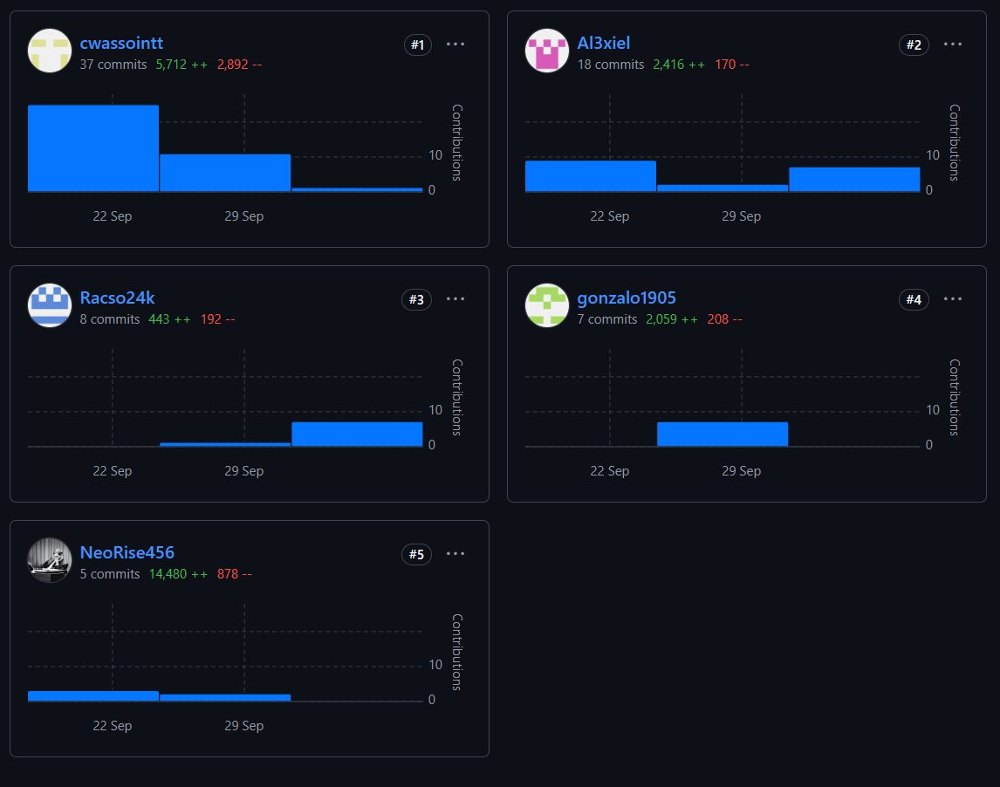
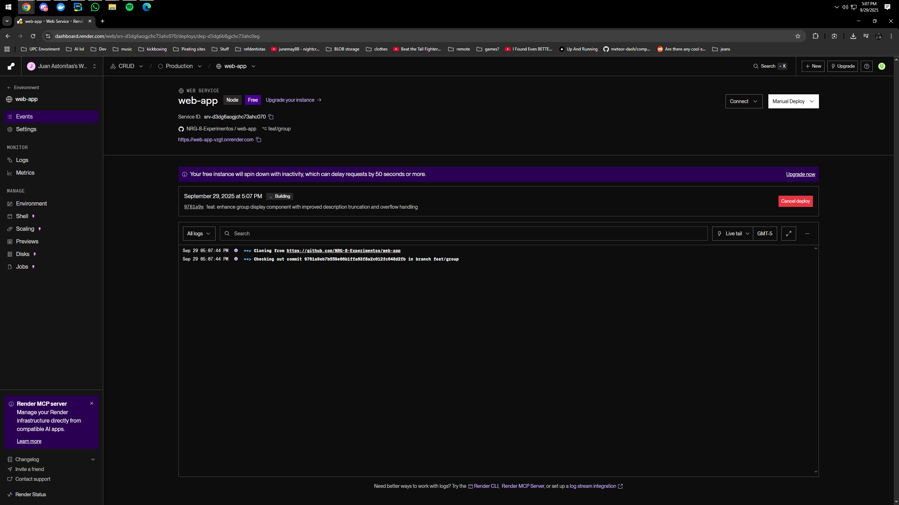
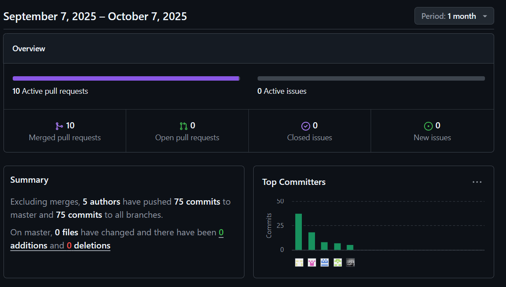
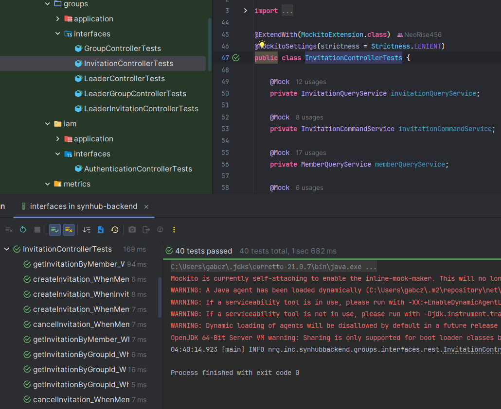
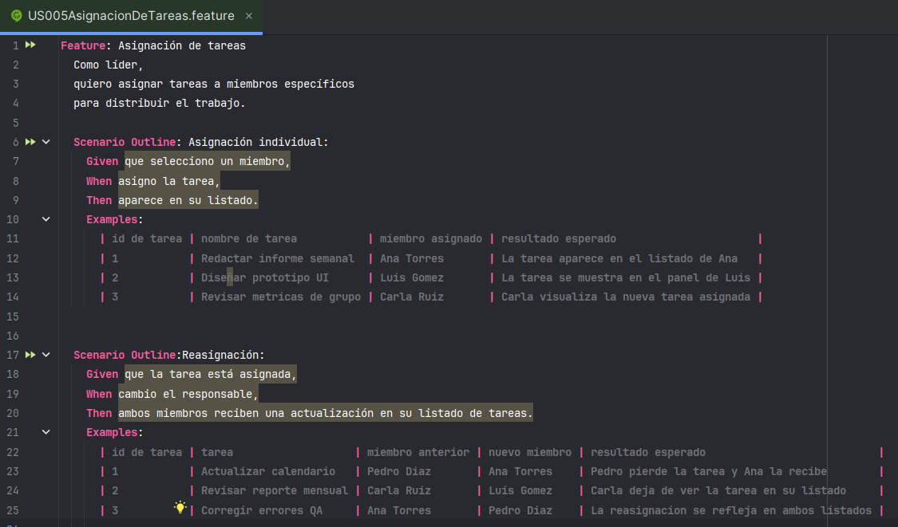
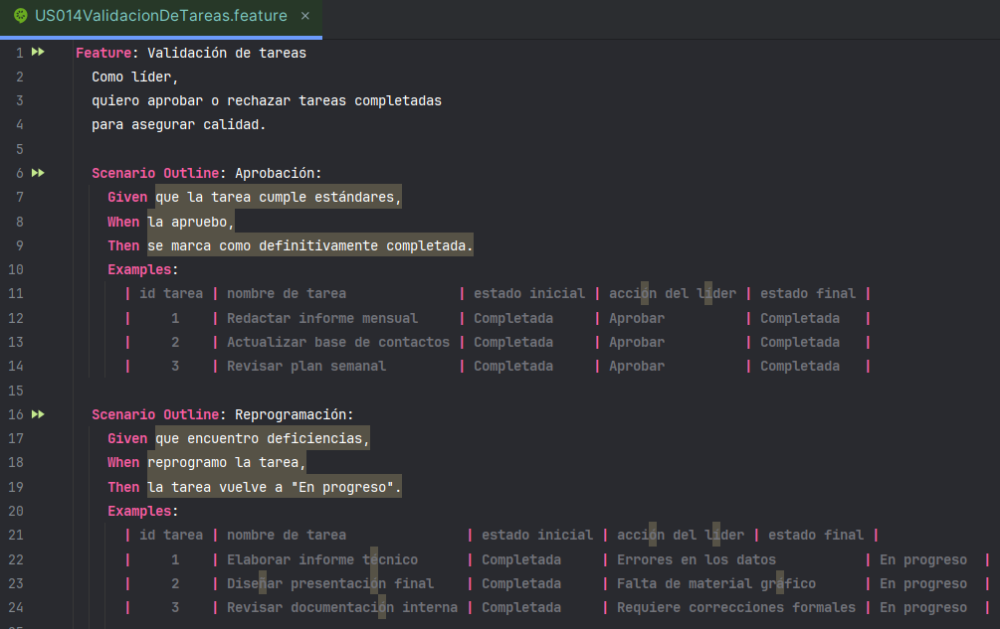
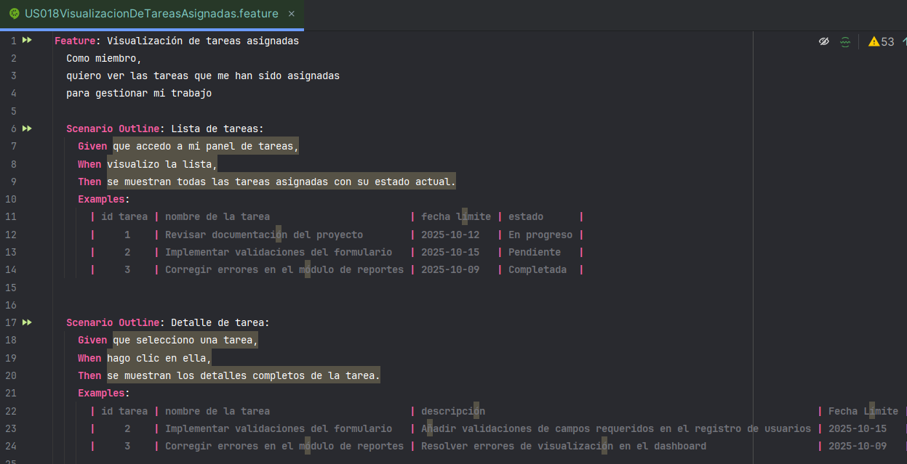

# Universidad Peruana de Ciencias Aplicadas

### **CURSO:** Diseño de Experimentos de Ingeniería de Software - 1ASI0732

### **NRC**: 7505

### **Profesor:** Julio Manuel Noriega Melendez

### **Ingeniería de software**

## Informe de Trabajo Final

### **Nombre del startup:** NRG8

### **Nombre del producto:** SynHub

## **Integrantes**


| **Nombre**                                | **Código** |
|-------------------------------------------|------------|
| **Astonitas Díaz Juan Diego**             | U202110237 |
| **Casas Sanchez Gabriel Alexander**       | U202220033 |
| **Pasquale Barrenechea Gianluca Santino** | U202112078 |
| **Wilder Gonzalo Aliaga Urbina**          | U202222001 |
| **Armas Sánchez Oscar Javier**            | U20211G192 |

**Septiembre 2025**

## Registro de Versiones del Informe

| Versión | Fecha      | Autor                                                                                                                                                       | Descripción de modificación            |
|---------|------------|-------------------------------------------------------------------------------------------------------------------------------------------------------------|----------------------------------------|
| 0.1     | 03/08/2025 | Gabriel Alexander Casas Sanchez                                                                                                                             | Elaboración de plantilla del reporte   |
| 0.2     | 06/09/2025 | Gabriel Alexander Casas Sanchez                                                                                                                             | Migración de datos del proyecto        |
| 0.3     | 15/09/2025 | Armas Sánchez Oscar Javier, Astonitas Díaz Juan Diego, Casas Sanchez Gabriel Alexander, Pasquale Barrenechea Gianluca Santino, Wilder Gonzalo Aliaga Urbina | Elaboración del proceso lean ux        |
| 1       | 19/09/2025 | Armas Sánchez Oscar Javier, Astonitas Díaz Juan Diego, Casas Sanchez Gabriel Alexander, Pasquale Barrenechea Gianluca Santino, Wilder Gonzalo Aliaga Urbina | Elaboración del entregable para la tb1 |

## Project Report Collaboration Insights

El enlace a github del reporte del proyecto es el siguiente: https://github.com/NRG-8-Experimentos/report


Para esta primera entrega se desarrollaron los capítulos del 1 al 4, en la captura adjunta se evidencia el trabajo colaborativo de github. Todos los integrantes del grupo trabajaron en el proyecto.
Recapitulando los commits se dividieron de la siguiente manera:
* Armas Sánchez Oscar Javier (Racso24k): 2
* Astonitas Díaz Juan Diego (NeoRise456): 1
* Casas Sanchez Gabriel Alexander (Al3xiel): 31
* Pasquale Barrenechea Gianluca Santino (cwassointt): 5
* Wilder Gonzalo Aliaga Urbina (gonzalo1905): 7

Entrega TP:





Para esta primera entrega se desarrollaron los capítulos del 1 al 4, en la captura adjunta se evidencia el trabajo colaborativo de github. Todos los integrantes del grupo trabajaron en el proyecto.
Recapitulando los commits se dividieron de la siguiente manera:
* Armas Sánchez Oscar Javier (Racso24k): 8
* Astonitas Díaz Juan Diego (NeoRise456): 5
* Casas Sanchez Gabriel Alexander (Al3xiel): 18 
* Pasquale Barrenechea Gianluca Santino (cwassointt): 37 
* Wilder Gonzalo Aliaga Urbina (gonzalo1905): 7

## Contenido

- [Student Outcome](#student-outcome)
- [Part I: As-Is Software Project](#part-i-as-is-software-project)
  - [Capítulo I: Introducción](#capítulo-i-introducción)
    - [1.1. Startup Profile](#11-startup-profile)
      - [1.1.1. Descripción de la Startup](#111-descripción-de-la-startup)
      - [1.1.2. Perfiles de integrantes del equipo](#112-perfiles-de-integrantes-del-equipo)
    - [1.2. Solution Profile](#12-solution-profile)
      - [1.2.1. Antecedentes y problemática](#121-antecedentes-y-problemática)
      - [1.2.2. Lean UX Process.](#122-lean-ux-process)
        - [1.2.2.1. Lean UX Problem Statements](#1221-lean-ux-problem-statements)
        - [1.2.2.2. Lean UX Assumptions](#1222-lean-ux-assumptions)
        - [1.2.2.3. Lean UX Hypothesis Statements](#1223-lean-ux-hypothesis-statements)
        - [1.2.2.3. Lean UX Canvas](#1224-lean-ux-canvas)
    - [1.3. Segmentos objetivo](#13-segmentos-objetivo)
  - [Capítulo II: Requirements Elicitation & Analysis](#capitulo-ii-requirements-elicitation--analysis)
    - [2.1. Competidores](#21-competidores)
      - [2.1.1. Análisis competitivo](#211-análisis-competitivo)
      - [2.1.2. Estrategias y tácticas frente a competidores](#212-estrategias-y-tácticas-frente-a-competidores)
    - [2.2. Entrevistas](#22-entrevistas)
      - [2.2.1. Diseño de entrevistas](#221-diseño-de-entrevistas)
      - [2.2.2. Registro de entrevistas](#222-registro-de-entrevistas)
      - [2.2.3. Análisis de entrevistas](#223-análisis-de-entrevistas)
    - [2.3. Needfinding](#23-needfinding)
      - [2.3.1. User Personas](#231-user-personas)
      - [2.3.2. User Task Matrix](#232-user-task-matrix)
      - [2.3.3. User Journey Mapping](#233-user-journey-mapping)
      - [2.3.4. Empathy Mapping](#234-empathy-mapping)
      - [2.3.5. As-is Scenario Mapping](#235-as-is-scenario-mapping)
    - [2.4. Ubiquitous Language](#24-ubiquitous-language)
  - [Capítulo III: Requirements Specification](#capitulo-iii-requirements-specification)
    - [3.1. To-Be Scenario Mapping](#31-to-be-scenario-mapping)
    - [3.2. User Stories](#32-user-stories)
    - [3.3. Product Backlog](#33-product-backlog)
    - [3.4. Impact Mapping](#34-impact-mapping)
  - [Capítulo IV: Product Design](#capitulo-iv-product-design)
    - [4.1. Style Guidelines](#41-style-guidelines)
      - [4.1.1. General Style Guidelines](#411-general-style-guidelines)
      - [4.1.2. Web Style Guidelines](#412-web-style-guidelines)
      - [4.1.3. Mobile Style Guidelines](#413-mobile-style-guidelines)
    - [4.2. Information Architecture](#42-information-architecture)
      - [4.2.1. Organization Systems](#421-organization-systems)
      - [4.2.2. Labeling Systems](#422-labeling-systems)
      - [4.2.3. SEO Tags and Meta Tags](#423-seo-tags-and-meta-tags)
      - [4.2.4. Searching Systems](#424-searching-systems)
      - [4.2.5. Navigation Systems](#425-navigation-systems)
    - [4.3. Landing Page UI Design](#43-landing-page-ui-design)
      - [4.3.1. Landing Page Wireframe](#431-landing-page-wireframe)
      - [4.3.2. Landing Page Mock-up](#432-landing-page-mock-up)
    - [4.4. Mobile Applications UX/UI Design](#44-mobile-applications-uxui-design)
      - [4.4.1. Mobile Applications Wireframes](#441-mobile-applications-wireframes)
      - [4.4.2. Mobile Applications Wireflow Diagrams](#442-mobile-applications-wireflow-diagrams)
      - [4.4.3. Mobile Applications Mock-ups](#443-mobile-applications-mock-ups)
      - [4.4.4. Mobile Applications User Flow Diagrams](#444-mobile-applications-user-flow-diagrams)
    - [4.5. Mobile Applications Prototyping](#45-mobile-applications-prototyping)
      - [4.5.1. Android Mobile Applications Prototyping](#451-android-mobile-applications-prototyping)
      - [4.5.2. iOS Mobile Applications Prototyping](#452-ios-mobile-applications-prototyping)
    - [4.6. Web Applications UX/UI Design](#46-web-applications-uxui-design)
      - [4.6.1. Web Applications Wireframes](#461-web-applications-wireframes)
      - [4.6.2. Web Applications Wireflow Diagrams](#462-web-applications-wireflow-diagrams)
      - [4.6.3. Web Applications Mock-ups](#463-web-applications-mock-ups)
      - [4.6.4. Web Applications User Flow Diagrams](#464-web-applications-user-flow-diagrams)
    - [4.7. Web Applications Prototyping](#47-web-applications-prototyping)
    - [4.8. Domain-Driven Software Architecture](#48-domain-driven-software-architecture)
      - [4.8.1. Software Architecture Context Diagram](#481-software-architecture-context-diagram)
      - [4.8.2. Software Architecture Container Diagrams](#482-software-architecture-container-diagrams)
      - [4.8.3. Software Architecture Components Diagrams](#483-software-architecture-components-diagrams)
    - [4.9. Software Object-Oriented Design](#49-software-object-oriented-design)
      - [4.9.1. Class Diagrams](#491-class-diagrams)
      - [4.9.2. Class Dictionary](#492-class-dictionary)
    - [4.10. Database Design](#410-database-design)
      - [4.10.1. Relational/Non-Relational Database Diagram](#4101-relationalnon-relational-database-diagram)
  - [Capítulo V: Product Implementation](#capitulo-v-product-implementation)
    - [5.1. Software Configuration Management](#51-software-configuration-management)
      - [5.1.1. Software Development Environment Configuration](#511-software-development-environment-configuration)
      - [5.1.2. Source Code Management](#512-source-code-management)
      - [5.1.3. Source Code Style Guide & Conventions](#513-source-code-style-guide--conventions)
      - [5.1.4. Software Deployment Configuration](#514-software-deployment-configuration)
    - [5.2. Product Implementation & Deployment](#52-product-implementation--deployment)
      - [5.2.1. Sprint Backlogs](#521-sprint-backlogs)
      - [5.2.2. Implemented Landing Page Evidence](#522-implemented-landing-page-evidence)
      - [5.2.3. Implemented Frontend-Web Application Evidence](#523-implemented-frontend-web-application-evidence)
      - [5.2.4. Acuerdo de Servicio - SaaS](#524-acuerdo-de-servicio---saas)
      - [5.2.5. Implemented Native-Mobile Application Evidence](#525-implemented-native-mobile-application-evidence)
      - [5.2.6. Implemented RESTful API and/or Serverless Backend Evidence](#526-implemented-restful-api-andor-serverless-backend-evidence)
      - [5.2.7. RESTful API documentation](#527-restful-api-documentation)
      - [5.2.8. Team Collaboration Insights](#528-team-collaboration-insights)
    - [5.3. Video About-the-Product](#53-video-about-the-product)
- [Part II: Verification, Validation & Pipeline](#part-ii-verification-validation--pipeline)
  - [Capítulo VI: Product Verification & Validation](#capítulo-vi-product-verification--validation)
    - [6.1. Testing Suites & Validation](#61-testing-suites--validation)
      - [6.1.1. Core Entities Unit Tests](#611-core-entities-unit-tests)
      - [6.1.2. Core Integration Tests](#612-core-integration-tests)
      - [6.1.3. Core Behavior-Driven Development](#613-core-behavior-driven-development)
      - [6.1.4. Core System Tests](#614-core-system-tests)
    - [6.2. Static testing & Verification](#62-static-testing--verification)
      - [6.2.1. Static Code Analysis](#621-static-code-analysis)
        - [6.2.1.1. Coding standard & Code conventions](#6211-coding-standard--code-conventions)
        - [6.2.1.2. Code Quality & Code Security](#6212-code-quality--code-security)
      - [6.2.2. Reviews](#622-reviews)
    - [6.3. Validation Interviews](#63-validation-interviews)
      - [6.3.1. Diseño de Entrevistas](#631-diseño-de-entrevistas)
      - [6.3.2. Registro de Entrevistas](#632-registro-de-entrevistas)
      - [6.3.3. Evaluaciones según heurísticas](#633-evaluaciones-según-heurísticas)
    - [6.4. Auditoría de Experiencias de Usuario](#64-auditoría-de-experiencias-de-usuario)
      - [6.4.1. Auditoría realizada](#641-auditoría-realizada)
        - [6.4.1.1. Información del grupo auditado](#6411-información-del-grupo-auditado)
        - [6.4.1.2. Cronograma de auditoría realizada](#6412-cronograma-de-auditoría-realizada)
        - [6.4.1.3. de auditoría realizada](#6413-de-auditoría-realizada)
      - [6.4.2. Auditoría recibida](#642-auditoría-recibida)
        - [6.4.2.1. Información del grupo auditor](#6421-información-del-grupo-auditor)
        - [6.4.2.2. Cronograma de auditoría recibida](#6422-cronograma-de-auditoría-recibida)
        - [6.4.2.3. Contenido de auditoría recibida](#6423-contenido-de-auditoría-recibida)
        - [6.4.2.4. Resumen de modificaciones para subsanar hallazgos](#6424-resumen-de-modificaciones-para-subsanar-hallazgos)
  - [Capítulo VII: DevOps Practices](#capítulo-vii-devops-practices)
    - [7.1. Continuous Integration](#71-continuous-integration)
      - [7.1.1. Tools and Practices](#711-tools-and-practices)
      - [7.1.2. Build & Test Suite Pipeline Components](#712-build--test-suite-pipeline-components)
    - [7.2. Continuous Delivery](#72-continuous-delivery)
      - [7.2.1. Tools and Practices](#721-tools-and-practices)
      - [7.2.2. Stages Deployment Pipeline Components](#722-stages-deployment-pipeline-components)
    - [7.3. Continuous deployment](#73-continuous-deployment)
      - [7.3.1. Tools and Practices](#731-tools-and-practices)
      - [7.3.2. Production Deployment Pipeline Components](#732-production-deployment-pipeline-components)
    - [7.4. Continuous Monitoring](#74-continuous-monitoring)
      - [7.4.1. Tools and Practices](#741-tools-and-practices)
      - [7.4.2. Monitoring Pipeline Components](#742-monitoring-pipeline-components)
      - [7.4.3. Alerting Pipeline Components](#743-alerting-pipeline-components)
      - [7.4.4. Notification Pipeline Components](#744-notification-pipeline-components)
- [Part III: Experiment-Driven Lifecycle](#part-iii-experiment-driven-lifecycle)
  - [Capítulo VIII: Experiment-Driven Development](#capítulo-viii-experiment-driven-development-)
    - [8.1. Experiment Planning](#81-experiment-planning)
      - [8.1.1. As-Is Summary](#811-as-is-summary)
      - [8.1.2. Raw Material: Assumptions, Knowledge Gaps, Ideas, Claims](#812-raw-material-assumptions-knowledge-gaps-ideas-claims)
      - [8.1.3. Experiment-Ready Questions](#813-experiment-ready-questions)
      - [8.1.4. Question Backlog](#814-question-backlog)
      - [8.1.5. Experiment Cards](#815-experiment-cards)
    - [8.2. Experiment Design](#82-experiment-design)
      - [8.2.1. Hypotheses](#821-hypotheses)
      - [8.2.2. Domain Business Metrics](#822-domain-business-metrics)
      - [8.2.3. Measures](#823-measures)
      - [8.2.4. Conditions](#824-conditions)
      - [8.2.5. Scale Calculations and Decisions](#825-scale-calculations-and-decisions)
      - [8.2.6. Methods Selection](#826-methods-selection)
      - [8.2.7. Data Analytics: Goals, KPIs and Metrics Selection](#827-data-analytics-goals-kpis-and-metrics-selection)
      - [8.2.8. Web and Mobile Tracking Plan](#828-web-and-mobile-tracking-plan)
    - [8.3. Experimentation](#83-experimentation)
      - [8.3.1. To-Be User Stories](#831-to-be-user-stories)
      - [8.3.2. To-Be Product Backlog](#832-to-be-product-backlog)
      - [8.3.3. Pipeline-supported, Experiment-Driven To-Be Software Platform Lifecycle](#833-pipeline-supported-experiment-driven-to-be-software-platform-lifecycle)
        - [8.3.3.1. To-Be Sprint Backlogs](#8331-to-be-sprint-backlogs)
        - [8.3.3.2. Implemented To-Be Landing Page Evidence](#8332-implemented-to-be-landing-page-evidence)
        - [8.3.3.3. Implemented To-Be Frontend-Web Application Evidence](#8333-implemented-to-be-frontend-web-application-evidence)
        - [8.3.3.4. Implemented To-Be Native-Mobile Application Evidence](#8334-implemented-to-be-native-mobile-application-evidence)
        - [8.3.3.5. Implemented To-Be RESTful API and/or Serverless Backend Evidence](#8335-implemented-to-be-restful-api-andor-serverless-backend-evidence)
        - [8.3.3.6. Team Collaboration Insights](#8336-team-collaboration-insights)
      - [8.3.4. To-Be Validation Interviews](#834-to-be-validation-interviews)
        - [8.3.4.1. Diseño de Entrevistas](#8341-diseño-de-entrevistas)
        - [8.3.4.2. Registro de Entrevistas](#8342-registro-de-entrevistas)
    - [8.4. Experiment Aftermath & Analysis](#84-experiment-aftermath--analysis)
      - [8.4.1. Analysis and Interpretation of Results](#841-analysis-and-interpretation-of-results)
      - [8.4.2. Re-scored and Re-prioritized Question Backlog](#842-re-scored-and-re-prioritized-question-backlog)
    - [8.5. Continuous Learning](#85-continuous-learning)
      - [8.5.1. Shareback Session Artifacts: Learning Workflow](#851-shareback-session-artifacts-learning-workflow)
    - [8.6. To-Be Software Platform Pre-launch](#86-to-be-software-platform-pre-launch)
      - [8.6.1. About-the-Product Intro Video](#861-about-the-product-intro-video)
- [Conclusiones](#conclusiones)
  - [Conclusiones y recomendaciones](#conclusiones-y-recomendaciones)
  - [Video App Validation](#video-app-validation)
  - [Video About-the-Team](#video-about-the-team)
- [Bibliografía](#bibliografía)
- [Anexos](#anexos)

## Student Outcome

El curso contribuye al cumplimiento del Student Outcome ABET:

**ABET – EAC - Student Outcome 4**

Criterio: La capacidad de reconocer responsabilidades éticas y profesionales en
situaciones de ingeniería y hacer juicios informados, que deben considerar el
impacto de las soluciones de ingeniería en contextos globales, económicos,
ambientales y sociales.

En el siguiente cuadro se describe las acciones realizadas y enunciados de conclusiones
por parte del grupo, que permiten sustentar el haber alcanzado el logro del ABET –
EAC - Student Outcome 4.

<table>
  <thead>
    <tr>
      <th style="text-align: left;">Criterio específico</th>
      <th style="text-align: left;">Acciones realizadas</th>
      <th style="text-align: left;">Conclusiones</th>
    </tr>
  </thead>
  <tbody>
    <tr>
      <td><strong>
        4.c.1 Reconoce responsabilidad ética y profesional en situaciones de ingeniería de software 
      </strong></td>
      <td>
        <b>Gabriel Alexander Casas Sanchez:</b> <br>
            - TB1: Reconocí la responsabilidad ética y profesional al diseñar el UX/UI, priorizando la comprensión y curva de aprendizaje de los usuarios.<br>
            - TP: Reconocí la responsabilidad ética y profesional al desarrollar pruebas de código que garantizaron la correcta integración entre frontend y backend, priorizando la calidad y robustez del sistema.<br>
        <b>Juan Diego Astonitas Diaz:</b> <br>
            - TB1: Reconocí mi responsabilidad ética y profesional al dejar instrucciones detalladas para el deployment, facilitando la replicabilidad y transparencia del proceso.<br>
            - TP: Reconocí mi responsabilidad ética y profesional al desarrollar pruebas unitarias e integradas para los servicios y controladores del backend, así como pruebas de sistema para la app móvil, asegurando la calidad y confiabilidad del software entregado.<br>
        <b>Gonzalo Aliaga:</b> <br>
            - TB1: econocí mi responsabilidad ética y profesional al gestionar la configuración y el código, desplegar el producto y elaborar el acuerdo SaaS, aplicando buenas prácticas técnicas y legales.<br>
            - TP: Reconocí mi responsabilidad ética y profesional al desarrollar e implementar la aplicación web y el backend, asegurando la calidad y confiabilidad de la funcionalidad de tareas y de las pruebas del sistema.<br>
        <b>Gianluca Pasquale:</b> <br>
            - TB1: Reconocí la responsabilidad ética y profesional al diseñar herramientas centradas en el usuario, asegurando que las soluciones respeten sus necesidades y derechos.<br>
            - TP: Reconocí mi responsabilidad ética y profesional al desarrollar nuevas métricas y reforzar la seguridad del inicio de sesión con CAPTCHA, protegiendo los datos y la integridad de los usuarios.<br>
        <b>Oscar Armas:</b> <br>
            - TB1: Reconocí la responsabilidad ética y profesional al realizar entrevistas y mapeos, considerando la ética en el manejo de datos.<br>
            - TP: <br>
       </td>
      <td>
        - TB1: Como equipo, reconocimos nuestra responsabilidad ética y profesional en el desarrollo del proyecto, aplicando buenas prácticas técnicas y legales en la gestión de la configuración, el código, el diseño UX/UI y la documentación de procesos, así como en la recolección y manejo ético de datos de usuarios.<br>
        - TP: <br>
      </td>
    </tr>
    <tr>
      <td><strong>
        4.c.2 Emite juicios informados considerando el impacto de las soluciones de ingeniería de software en contextos globales, económicos, ambientales y sociales 
      </strong></td>
      <td>
        <b>Gabriel Alexander Casas Sanchez:</b> <br>
            - TB1: Emití juicios informados al evaluar cómo el diseño de la aplicación impacta en la experiencia y objetivos de los usuarios.<br>
            - TP: Emití juicios informados al decidir qué restricciones implementar en la UI y cuáles en el código, evaluando el impacto de estas decisiones en la usabilidad y seguridad para los usuarios.<br>
        <b>Juan Diego Astonitas Diaz:</b> <br>
            - TB1: Emití juicios informados al considerar el impacto del deployment en la experiencia de otros desarrolladores y usuarios.<br>
            - TP: Emití juicios informados al implementar la funcionalidad de gestión de grupos en la aplicación web y su integración con el backend, considerando el impacto de estas soluciones en la experiencia y productividad de los usuarios en diferentes contextos.<br>
        <b>Gonzalo Aliaga:</b> <br>
            - TB1: Emití juicios informados al desarrollar prototipos web y móviles, considerando el impacto del despliegue en los usuarios y el entorno.<br>
            - TP: Emití juicios informados al diseñar e implementar funcionalidades que impactan directamente en la experiencia y productividad de los usuarios, considerando su entorno y necesidades.<br>
        <b>Gianluca Pasquale:</b> <br>
            - TB1: Emití juicios informados al crear User Personas, User Journey Mapping e Impact Mapping, evaluando el impacto de las soluciones en contextos globales y sociales.<br>
            - TP: Emití juicios informados al implementar métricas y factores de seguridad que mejoran la experiencia y confianza de los usuarios, considerando su impacto en contextos sociales y tecnológicos.<br>
        <b>Oscar Armas:</b> <br>
            - TB1: Emití juicios informados al proponer mejoras basadas en el análisis del impacto social, económico y ambiental del sistema.<br>
            - TP: <br>
       </td>
      <td>
        - TB1: Emitimos juicios informados al diseñar y desarrollar soluciones considerando el impacto en los usuarios, el entorno social, económico y ambiental, evaluando continuamente cómo nuestras decisiones afectan la experiencia, los derechos y el bienestar de todos los involucrados.<br>
        - TP: <br>
      </td>
    </tr>
  </tbody>
</table>

# **Part I: As-Is Software Project**

## Capítulo I: Introducción

### 1.1. Startup Profile
#### 1.1.1. Descripción de la Startup
NRG8 es una startup tecnológica dedicada al desarrollo de soluciones digitales para la gestión de proyectos, con un enfoque en la accesibilidad y la facilidad de uso. Nuestra misión es simplificar la organización y el seguimiento de tareas en equipos de cualquier tamaño, ofreciendo una alternativa ágil y amigable frente a herramientas tradicionales que suelen ser complejas y poco intuitivas.
Con una visión centrada en la experiencia de usuario y la colaboración efectiva, NRG8 busca democratizar el acceso a plataformas de gestión profesional, impulsando la productividad y la transparencia en proyectos tanto personales como organizacionales.

#### 1.1.2. Perfiles de integrantes del equipo

<table>
  <tr>
    <th colspan="2"> Juan Diego Astonitas </th>
  </tr>
  <tr>
    <td>  </td>
    <td> Mi nombre es Juan Diego Astonitas Diaz, mi código de estudiante es u202110237,tengo 21 años, actualmente curso el 7mo ciclo de la carrera de Ingeniería de Software, en la UPC en la sede San Miguel. Mis principales cualidades son el liderazgo y el dominio de NextJS. Haré todo lo que esté a mi alcance para respaldar al equipo en la finalización oportuna y efectiva de las tareas asignadas. </td>
  </tr>
  <tr>
    <th colspan="2"> Casas Sanchez Gabriel Alexander </th>
  </tr>
  <tr>
    <td>  </td>
    <td> Soy estudiante de Ingeniería de Software en sexto ciclo, con habilidades para dirigir y trabajar bien bajo presión. Aunque no disfruto mucho de los trabajos grupales, siempre asumo un rol destacado y sobresaliente en ellos, aprovechando mi capacidad académica y versatilidad. </td>
  </tr>
  <tr>
    <th colspan="2"> Gianluca Santino Pasquale Barrenechea </th>
  </tr>
  <tr>
    <td>  </td>
    <td> Me llamo Gianluca Santino Pasquale Barrenechea, estudiante de Ingeniería de Software (código u202112078). En nuestra Startup, me enfoco en el desarrollo frontend y backend, utilizando C++, C#, Python, Java, HTML y JavaScript. Mi objetivo es crear soluciones escalables y eficientes, mejorando la experiencia del usuario y optimizando la operación de la plataforma, siempre aplicando metodologías ágiles como Scrum. </td>
  </tr>
  <tr>
    <th colspan="2">Wilder Gonzalo Aliaga Urbina</th>
  </tr>
  <tr>
    <td>  </td>
    <td></td>
  </tr>
  <tr>
    <th colspan="2">Armas Sánchez Oscar Javier</th>
  </tr>
  <tr>
    <td>  </td>
    <td></td>
  </tr>
</table>

### 1.2. Solution Profile

En el entorno actual, muchos equipos y grupos de trabajo —laborales, académicos o comunitarios— enfrentan serias dificultades para organizar sus proyectos, distribuir responsabilidades de forma equitativa y mantener una comunicación clara entre sus integrantes.
Estos problemas se traducen en:
* Sobrecarga de tareas en ciertos miembros.
* Falta de coordinación general.
* Duplicación o abandono de responsabilidades.
* Disminución de la productividad y el bienestar del equipo.

Aunque existen herramientas de gestión digital, la mayoría presentan una curva de aprendizaje alta, interfaces complejas o están orientadas a entornos corporativos muy específicos. Esto genera barreras para equipos pequeños, medianos o multidisciplinarios que requieren soluciones más accesibles y fáciles de adoptar.
**Solución propuesta: SynHub**

SynHub es una plataforma de gestión de proyectos intuitiva, accesible y colaborativa, diseñada para simplificar la organización y el seguimiento de actividades en cualquier tipo de grupo.

**Desde el rol de Organizador/Administrador**

* Crear y configurar grupos de trabajo.
* Asignar miembros y distribuir responsabilidades.
* Definir y personalizar tareas (título, descripción, plazos, responsables).
* Monitorear el avance y cumplimiento de tareas.
* Facilitar la coordinación interna y la comunicación clara dentro del equipo.
  
**Desde el rol de Integrante del equipo**

* Consultar las responsabilidades asignadas desde una interfaz clara y accesible.
* Recibir notificaciones y recordatorios sobre plazos.
* Proponer ajustes o modificaciones en las tareas según el avance.
* Visualizar la su propia carga de trabajo.
* Acceder a métricas de desempeño personal y grupal.

#### 1.2.1. Antecedentes y problemática

**What**

**¿Cuál es el problema?**
El problema radica en la baja adopción de aplicaciones móviles para la gestión y organización colaborativa de proyectos. Aunque existen diversas herramientas digitales, muchos equipos siguen recurriendo a métodos improvisados (chats, hojas de cálculo, notas físicas) que dificultan la coordinación. Esto genera distribución desigual de tareas, falta de seguimiento, comunicación fragmentada y pérdida de productividad.
**¿Cuál es la relación con la persona en cuestión?**
La relación es brindar a organizadores y miembros de equipos una herramienta accesible, intuitiva y centrada en sus necesidades reales, que permita una organización clara, distribución equitativa de tareas y comunicación fluida, facilitando su adopción cotidiana.

**When**

**¿Cuándo sucede el problema?**
El problema aparece cuando los equipos necesitan coordinar proyectos, asignar responsabilidades y mantener una comunicación constante para alcanzar objetivos comunes.
**¿Cuándo utiliza el cliente el producto?**
El cliente utiliza SynHub en momentos clave del ciclo de un proyecto: al planificar actividades, asignar tareas y hacer seguimiento del cumplimiento, así como en la resolución de ajustes o imprevistos.

**Where**

**¿Dónde está el cliente cuando usa el producto?**
El cliente accede a SynHub desde cualquier lugar con conexión a Internet: en la oficina, en casa, en el aula o durante desplazamientos, adaptándose a su rutina diaria.
**¿Dónde surge el problema?**
El problema se manifiesta en espacios de trabajo colaborativo: oficinas, instituciones educativas, organizaciones comunitarias y grupos multidisciplinarios, donde la coordinación efectiva es clave para lograr resultados.

**Who**

**¿Quiénes se ven involucrados en el problema?**
* Organizadores o coordinadores de proyectos (líderes, docentes, jefes de área, representantes comunitarios) que necesitan asignar tareas y dar seguimiento.
* Miembros de equipos de trabajo (colaboradores, estudiantes, voluntarios, participantes) que enfrentan dificultades para organizarse y comunicarse de forma efectiva.

**Why**

**¿Cuáles son las causas del problema?**
Las causas están en la resistencia al cambio, la percepción de bajo valor inmediato y la falta de hábitos digitales consolidados. Aunque existen plataformas robustas como Jira o Trello, muchas personas las perciben como complejas o poco integradas en su dinámica diaria.
Por ello, se recurre a métodos tradicionales que, si bien resultan familiares, no resuelven la necesidad de organización integral y colaboración ágil.

**How**

**¿En qué condiciones los clientes usan nuestro producto?**
Los clientes usan SynHub cuando necesitan coordinar proyectos con múltiples tareas, integrantes y plazos variables, en un entorno donde la corresponsabilidad y la comunicación clara son esenciales para el éxito colectivo.

**How Much**

**¿Cuál es la magnitud del problema?**
La magnitud es considerable. Según el State of Teams Report de Atlassian (2021):
* Solo el 17% de los equipos se consideran “saludables”, mientras que el 54% son parcialmente saludables y el 29% insalubres (p. 12).
* El 57% de los participantes admitió que sus equipos no operan con eficiencia, generando retrasos y baja productividad (p. 18).
* El 56% de los miembros reportó baja conexión interpersonal y el 37% señaló que no puede expresar ideas libremente por falta de seguridad psicológica (p. 24).
  Estos datos reflejan la urgencia de contar con herramientas accesibles y de rápida adopción, como SynHub, que reduzcan la fricción tecnológica y potencien la colaboración.

#### 1.2.2. Lean UX Process.

El lean UX process es un enfoque iterativo centrado en el usuario para el diseño de proyectos y productos. Este enfoque se basa en ciclos rápidos (sprints) de investigación, diseño y pruebas para validar la propuesta o ideas planteadas por el equipo. Estas propuestas estarán siempre orientadas a satisfacer las necesidades de los usuarios.

##### 1.2.2.1. Lean UX Problem Statements

En el entorno actual, los equipos de trabajo, ya sean laborales, académicos o comunitarios,  enfrentan grandes desafíos para organizar proyectos, coordinar responsabilidades y mantener una comunicación clara y constante.
Si bien existen herramientas digitales de gestión como tableros de tareas o plataformas corporativas (ej. Jira, Trello, Asana), muchas resultan complejas, fragmentadas o poco accesibles, lo que genera una baja adopción por parte de equipos pequeños y multidisciplinarios. La falta de soluciones centralizadas, intuitivas y personalizables provoca desorganización, sobrecarga en ciertos miembros, retrasos en los proyectos y fricciones dentro del equipo.
SynHub surge como respuesta a esta brecha: una plataforma integral de gestión de proyectos que combina accesibilidad, simplicidad y experiencia de usuario clara para facilitar la planificación, la asignación de tareas, el seguimiento del cumplimiento y la comunicación colaborativa. Su diseño busca reducir la curva de aprendizaje y fomentar una rápida adopción, permitiendo que cualquier equipo, sin importar su tamaño o nivel de madurez digital, pueda organizar sus proyectos de manera eficiente y efectiva.

##### 1.2.2.2. Lean UX Assumptions

**_User Assumptions (Suposiciones de Usuario)_**

**¿Quién es el usuario?** Profesionales, estudiantes o miembros de equipos que buscan una solución accesible para organizar proyectos, coordinar tareas y mantener comunicación fluida sin necesidad de herramientas complejas.

**¿Dónde encaja nuestro producto en su trabajo o vida?** Encaja en proyectos grupales (laborales, académicos, comunitarios o personales), donde la claridad en responsabilidades y la colaboración son esenciales.

**¿Qué problemas resuelve nuestro producto?** Desorganización, comunicación fragmentada, falta de seguimiento en proyectos y baja adopción de herramientas por interfaces poco intuitivas.

**¿Cuándo y cómo se usa nuestro producto?** Se usa en momentos clave del ciclo de un proyecto: planificación inicial, asignación de tareas, coordinación de avances y seguimiento de resultados.

**¿Qué características son importantes?** Asignación de tareas claras, tableros visuales de progreso, notificaciones inteligentes, métricas de desempeño, comunicación estructurada y adaptabilidad a distintos tipos de proyectos.

**¿Cómo debe verse y comportarse nuestro producto?** Debe ofrecer una interfaz minimalista, intuitiva y amigable, con navegación clara, aprendizaje rápido y personalización ligera que fomente su adopción inmediata.

**_Business Assumptions (Suposiciones de Negocio)_**


**Necesidades y problemas:** Los equipos necesitan una plataforma ágil que les permita organizar proyectos sin la curva de aprendizaje que presentan herramientas robustas como Jira o Asana.

**Plataforma:** Una aplicación web y móvil con sincronización en la nube que ofrezca gestión integral de proyectos de manera simple.

**Segmentación:** Coordinadores de proyectos, líderes de equipos pequeños/medianos y miembros que requieren claridad en sus responsabilidades.

**Comportamientos:** Los usuarios valoran principalmente la facilidad de uso, accesibilidad y rapidez de adopción.

**Beneficios:** Mejor organización personal y grupal, mayor visibilidad sobre las responsabilidades, reducción de fricciones y sensación de progreso al completar tareas.

**Captación de clientes:** Estrategias de inbound marketing, marketing digital, integraciones con ecosistemas educativos/laborales y boca a boca.

**Modelo de ingresos:** Versión freemium (básica gratuita) + modelo SaaS con planes de suscripción mensual/anual.

**Competencia:** Jira, Trello, Asana, Notion y aplicaciones de chat con funciones de organización.

**Ventaja competitiva:** Facilidad de uso, accesibilidad multiplataforma, experiencia clara y diseño pensado para rápida adopción, eliminando la barrera de complejidad de la competencia.

**_Technical Assumptions (Suposiciones Técnicas)_**


**Tecnología utilizada:** Tecnologías móviles y web modernas (React Native/Flutter, Node.js, etc.) para garantizar accesibilidad en múltiples dispositivos.

**Integraciones:** Posibilidad de conexión con herramientas ya usadas por los equipos (Google Workspace, Microsoft Teams, Slack, calendarios).

**Escalabilidad:** Arquitectura en la nube para soportar un crecimiento continuo en usuarios y datos sin perder rendimiento.

**_Market Assumptions (Suposiciones de Mercado)**_


**Tamaño del mercado:** Creciente demanda global por soluciones de productividad y gestión de proyectos digitales, especialmente en equipos remotos e híbridos.

**Competencia:** Aplicaciones ya posicionadas en el mercado de gestión de proyectos, pero con mayores barreras de adopción por complejidad.

**Tendencias:** Aceleración de la digitalización en el trabajo colaborativo y mayor interés en herramientas accesibles, simples y multiplataforma.

**_Design Assumptions (Suposiciones de Diseño)_**


**Interacción del usuario:** La experiencia debe ser clara y guiada con tableros visuales, recordatorios automáticos y navegación simple.

**Experiencia del usuario:** Los usuarios valorarán una experiencia de organización ágil, flexible, colaborativa y fácil de entender en pocos minutos.

**Colores y tipografía:** Paleta moderna, limpia y accesible (colores suaves/pastel, tipografía legible y sin distracciones visuales).

**Preferencias visuales:** Diseño minimalista, con iconografía intuitiva y jerarquía clara en la información.

**Prototipos y pruebas:** Validación continua con pruebas de usabilidad para garantizar accesibilidad y rápida adopción desde el primer uso.

##### 1.2.2.3. Lean UX Hypothesis Statements

**_Usuario y Necesidad_**


**Hypothesis 01:** Creemos que el usuario es alguien que busca una solución accesible para organizar tareas en un equipo y mejorar la comunicación entre los miembros.
Sabremos que estamos en lo correcto cuando recibamos comentarios positivos sobre la utilidad de la app y observemos un aumento en usuarios registrados.

**Hypothesis 02:** Creemos que el producto encaja en actividades grupales donde los usuarios participan junto a otros miembros, facilitando la gestión de tareas y responsabilidades.
Sabremos que estamos en lo correcto cuando los usuarios destaquen la facilidad de integración del producto en su dinámica de equipo.

**Hypothesis 03:** Creemos que el producto resuelve problemas de desorganización y falta de comunicación en los equipos.
Sabremos que estamos en lo correcto cuando encuestas y reseñas indiquen mejoras en la coordinación y claridad de responsabilidades.

**Hypothesis 04:** Creemos que el producto se usa principalmente en momentos de planificación, seguimiento de tareas y coordinación de equipo.
Sabremos que estamos en lo correcto cuando veamos un aumento en la frecuencia de uso durante ciclos de planificación y ejecución.

**_Características y Experiencia_**


**Hypothesis 05:** Creemos que los usuarios valoran características como asignación de tareas, visualización de horarios, disponibilidad de miembros y personalización de roles.
Sabremos que estamos en lo correcto cuando recibamos comentarios positivos y altos niveles de satisfacción en estas funciones.

**Hypothesis 06:** Creemos que el producto debe tener una interfaz intuitiva y amigable.
Sabremos que estamos en lo correcto cuando los usuarios reporten experiencias de navegación fluida en pruebas de usabilidad.

**Hypothesis 07:**  Creemos que los equipos necesitan organizar sus tareas de forma eficiente y mejorar la comunicación.
Sabremos que estamos en lo correcto cuando aumente la adopción por parte de equipos y recibamos feedback sobre la utilidad práctica.

**Hypothesis 08:** Creemos que estas necesidades se resuelven con una aplicación móvil que ofrezca gestión de tareas y comunicación en una experiencia fluida y accesible.
Sabremos que estamos en lo correcto cuando la app muestre alta retención y satisfacción de los usuarios móviles.

**Hypothesis 09:** Creemos que los usuarios clave son coordinadores e integrantes de equipos que buscan organizar sus responsabilidades de forma accesible.
Sabremos que estamos en lo correcto cuando los perfiles registrados coincidan mayoritariamente con este segmento.

**Hypothesis 10:** Creemos que el valor principal que buscan los usuarios es la facilidad de uso y la mejora en organización y comunicación del equipo.
Sabremos que estamos en lo correcto cuando recibamos comentarios consistentes sobre facilidad de uso y efectividad en la coordinación.

**Hypothesis 11:** Creemos que los usuarios obtendrán beneficios como mayor organización personal, claridad en sus responsabilidades y satisfacción al completar tareas.
Sabremos que estamos en lo correcto cuando las reseñas reflejen estos beneficios percibidos.

**_Negocio y Mercado_**


**Hypothesis 12:** Creemos que captaremos usuarios principalmente con marketing digital y recomendaciones en ámbitos laborales y educativos.
Sabremos que estamos en lo correcto cuando estas fuentes sean los principales canales de adquisición.

**Hypothesis 13:** Creemos que generaremos ingresos clasificando la aplicación como un servicio de pago.
Sabremos que estamos en lo correcto cuando los ingresos crezcan de forma sostenida por suscripciones o compras directas.

**Hypothesis 14:** Creemos que la competencia principal serán aplicaciones de gestión de tareas como Jira, Trello o Asana.
Sabremos que estamos en lo correcto cuando el análisis competitivo lo confirme.

**Hypothesis 15:** Creemos que superaremos a la competencia con un enfoque en personalización, facilidad de uso e integración para gestión de equipos.
Sabremos que estamos en lo correcto cuando los usuarios destaquen estas ventajas y adopten la app en lugar de alternativas.

**Hypothesis 16:** Creemos que podemos utilizar tecnologías móviles actuales para desarrollar la aplicación.
Sabremos que estamos en lo correcto cuando la app funcione sin problemas en dispositivos modernos y cumpla con estándares de rendimiento.

**Hypothesis 17:** Creemos que la aplicación debe integrarse con plataformas de comunicación ya utilizadas por los equipos.
Sabremos que estamos en lo correcto cuando las integraciones funcionen sin fricción y los usuarios las adopten.

**Hypothesis 18:** Creemos que la aplicación podrá escalar para soportar un número creciente de usuarios y datos.
Sabremos que estamos en lo correcto cuando la app maneje la carga sin problemas de rendimiento.

**Hypothesis 19:** Creemos que existe un mercado amplio de equipos que buscan soluciones de organización y coordinación.
Sabremos que estamos en lo correcto cuando aumente la adopción y la base de usuarios de la app.

**Hypothesis 20:** Creemos que las aplicaciones similares son los principales competidores directos.
Sabremos que estamos en lo correcto cuando el análisis competitivo confirme esta dinámica y la adopción de nuestra app crezca frente a estas opciones.

**Hypothesis 21:** Creemos que el mercado de apps de organización y productividad está en crecimiento, impulsado por la digitalización en entornos laborales y educativos.
Sabremos que estamos en lo correcto cuando estudios de mercado y tendencias lo respalden.

_**Diseño y Usabilidad**_


**Hypothesis 22:** Creemos que los usuarios interactuarán mejor si implementamos recordatorios automáticos, organización por prioridades y asignación clara de tareas.
Sabremos que estamos en lo correcto cuando los usuarios destaquen la utilidad de estas funciones en encuestas y reseñas.

**Hypothesis 23:** Creemos que los usuarios valorarán una experiencia de organización simple, flexible, colaborativa y motivadora.
Sabremos que estamos en lo correcto cuando la satisfacción general aumente y los comentarios resalten estos atributos.

**Hypothesis 24:** Creemos que los usuarios prefieren una paleta de colores pastel y una tipografía moderna y legible.
Sabremos que estamos en lo correcto cuando los comentarios sobre la estética de la app sean positivos.

**Hypothesis 25:** Creemos que los usuarios consideran atractivo un diseño simple con iconos intuitivos.
Sabremos que estamos en lo correcto cuando los tests de usabilidad confirmen la comprensión rápida de la interfaz.

**Hypothesis 26:** Creemos que necesitamos validar la facilidad de uso y efectividad del diseño mediante pruebas de usabilidad.
Sabremos que estamos en lo correcto cuando los resultados de testing muestran alta tasa de éxito en las tareas clave y feedback constructivo de mejora.

##### 1.2.2.4. Lean UX Canvas


### 1.3. Segmentos objetivos

**Segmento Objetivo #1: Coordinadores o Líderes de Grupo**

Este grupo incluye a personas que asumen la responsabilidad de organizar y gestionar las actividades dentro de un equipo o grupo. Pueden ser líderes de proyectos, responsables de logística en voluntariados, administradores de espacios compartidos, docentes coordinadores o encargados de comunidades (vecinales, académicas o laborales). Estas personas buscan una herramienta que les permita distribuir tareas, planificar actividades, hacer seguimiento del cumplimiento y facilitar la comunicación interna. Características clave:
* Edad: 25 a 60 años
* Género: Ambos
* Contexto: Trabajo en equipo (laboral, educativo, comunitario o institucional)
* Ocupación: Líderes de proyectos, jefes de equipo, coordinadores, docentes, voluntarios, emprendedores
* Uso de tecnología: Usuarios activos de plataformas colaborativas y herramientas de gestión de tareas (como Trello, Notion, Slack, etc.)
* Necesidades: Distribuir responsabilidades, establecer fechas límite, tener visibilidad del progreso del equipo, mejorar la coordinación y reducir fricciones en la organización diaria.

**Segmento Objetivo #2: Miembros del Equipo o Grupo**

Corresponde a las personas que forman parte activa de un grupo con tareas y roles específicos, pero que no necesariamente tienen funciones administrativas. Incluye desde colaboradores de un proyecto, estudiantes de un curso, miembros de una comunidad, hasta empleados de una pequeña empresa. Este grupo busca mantenerse al tanto de sus responsabilidades, recibir recordatorios, y colaborar de forma clara y organizada con los demás. Características clave:
* Edad: 13 a 60 años
* Género: Ambos
* Contexto: Participación activa en un grupo organizado (laboral, educativo, social, comunitario, voluntariado, etc.)
* Ocupación: Colaboradores, estudiantes, asistentes, voluntarios, trabajadores, participantes de redes de apoyo
* Uso de tecnología: Habitualmente usan apps móviles, redes sociales, herramientas de trabajo remoto o colaboración básica
* Necesidades: Consultar tareas, recibir recordatorios, gestionar su tiempo dentro del equipo, proponer cambios o ajustes, y mantenerse alineados con los objetivos grupales.

## Capitulo II: Requirements Elicitation & Analysis

### 2.1. Competidores

En esta sección, se presenta un análisis de los principales competidores de nuestra startup, centrado en aquellos que operan con modelos de negocio digitales similares o que, aunque no sean idénticos, ofrecen productos o servicios que se superponen parcialmente con los de SynHome. Evaluamos tanto competidores directos, que se encuentran en el mismo segmento de mercado, como competidores indirectos, que abordan áreas relacionadas con la organización de tareas, la planificación de actividades y la gestión colaborativa de equipos.

**1. Asana**


**Descripción:**

Asana es una herramienta de gestión de proyectos que permite a los equipos organizar tareas, asignar responsabilidades y seguir el progreso de los proyectos. Ofrece múltiples vistas, como listas y tableros Kanban, facilitando la personalización según las necesidades del equipo.

**Características principales:**

* **Proyectos y tareas** organizados en listas y tableros Kanban.
* **Subtareas y dependencias** para definir pasos y secuencias de trabajo.
* **Colaboración**: asignación de tareas, comentarios, archivos adjuntos.
* **Notificaciones y recordatorios** por correo y en app.
* **Informes y seguimiento** de progreso (gráficas, porcentaje completado).
* **Integraciones** con Slack, Google Drive, Microsoft Teams, etc.
* **App móvil** intuitiva, con acceso a tareas y colaboración.

**2. FamilyWall**


**Descripción:**

FamilyWall es una plataforma familiar digital que integra varias funciones en un solo espacio. Su diseño visual y amigable la hace ideal para familias con hijos de diferentes edades.

**Principales características:**

* **Listas de tareas y compras** colaborativas.
* **Ubicación en tiempo real** (ideal para saber dónde están los hijos).
* **Mensajería privada o grupal**.
* **Galería multimedia compartida** (fotos y videos familiares).

**3. ClickUp**


**Descripción:**

ClickUp es una plataforma todo-en-uno que ofrece funciones de gestión de tareas, documentos, objetivos y más. Es conocida por su alta personalización y adaptabilidad a diferentes flujos de trabajo.

**Características principales:**

* **Jerarquía flexible**: espacios, carpetas, listas, tareas y subtareas.
* **Vistas múltiples**: lista, tablero, cronología, workload
* **Seguimiento de tiempo** incluido .
* **Docs internos**, notas y wikis colaborativos.
* **Automatizaciones personalizadas**.
* **Comentarios con menciones**, edición colaborativa.
* **Plantillas reutilizables** para tareas o proyectos.
* **App móvil** potente, aunque puede ser compleja para usuarios nuevos.

**4. Monday.com**


**Descripción:**

Monday.com proporciona una interfaz visual para planificar, rastrear y colaborar en proyectos. Ofrece integraciones con diversas herramientas y es apreciada por su facilidad de uso y escalabilidad.

**Características principales:**

* **Tablas visuales** personalizables para tareas, flujos y procesos.
* **Elementos configurables**: estado, texto, números, etiquetas.
* **Automatizaciones fáciles** (si sucede X, entonces haz Y).
* **Vistas como cronograma, Kanban y workload** .
* **Colaboración por columnas** con comentarios y archivos.
* **Integraciones** con Gmail, Google Drive, etc.
* **Búsqueda y filtros** potentes.
* **App móvil** clara, amigable y funcional.

#### 2.1.1. Análisis competitivo

<table> 
  <tr>
    <th colspan="6"> Competitive Analysis Landscape </th>
  </tr>
  <tr>
    <td colspan="2" rowspan="2">¿Por qué llevar acabo este análisis? </td>
    <td colspan="4"> Pregunta </td>
  </tr>
  <tr>
    <td colspan="4"> Deberíamos llevar a cabo este análisis para conocer el entorno, la competencia, tomar decisiones de desarrollo y construir nuestra propuesta de valor. </td>
  </tr>
  <tr>
    <td colspan="2"> Productos </td>
    <td style="text-align: center;"> <div>SynHub</div>  </td>
    <td style="text-align: center;"> <div>Asana</div>  </td>
    <td style="text-align: center;"> <div>FamilyWall</div>  </td>
    <td style="text-align: center;"> <div>ClickUp</div>  </td>
  </tr>
  <tr>
    <td rowspan="2">Perfil</td>
    <td>Overview</td>
    <td>SynHub es una plataforma digital colaborativa diseñada para facilitar la organización y gestión de actividades de grupos o equipos de trabajo de cualquier tipo: laborales, académicos, sociales.</td>
    <td>Plataforma de gestión de proyectos y tareas diseñada para ayudar a los equipos a organizar, rastrear y gestionar su trabajo. Ofrece diversas vistas como listas y tableros Kanban para facilitar la planificación y el seguimiento de proyectos.</td>
    <td>FamilyWall es una plataforma de gestión familiar diseñada para ayudar a las familias a organizar su vida diaria. Ofrece funciones para coordinar tareas, mensajes, fotos y más.</td>
    <td>ClickUp es una plataforma todo-en-uno que ofrece herramientas para la gestión de tareas, documentos, objetivos y más, con un alto grado de personalización para adaptarse a diferentes flujos de trabajo.</td>
  </tr>
  <tr>
    <td>Ventaja competitiva ¿Qué valor ofrece a los clientes? </td>
    <td>Potencia la corresponsabilidad con funciones como seguimiento de cumplimiento, validacion de tareas y visualización de reportes con graficas.</td>
    <td>Asana destaca por su interfaz intuitiva y facilidad de uso, permitiendo a los equipos adaptarse rápidamente a la plataforma. Su capacidad para integrarse con numerosas herramientas de terceros amplía su funcionalidad y la hace versátil para diferentes tipos de equipos.</td>
    <td>Ayuda a mejorar la comunicación familiar mediante el chat y las actualizaciones compartidas.</td>
    <td>Su capacidad de personalización y la amplia variedad de funciones integradas en una sola plataforma la hacen atractiva para equipos que buscan consolidar múltiples herramientas en una.</td>
  </tr>
  <tr>
    <td rowspan="2">Perfil de Marketing</td>
    <td>Mercado Objetivo</td>
    <td>Grupos académicos o universitarios (estudiantes, equipos de proyecto, docentes) y equipos que buscan una herramienta flexible, económica y con curva de aprendizaje baja.</td>
    <td>Empresas de todos los tamaños que buscan una solución eficiente para la gestión de proyectos y tareas, desde startups hasta grandes corporaciones.</td>
    <td>Familias que buscan una plataforma unificada para coordinar actividades y compartir momentos.</td>
    <td>Equipos y empresas de diversos tamaños que buscan una solución integral para la gestión de proyectos y tareas, especialmente aquellos que requieren alta personalización.</td>
  </tr>
  <tr>
    <td>Estrategias de Marketing</td>
    <td>Pruebas gratuitas y versiones premium: Ofrecer una versión gratuita básica y luego incentivar la migración a la versión premium con funciones avanzadas.</td>
    <td>Asana utiliza contenido educativo, como guías y webinars, para atraer y educar a su audiencia. Además, ofrece una versión gratuita con funcionalidades básicas para captar usuarios que luego pueden optar por planes premium.</td>
    <td>Ofrecen pruebas gratuitas para fomentar la adopción.</td>
    <td>ClickUp se centra en destacar su versatilidad y capacidad todo-en-uno. Utiliza contenido educativo, testimonios de clientes y comparativas con otras herramientas para demostrar su valor.</td>
  </tr>
  <tr>
    <td rowspan="3">Perfil de Producto</td>
    <td>Productos & Servicios</td>
    <td>Gestión de tareas familiares (responsabilidades a cada miembro del hogar) y sistema de tareas compartidas.</td>
    <td>Gestión de tareas y proyectos, vistas personalizadas: lista, tablero, integraciones con herramientas como Slack, Google Drive y Microsoft Teams, informes y seguimiento del progreso.</td>
    <td>Listas de compras y tareas, mensajería privada, compartición de fotos.</td>
    <td>Gestión de tareas y proyectos con múltiples vistas, documentos y wikis colaborativos, seguimiento del tiempo integrado y automatizaciones personalizadas.</td>
  </tr>
  <tr>
    <td>Precios & Costos</td>
    <td>Plan Gratuito y Plan Premium – $6.99/usuario/mes</td>
    <td>Gratis: Funciones básicas para equipos pequeños y Premium: Mensual $13.49 y Anual $10.99 c/m.</td>
    <td>Premium por $4.99/mes o $29.99/año con características avanzadas.</td>
    <td>Gratis: Funciones básicas para equipos pequeños y Unlimited: Mensual $9 y Anual $10.99 c/m.</td>
  </tr>
  <tr>
    <td>Canales de distribución</td>
    <td>App móvil (Android / iOS)</td>
    <td>Disponible en plataforma web y aplicaciones móviles para iOS y Android.</td>
    <td>App Store y Google Play Store.</td>
    <td>Disponible en plataforma web y aplicaciones móviles para iOS y Android.</td>
  </tr>
  <tr>
    <td rowspan="5">Análisis SWOT</td>
  </tr>
  <tr>
    <td>Fortalezas</td>
    <td>Versatilidad para distintos tipos de equipos y contextos.</td>
    <td>Interfaz intuitiva y fácil de usar.</td>
    <td>Funciones completas para gestionar la familia en un solo lugar.</td>
    <td>Alta personalización y flexibilidad en flujos de trabajo.</td>
  </tr>
  <tr>
    <td>Debilidades</td>
    <td>Marca nueva: carece de reconocimiento y reputación.</td>
    <td>Limitaciones en la personalización de flujos de trabajo complejos.</td>
    <td>La versión gratuita tiene restricciones significativas.</td>
    <td>Curva de aprendizaje pronunciada debido a la cantidad de funciones.</td>
  </tr>
  <tr>
    <td>Oportunidades</td>
    <td>Penetrar en mercados que no están siendo bien servidos por soluciones complejas.</td>
    <td>Expansión en mercados internacionales emergentes.</td>
    <td>Expansión en la gestión de actividades educativas.</td>
    <td>Expansión en sectores específicos que requieren soluciones personalizadas.</td>
  </tr>
  <tr>
    <td>Amenazas</td>
    <td>Grandes plataformas podrían lanzar versiones más económicas para captar a este nicho.</td>
    <td>Competencia creciente en el sector de herramientas de gestión de proyectos.</td>
    <td>La falta de integraciones con otras plataformas populares.</td>
    <td>Competencia con herramientas especializadas que pueden ofrecer soluciones más simples.</td>
  </tr>
</table>

#### 2.1.2. Estrategias y tácticas frente a competidores

1. **Estrategia de Diferenciación por Simplicidad y Usabilidad**
   **Objetivo:** Posicionar a SynHub como la plataforma de gestión de proyectos más intuitiva, clara y rápida de adoptar, en contraste con herramientas robustas pero complejas como Jira, Asana o ClickUp.
   **Tácticas:**
   * Diseñar una interfaz limpia, visual y accesible, con flujos de navegación simples.
   * Implementar un onboarding exprés: en menos de 2 minutos crear un proyecto, agregar miembros y asignar tareas.
   * Incluir tutoriales interactivos y ayuda contextual dentro de la app.
   * Enfatizar: “Organizar proyectos no debería ser complicado”.
2. **Estrategia de Enfoque en Nichos Desatendidos**
   **Objetivo:** Llegar a segmentos que las grandes plataformas no priorizan, como universitarios, equipos académicos, startups, ONGs y comunidades colaborativas.
   **Tácticas:**
   * Ofrecer plantillas y funciones adaptadas a proyectos educativos, voluntariado o pequeños negocios.
   * Posicionarse como la herramienta ideal para equipos híbridos que mezclan estudio, trabajo y vida comunitaria.
   * Diferenciarse de soluciones demasiado “empresariales” al ofrecer un entorno más flexible y humano
3. **Estrategia de Humanización y Cercanía de Marca**
   **Objetivo:** Ganar la confianza de los usuarios transmitiendo una experiencia positiva, cercana y empática que reduzca la barrera de entrada a la gestión de proyectos.
   **Tácticas:**
   * Brindar soporte rápido y cálido, especialmente durante los primeros usos.
   * Usar un lenguaje simple, accesible y sin tecnicismos en la plataforma.
   * Diferenciarse de marcas con una imagen muy corporativa (como Jira o Asana) con una propuesta: “Gestión de proyectos hecha para personas reales”.
4. **Estrategia de Precio Accesible y Transparente**
   **Objetivo:** Atraer usuarios que necesitan gestión de proyectos ágil y funcional, sin los costos altos de herramientas empresariales.
   **Tácticas:**
   * Estructurar precios claros: un plan gratuito funcional y un plan premium asequible (más barato que Asana o ClickUp).
   * Ofrecer descuentos para estudiantes, equipos educativos y organizaciones sin fines de lucro.
   * Incluir las funcionalidades clave en el plan gratuito, evitando la frustración de “pagar por lo básico”.

### 2.2. Entrevistas

En esta sección del informe se realizará el diseño, registro y análisis de las entrevistas de nuestros segmentos objetivos.

#### 2.2.1. Diseño de entrevistas

**Entrevista para el Coordinador o Líder de Grupo**
**Objetivo principal:** Identificar problemas de gestión actuales, dificultades con herramientas como Jira o similares, y expectativas de una plataforma más accesible.
**Preguntas principales:**

* ¿Podrías contarme un poco sobre ti? (edad, ocupación, lugar de residencia, estado civil)
* ¿Qué tipo de grupos o proyectos lideras actualmente?
* ¿Qué responsabilidades tienes como líder en esos proyectos?
  **Preguntas complementarias orientadas al nuevo enfoque:**
* ¿Qué herramientas usas hoy para organizar proyectos o equipos (ejemplo: Jira, Trello, Excel, WhatsApp)?
* ¿Qué es lo que más te complica al usar esas herramientas?
* ¿En qué situaciones sientes que una herramienta de gestión te ayuda menos de lo que debería?
* ¿Qué tan importante es para ti la facilidad de uso en comparación con la cantidad de funciones?
* ¿Qué esperas que una plataforma de gestión de proyectos haga por ti que hoy no encuentras en otras herramientas?
* Si pudieras cambiar una sola cosa de las herramientas actuales, ¿qué sería?
* ¿En qué dispositivo trabajas más (celular, laptop, tablet)? ¿Te resulta fácil usar las herramientas actuales en ese dispositivo?
* ¿Prefieres una herramienta que priorice la simplicidad aunque tenga menos funciones, o una que lo tenga todo aunque sea más compleja?
* ¿Qué funcionalidades mínimas no pueden faltar en una plataforma de gestión de proyectos?
  **Entrevista para el Miembro del Equipo o Grupo**
  **Objetivo principal:** Conocer cómo los miembros reciben tareas, qué tan cómodos se sienten con herramientas actuales, y qué esperan de una solución más simple y accesible.
  **Preguntas principales:**
* ¿Podrías contarme un poco sobre ti? (edad, ocupación, lugar de residencia, estado civil)
* ¿A qué tipo de grupo o proyectos perteneces actualmente?
* ¿Qué rol cumples dentro del grupo (ejemplo: participante, colaborador, voluntario)?
* Preguntas complementarias orientadas al nuevo enfoque:
* ¿Cómo te enteras normalmente de tus tareas o responsabilidades dentro del grupo?
* ¿Qué herramientas usas para llevar un seguimiento de esas tareas?
* ¿Qué problemas encuentras al usar esas herramientas? (ejemplo: son confusas, no notifican bien, difícil en celular, requieren capacitación).
* ¿Qué es lo más frustrante de trabajar con herramientas como Jira, Trello u otras?
* ¿Qué tipo de plataformas prefieres? (Ejemplo: fáciles de usar, rápidas, visuales, minimalistas).
* ¿Usas más tu celular o tu computadora para seguir tus tareas? ¿Te resulta cómodo?
* ¿Qué características valoras más en una aplicación de gestión de proyectos? (ejemplo: notificaciones claras, diseño visual simple, integración con WhatsApp/Google Calendar).
* Si pudieras imaginar la app de proyectos ideal para ti, ¿cómo sería?

#### 2.2.2. Registro de entrevistas

En esta sección registramos los puntos e ideas más importantes de las entrevistas realizadas a los coordinadores y miembros de grupo. Los detalles completos de las entrevistas, incluyendo las grabaciones, se encuentran disponibles en el siguiente enlace:
A continuación se presentan los detalles clave de las entrevistas realizadas:

<table>
  <tbody>
    <tr>
      <td>Entrevista 1</td>
      <td>  </td>
    </tr>
    <tr>
      <td>Enlace a la entrevista</td>
      <td>https://upcedupe-my.sharepoint.com/:v:/g/personal/u20211g192_upc_edu_pe/EVIRm3bMt91DhCDkrnZx6tUBWLxC5EgEYrkPsdBFVbx4eg?e=F0HUYP&nav=eyJyZWZlcnJhbEluZm8iOnsicmVmZXJyYWxBcHAiOiJTdHJlYW1XZWJBcHAiLCJyZWZlcnJhbFZpZXciOiJTaGFyZURpYWxvZy1MaW5rIiwicmVmZXJyYWxBcHBQbGF0Zm9ybSI6IldlYiIsInJlZmVycmFsTW9kZSI6InZpZXcifX0%3D</td>
    </tr>
    <tr>
      <td>Nombre Entrevistado</td>
      <td>Daniel Mateo Vergaray La Hoz</td>
    </tr>
    <tr>
      <td>Edad</td>
      <td>21</td>
    </tr>
    <tr>
      <td>Distrito</td>
      <td>Pueblo Libre</td>
    </tr>
    <tr>
      <td>Ocupación</td>
      <td>Estudiante de Arquitectura</td>
    </tr>
    <tr>
      <td>Duración Entrevista</td>
      <td>5:20 minutos</td>
    </tr>
    <tr>
      <td>Minuto de Inicio</td>
      <td>0:00</td>
    </tr>
  </tbody>
</table>

<table>
  <tbody>
    <tr>
      <td>Entrevista 2</td>
      <td>  </td>
    </tr>
    <tr>
        <td>Enlace</td>
        <td>https://upcedupe-my.sharepoint.com/:v:/g/personal/u20211g192_upc_edu_pe/EVIRm3bMt91DhCDkrnZx6tUBWLxC5EgEYrkPsdBFVbx4eg?e=F0HUYP&nav=eyJyZWZlcnJhbEluZm8iOnsicmVmZXJyYWxBcHAiOiJTdHJlYW1XZWJBcHAiLCJyZWZlcnJhbFZpZXciOiJTaGFyZURpYWxvZy1MaW5rIiwicmVmZXJyYWxBcHBQbGF0Zm9ybSI6IldlYiIsInJlZmVycmFsTW9kZSI6InZpZXcifX0%3D</td>
    </tr>
    <tr>
      <td>Nombre Entrevistado</td>
      <td>Renato Guillermo Calvo Yalan</td>
    </tr>
    <tr>
      <td>Edad</td>
      <td>21</td>
    </tr>
    <tr>
      <td>Distrito</td>
      <td>San Isidro </td>
    </tr>
    <tr>
      <td>Ocupación</td>
      <td>Estudiante de Ingeniería de Software</td>
    </tr>
    <tr>
      <td>Duración Entrevista</td>
      <td>7:30</td>
    </tr>
    <tr>
      <td>Minuto de Inicio</td>
      <td>0:00</td>
    </tr>
  </tbody>
</table>

<table>
  <tbody>
    <tr>
      <td>Entrevista 3</td>
      <td>  </td>
    </tr>
    <tr>
        <td>Enlace</td>
        <td>https://upcedupe-my.sharepoint.com/:v:/g/personal/u20211g192_upc_edu_pe/EVIRm3bMt91DhCDkrnZx6tUBWLxC5EgEYrkPsdBFVbx4eg?e=F0HUYP&nav=eyJyZWZlcnJhbEluZm8iOnsicmVmZXJyYWxBcHAiOiJTdHJlYW1XZWJBcHAiLCJyZWZlcnJhbFZpZXciOiJTaGFyZURpYWxvZy1MaW5rIiwicmVmZXJyYWxBcHBQbGF0Zm9ybSI6IldlYiIsInJlZmVycmFsTW9kZSI6InZpZXcifX0%3D</td>
    </tr>
    <tr>
      <td>Nombre Entrevistado</td>
      <td>Renzo Miguel Llerena Delagado</td>
    </tr>
    <tr>
      <td>Edad</td>
      <td>20</td>
    </tr>
    <tr>
      <td>Distrito</td>
      <td>Chorrillos </td>
    </tr>
    <tr>
      <td>Ocupación</td>
      <td>Estudiante de Ingeniería de Software</td>
    </tr>
    <tr>
      <td>Duración Entrevista</td>
      <td>8:41</td>
    </tr>
    <tr>
      <td>Minuto de Inicio</td>
      <td>0:00</td>
    </tr>
  </tbody>
</table>

<table>
  <tbody>
    <tr>
      <td>Entrevista 4</td>
      <td>  </td>
    </tr>
    <tr>
        <td>Enlace</td>
        <td>https://upcedupe-my.sharepoint.com/:v:/g/personal/u20211g192_upc_edu_pe/EVIRm3bMt91DhCDkrnZx6tUBWLxC5EgEYrkPsdBFVbx4eg?e=F0HUYP&nav=eyJyZWZlcnJhbEluZm8iOnsicmVmZXJyYWxBcHAiOiJTdHJlYW1XZWJBcHAiLCJyZWZlcnJhbFZpZXciOiJTaGFyZURpYWxvZy1MaW5rIiwicmVmZXJyYWxBcHBQbGF0Zm9ybSI6IldlYiIsInJlZmVycmFsTW9kZSI6InZpZXcifX0%3D</td>
    </tr>
    <tr>
      <td>Nombre Entrevistado</td>
      <td>Jorge Alexandro Linares Arroyo</td>
    </tr>
    <tr>
      <td>Edad</td>
      <td>25</td>
    </tr>
    <tr>
      <td>Distrito</td>
      <td>San Miguel</td>
    </tr>
    <tr>
      <td>Ocupación</td>
      <td>Estudiante de Ingeniería</td>
    </tr>
    <tr>
      <td>Duración Entrevista</td>
      <td>5:49</td>
    </tr>
    <tr>
      <td>Minuto de Inicio</td>
      <td>00:00</td>
    </tr>
  </tbody>
</table>

<table>
  <tbody>
    <tr>
      <td>Entrevista 5</td>
      <td>  </td>
    </tr>
    <tr>
        <td>Enlace</td>
        <td>https://upcedupe-my.sharepoint.com/:v:/g/personal/u20211g192_upc_edu_pe/EVIRm3bMt91DhCDkrnZx6tUBWLxC5EgEYrkPsdBFVbx4eg?e=F0HUYP&nav=eyJyZWZlcnJhbEluZm8iOnsicmVmZXJyYWxBcHAiOiJTdHJlYW1XZWJBcHAiLCJyZWZlcnJhbFZpZXciOiJTaGFyZURpYWxvZy1MaW5rIiwicmVmZXJyYWxBcHBQbGF0Zm9ybSI6IldlYiIsInJlZmVycmFsTW9kZSI6InZpZXcifX0%3D</td>
    </tr>
    <tr>
      <td>Nombre Entrevistado</td>
      <td>Eduard Enrique Ancasi Carrion</td>
    </tr>
    <tr>
      <td>Edad</td>
      <td>22</td>
    </tr>
    <tr>
      <td>Distrito</td>
      <td>Villa Maria del Triunfo </td>
    </tr>
    <tr>
      <td>Ocupación</td>
      <td>Estudiante de Ingeneria de Sistemas</td>
    </tr>
    <tr>
      <td>Duración Entrevista</td>
      <td>8:26</td>
    </tr>
    <tr>
      <td>Minuto de Inicio</td>
      <td>00:00</td>
    </tr>
  </tbody>
</table>

<table>
  <tbody>
    <tr>
      <td>Entrevista 6</td>
      <td>  </td>
    </tr>
    <tr>
        <td>Enlace</td>
        <td>https://upcedupe-my.sharepoint.com/:v:/g/personal/u20211g192_upc_edu_pe/EVIRm3bMt91DhCDkrnZx6tUBWLxC5EgEYrkPsdBFVbx4eg?e=F0HUYP&nav=eyJyZWZlcnJhbEluZm8iOnsicmVmZXJyYWxBcHAiOiJTdHJlYW1XZWJBcHAiLCJyZWZlcnJhbFZpZXciOiJTaGFyZURpYWxvZy1MaW5rIiwicmVmZXJyYWxBcHBQbGF0Zm9ybSI6IldlYiIsInJlZmVycmFsTW9kZSI6InZpZXcifX0%3D</td>
    </tr>
    <tr>
      <td>Nombre Entrevistado</td>
      <td>Fabricio Grimaldo de la Cruz Jimenez</td>
    </tr>
    <tr>
      <td>Edad</td>
      <td>24</td>
    </tr>
    <tr>
      <td>Distrito</td>
      <td>Chorrillos</td>
    </tr>
    <tr>
      <td>Ocupación</td>
      <td>Estudiante</td>
    </tr>
    <tr>
      <td>Duración Entrevista</td>
      <td>6:01</td>
    </tr>
    <tr>
      <td>Minuto de Inicio</td>
      <td>00:00</td>
    </tr>
  </tbody>
</table>

#### 2.2.3. Análisis de entrevistas

**Entrevista Mateo Vergaray**

**Resumen:**

Mateo, estudiante de Arquitectura (7.º ciclo) y líder de proyecto académico, organiza a su equipo principalmente por WhatsApp y no usa herramientas como Jira o Trello por falta de familiaridad. Su dolor central no es la “falta de funciones”, sino la complejidad y dispersión de las plataformas de gestión: siente que terminan desordenando y generando estrés en lugar de ayudar. Valora de forma tajante la simplicidad y la intuición (menciona el símil Canva vs. Adobe) y subraya la necesidad de un buen onboarding para usuarios nuevos. Espera una solución que facilite asignación clara de tareas por integrante, medición visible del progreso y control de plazos para anticipar desviaciones, sin depender de respuestas en chats. Trabaja sobre todo en computadora, por lo que la interfaz web/desktop y la reducción de fricción en tareas frecuentes son claves para su adopción.

**Características objetivas**

* Perfil: 21 años, estudiante universitario de Arquitectura (7.º ciclo), residente en Lima.
* Rol: Líder/supervisor de proyecto académico del ciclo.
* Responsabilidades: Coordinar tareas por integrante, asegurar cumplimiento de fechas y consolidar la entrega integral.
* Herramientas actuales: Uso predominante de WhatsApp; no utiliza/ no conoce Jira, Trello u otras.
* Dispositivo principal: Computadora (trabajo mayormente en desktop/laptop).

**Características subjetivas**

* Dolor clave: Herramientas de gestión complejas y poco intuitivas; funciones dispersas que desorganizan y estresan.
* Criterio de elección: Prioriza facilidad de uso y una curva de aprendizaje baja por encima del “tenerlo todo”.
* Expectativas funcionales: Asignación de tareas por integrante, medición/visualización del progreso y gestión de plazos para anticipar retrasos.
* Flujo deseado: Menos dependencia de WhatsApp; estado y avance claros y visibles sin esperar confirmaciones por chat.
* Preferencia explícita: Simplicidad > complejidad (analogía Canva vs. Adobe) aunque implique sacrificar funciones avanzadas.

**Entrevista Renato Guillermo Calvo Yalan**

**Resumen:**

Renato, estudiante de Ingeniería de Software (21 años, San Isidro), utiliza principalmente Notion y GitHub para gestionar y coordinar sus proyectos académicos de software. Su dinámica de trabajo está muy asociada a estas plataformas porque le permiten centralizar documentación y control de versiones sin depender de demasiadas herramientas externas. Más que un rechazo a la tecnología, su dolor principal está en la fragmentación: reconoce que cada miembro del equipo a veces maneja la información de forma dispersa, lo que complica el seguimiento de avances. Valora mucho la integración y la claridad en la organización, buscando que las herramientas no interfieran con el flujo de programación, sino que lo potencien. La simplicidad es importante, pero no descarta cierto nivel de complejidad si eso se traduce en mayor potencia y control. Considera esencial poder visualizar el progreso del equipo de forma clara y contar con mecanismos que reduzcan la duplicidad de información. Su uso se centra tanto en computadora como en plataformas en la nube, por lo que la interoperabilidad entre dispositivos y la facilidad de colaboración en tiempo real son determinantes para su adopción.

**Características objetivas**

* Perfil: 21 años, estudiante universitario de Ingeniería de Software (6.º ciclo), residente en San Isidro, Lima.
* Rol: Líder / supervisor de proyecto académico del ciclo.
* Responsabilidades: Coordinar las tareas del equipo, organizar la documentación, supervisar avances y asegurar que el grupo trabaje de manera alineada con los objetivos del curso.
* Herramientas actuales: Notion (para documentación y organización) y GitHub (para control de versiones y colaboración en código).
* Dispositivo principal: Laptop personal con acceso constante a plataformas en la nube.

**Características subjetivas**

* Dolor clave: Fragmentación de la información y falta de centralización cuando cada integrante usa diferentes métodos o plataformas.
* Criterio de elección: Prefiere herramientas que integren organización y programación, que permitan colaboración fluida en tiempo real y eviten duplicidad de información.
* Expectativas funcionales: Visualizar claramente el progreso del equipo, centralizar la documentación, facilitar el control de versiones y mejorar la interoperabilidad entre dispositivos.
* Flujo deseado: Un ecosistema unificado donde toda la información, código y documentación esté centralizada, actualizada y accesible para todos los miembros del equipo sin fricciones.
* Preferencia explícita: Simplicidad en la interfaz y uso, pero con potencia suficiente para cubrir necesidades de programación y gestión de proyectos académicos.

**Entrevista Renzo Miguel Llerena Delagado**

**Resumen:**

Renzo, estudiante de Ingeniería de Software (20 años, Chorrillos), organiza sus proyectos principalmente con el calendario de iCloud, herramienta que le resulta suficiente para llevar un control básico de fechas y tareas. No presenta mayores problemas de conectividad ni fricción técnica en su trabajo actual, pero reconoce que se beneficiaría con una solución de gestión de proyectos más intuitiva y orientada al trabajo en equipo. Su dolor no está en la complejidad del software, sino en la limitación de funcionalidades: depende de un sistema pensado más para recordatorios individuales que para la coordinación colaborativa. Destaca que, al estar acostumbrado a iCloud, no requiere un gestor recargado de funciones, sino uno que cumpla con lo esencial de manera clara: asignación mínima de tareas, visibilidad de plazos y seguimiento simple del progreso. La clave para su adopción sería una interfaz que conserve la ligereza de un calendario, pero que amplíe sus capacidades hacia la colaboración sin añadir fricción.

**Características objetivas**

* Perfil: 20 años, estudiante universitario de Ingeniería de Software (6.º ciclo), residente en Chorrillos, Lima.
* Rol: Miembro de proyecto académico del ciclo.
* Responsabilidades: Cumplir con las tareas asignadas dentro del equipo, organizar sus tiempos de entrega, coordinar parcialmente con sus compañeros y mantener al día su progreso académico.
* Herramientas actuales: Calendario de iCloud (para gestión de tiempos y recordatorios).
* Dispositivo principal: iPhone y laptop personal, sincronizados con iCloud

**Características subjetivas**

* Problemas principales: Limitaciones de iCloud para el trabajo colaborativo y falta de visibilidad compartida.
* Criterio de elección: Prefiere una herramienta intuitiva, ligera y sin sobrecarga de funciones.
* Expectativas funcionales: Quiere asignación básica de tareas, seguimiento simple y sincronización entre dispositivos.
* Preferencia explícita: Mantener la simplicidad de un calendario pero con capacidades mínimas de colaboración.

**Entrevista Jorge Alexandro Linares Arroyo**

**Resumen:**

Jorge, estudiante de Ingeniería de 25 años, participa en proyectos universitarios de programación y en actividades académicas, principalmente como miembro o colaborador. Aunque utiliza herramientas como Trello, Google Calendar y Jira, siente que estas resultan abrumadoras, poco intuitivas y consumen demasiado tiempo en configuraciones. Destaca además que las notificaciones no siempre son claras, lo que complica el seguimiento. Prefiere soluciones visuales, rápidas y simples, con un diseño intuitivo y adaptable al celular, que es su dispositivo de uso más frecuente. Valora especialmente la integración con aplicaciones cotidianas como WhatsApp y la posibilidad de contar con recordatorios automáticos, sin necesidad de funcionalidades complejas. En su visión, una aplicación ideal debe reducir la curva de aprendizaje y centrarse en la facilidad de uso para distribuir tareas y coordinarse en equipo de forma práctica y accesible.

**Características objetivas (sin porcentajes)**

* Perfil: 25 años, estudiante universitario de Ingeniería, residente en Lima.
* Rol en proyectos: Miembro o colaborador; ocasionalmente líder.
* Ámbito: Participa en proyectos académicos y de programación.
* Herramientas actuales: Trello, Google Calendar, Jira y WhatsApp.
* Dispositivo principal: Celular (revisión y seguimiento de tareas).

**Características subjetivas**

* Problemas principales: Herramientas complejas y abrumadoras, consumen tiempo en configurarse y no ofrecen notificaciones claras.
* Criterio de elección: Prefiere plataformas visuales, rápidas e intuitivas, adaptadas a móviles.
* Expectativas funcionales: Notificaciones visibles, recordatorios automáticos e integración simple con WhatsApp o Google Calendar.
* Preferencia explícita: Simplicidad > complejidad; una aplicación que facilite tareas básicas de organización sin sobrecargar al usuario.

**Entrevista Eduard Enrique Ancasi Carrion**

**Resumen:**

Eduard, estudiante de Ingeniería de Sistemas (22 años, Villa María del Triunfo), lidera proyectos académicos en su universidad y se apoya principalmente en Jira y Trello para organizar tareas y dar seguimiento. Si bien estas herramientas le ofrecen control, su dolor central está en la dificultad para lograr que los integrantes cumplan con las tareas asignadas y en la curva de aprendizaje que enfrentan los nuevos miembros, quienes suelen ver estas plataformas como complicadas. Para él, la facilidad de uso es tan importante como la capacidad de supervisión, ya que necesita asegurar el avance sin invertir demasiado tiempo en capacitar a cada integrante. Valora una solución que combine simplicidad con control efectivo del progreso, que permita asignar y visualizar tareas de forma clara y que reduzca la fricción al integrarse nuevos usuarios.

**Características objetivas (sin porcentajes)**

* Perfil: 22 años, estudiante universitario de Ingeniería de Sistemas, residente en Villa María del Triunfo (Lima).
* Rol: Líder en proyectos académicos del ciclo.
* Responsabilidades: Coordinar y asignar tareas, supervisar avances, asegurar el cumplimiento de plazos y guiar a los integrantes del equipo.
* Herramientas actuales: Uso de Jira y Trello como principales plataformas de gestión de proyectos.
* Dispositivo principal: Computadora (desktop/laptop).

**Características subjetivas**

* Dolor clave: Dificultad para que los integrantes cumplan las tareas asignadas y barrera de entrada alta para nuevos miembros, quienes encuentran complicada la interacción en Jira y Trello.
* Criterio de elección: Prefiere herramientas que combinen capacidad de control y facilidad de uso, reduciendo la curva de aprendizaje.
* Expectativas funcionales: Seguimiento claro de tareas por integrante, recordatorios automáticos, y un sistema intuitivo que no frene a nuevos usuarios.
* Flujo deseado: Una plataforma que permita mantener control del equipo sin invertir demasiado tiempo en capacitar a cada miembro.
* Preferencia explícita: Usabilidad simple e intuitiva para mejorar la adopción del equipo, sin sacrificar el control de progreso.

**Entrevista Fabricio**

**Resumen:**

Fabricio, estudiante universitario de 24 años, es miembro activo de grupos de trabajo académicos, en los que cumple de manera constante con sus responsabilidades. Aunque ocasionalmente asume roles de liderazgo, suele participar como colaborador en proyectos de programación y tareas grupales. Presenta algunas dificultades al adaptarse a las distintas herramientas que su equipo utiliza, por lo que valora soluciones simples, intuitivas y enfocadas en las funcionalidades principales que le permitan centrarse en sus tareas sin complicaciones.

**Características objetivas (sin porcentajes)**

* Perfil: 24 años, estudiante universitario.
* Rol en proyectos: Miembro o colaborador; ocasionalmente líder.
* Ámbito: Proyectos académicos y de programación.
* Herramientas actuales: Herramientas digitales diversas según el grupo, aunque no siempre domina su uso.
* Dispositivo principal: Laptop personal.

**Características subjetivas**

* Problemas principales: Dificultades para adaptarse al uso de múltiples herramientas en los proyectos.
* Criterio de elección: Prefiere plataformas fáciles de aprender y usar.
* Expectativas funcionales: Que el gestor de proyectos sea simple, intuitivo y centrado en lo esencial.
* Preferencia explícita: Funcionalidades principales claras, sin excesiva complejidad.

### 2.3. Needfinding

#### 2.3.1. User Personas

En esta sección, mostraremos los perfiles de los usuarios que hemos definido para nuestro producto. Estos perfiles nos ayudarán a entender mejor las necesidades y expectativas de nuestros usuarios.

**1. User Persona: Coordinador de equipos**


**2. User Persona: Miembro de equipo** 


#### 2.3.2. User Task Matrix

<table>
  <thead>
    <tr>
      <th colspan="3">Coordinador o Líder de Grupo</th>
    </tr>
    <tr>
      <th>Tarea</th>
      <th>Frecuencia</th>
      <th>Severidad</th>
    </tr>
  </thead>
  <tbody>
    <tr>
      <td>Seleccionar miembros y definir objetivos</td>
      <td>Alta</td>
      <td>Media</td>
    </tr>
    <tr>
      <td>Crear grupos, proyectos y cronogramas</td>
      <td>Media</td>
      <td>Alta</td>
    </tr>
    <tr>
      <td>Coordinar reuniones por distintos medios (Zoom, Meet, WhatsApp)</td>
      <td>Media</td>
      <td>Media</td>
    </tr>
    <tr>
      <td>Asignar tareas a miembros del grupo</td>
      <td>Alta</td>
      <td>Alta</td>
    </tr>
    <tr>
      <td>Supervisar y actualizar avances del equipo</td>
      <td>Alta</td>
      <td>Alta</td>
    </tr>
    <tr>
      <td>Recolectar información dispersa de los miembros</td>
      <td>Alta</td>
      <td>Alta</td>
    </tr>
    <tr>
      <td>Identificar mejoras a partir de conclusiones finales</td>
      <td>Media</td>
      <td>Baja</td>
    </tr>
  </tbody>
</table>

<table>
  <thead>
    <tr>
      <th colspan="3">Coordinador o Líder de Grupo</th>
    </tr>
    <tr>
      <th>Tarea</th>
      <th>Frecuencia</th>
      <th>Severidad</th>
    </tr>
  </thead>
  <tbody>
    <tr>
      <td>Revisar miembros y objetivos del grupo</td>
      <td>Baja</td>
      <td>Media</td>
    </tr>
    <tr>
      <td>Revisar horarios y organización del grupo</td>
      <td>Alta</td>
      <td>Alta</td>
    </tr>
    <tr>
      <td>Asistir a reuniones coordinadas por el líder</td>
      <td>Media</td>
      <td>Alta</td>
    </tr>
    <tr>
      <td>Realizar tareas asignadas según cronograma</td>
      <td>Alta</td>
      <td>Alta</td>
    </tr>
    <tr>
      <td>Actualizar avances de tareas</td>
      <td>Alta</td>
      <td>Alta</td>
    </tr>
    <tr>
      <td>Compartir información y hallazgos con el líder</td>
      <td>Media</td>
      <td>Media</td>
    </tr>
    <tr>
      <td>Reflexionar sobre mejoras personales o del grupo</td>
      <td>Baja</td>
      <td>Media</td>
    </tr>
  </tbody>
</table>

#### 2.3.3. User Journey Mapping

En esta sección, se presenta el mapa de viaje del usuario, que ilustra las etapas y experiencias de los usuarios al interactuar con nuestro producto. Este mapa nos ayudará a identificar oportunidades de mejora y a comprender mejor las necesidades de nuestros usuarios.

**1. User Journey: Coordinador de equipos**


**2. User Journey: Miembro de equipo**


#### 2.3.4. Empathy Mapping

En esta sección, se presenta el mapa de empatía, que nos ayudará a comprender mejor las emociones, pensamientos y necesidades de nuestros usuarios. Este mapa es una herramienta valiosa para identificar oportunidades de mejora en la experiencia del usuario.

**1. Empathy Map: Coordinador de equipos**


**2. Empathy Map: Miembro de equipo**


#### 2.3.5. As-is Scenario Mapping

El As-is Scenario Mapping es una técnica que permite analizar cómo los usuarios realizan actualmente sus tareas dentro de un flujo de trabajo existente. Su objetivo es identificar los pasos, fricciones y soluciones improvisadas que los equipos usan en su día a día. Al documentar este escenario “tal cual es”, se obtiene una visión clara de los problemas reales y las oportunidades de mejora que la nueva solución puede abordar.

**1. Segmento 1: Coordinadores o Líderes de Grupo**


**2. Segmento 2: Miembros del Equipo o Grupo**


### 2.4. Ubiquitous Language

<table>
  <tr>
    <th colspan="3">Ubiquitous Language</th>
  </tr>
  <tr>
    <th style="text-align: center;">Término (en inglés)</th>
    <th style="text-align: center;">Término (en español)</th>
    <th style="text-align: center;">Definición</th>
  </tr>
  <tr>
    <td>Task</td>
    <td>Tarea</td>
    <td>Acción específica asignada a un miembro del grupo para ser completada en un periodo.</td>
  </tr>
  <tr>
    <td>Group</td>
    <td>Grupo</td>
    <td>Conjunto de personas que colaboran en actividades comunes dentro de SynHub.</td>
  </tr>
  <tr>
    <td>Responsibility</td>
    <td>Responsabilidad</td>
    <td>Obligación asumida por un miembro del grupo respecto a una o varias tareas asignadas.</td>
  </tr>
  <tr>
    <td>Workload View</td>
    <td>Visualización de carga</td>
    <td>Representación gráfica del volumen de tareas por miembro, útil para balancear el trabajo.</td>
  </tr>
  <tr>
    <td>Comment</td>
    <td>Comentario</td>
    <td>Observación o feedback escrito sobre una tarea por un miembro.</td>
  </tr>
  <tr>
    <td>Notification</td>
    <td>Notificación</td>
    <td>Aviso que informa a los usuarios sobre actualizaciones, nuevas tareas o recordatorios.</td>
  </tr>
  <tr>
    <td>Time Estimate</td>
    <td>Estimacion de tiempo</td>
    <td>Tiempo previsto para completar una tarea (ej: 2 horas).</td>
  </tr>
  <tr>
    <td>Task Status</td>
    <td>Estado de tarea</td>
    <td>Situación actual de una tarea (ej. pendiente, en progreso, completada, cancelada).</td>
  </tr>
  <tr>
    <td>Member</td>
    <td>Miembro</td>
    <td>Usuario que forma parte de un grupo dentro de la aplicación SynHub.</td>
  </tr>
  <tr>
    <td>Notification</td>
    <td>Notificación</td>
    <td>Aviso que informa a los usuarios sobre actualizaciones, nuevas tareas o recordatorios.</td>
  </tr>
  <tr>
    <td><strong>Request</strong></td>
    <td><strong>Solicitud</strong></td>
    <td>Petición formal de un usuario para acceder a un grupo, recurso o acción específica dentro de SynHub.</td>
  </tr>
  <tr>
    <td><strong>Applications and Validations</strong></td>
    <td><strong>Solicitudes y Validaciones</strong></td>
    <td>Proceso donde los usuarios envían solicitudes (ej: unirse a un grupo) y un administrador las aprueba/rechaza.</td>
  </tr>
  <tr>
    <td><strong>Analytical and Reports</strong></td>
    <td><strong>Análisis e Informes</strong></td>
    <td>Herramientas que generan métricas visuales (gráficos, tablas) sobre productividad, carga de trabajo o progreso del grupo.</td>
  </tr>
</table>

## Capitulo III: Requirements Specification

### 3.1. To-Be Scenario Mapping
El To-be Scenario Mapping describe el flujo de trabajo ideal que los usuarios tendrán al implementar la nueva solución. Busca proyectar cómo las tareas serán más claras, rápidas y colaborativas gracias a la plataforma propuesta. Este escenario “deseado” permite visualizar los beneficios, reducir la complejidad actual y alinear las funcionalidades con las necesidades reales de los usuarios.

**1. Segmento 1: Coordinadores o Líderes de Grupo**


**2. Segmento 2: Miembros del Equipo o Grupo**


### 3.2. User Stories

**Epics:**

<table>
  <thead>
    <tr>
      <th>Epic ID</th>
      <th>Título</th>
      <th>Descripción</th>
    </tr>
  </thead>
  <tbody>
    <tr>
      <td>EP-001</td>
      <td>Gestión de Grupos</td>
      <td>Creación, configuración y administración de grupos colaborativos e invitaciones . Cubre todo el ciclo de vida del grupo.</td>
    </tr>
    <tr>
      <td>EP-002</td>
      <td>Gestión de Tareas</td>
      <td>Creación, asignación (con responsables y fechas) y seguimiento de estados (En progreso , completada ,caducada y cancelada).</td>
    </tr>
    <tr>
      <td>EP-003</td>
      <td>Analítica y Reportes</td>
      <td>Generación automatizada de dashboards y métricas de productividad (individual/grupal)</td>
    </tr>
    <tr>
      <td>EP-004</td>
      <td>Solicitudes y Validaciones</td>
      <td>Flujo completo para solicitudes de procesamiento de tareas con estados (En progreso , completada ,caducada y cancelada), comentarios y notificaciones asociadas.</td>
    </tr>
    <tr>
      <td>EP-005</td>
      <td>Gestión de Usuarios</td>
      <td>Registro, inicio de sesión, edición de perfil y gestión de credenciales. Incluye autenticación y recuperación de acceso.</td>
    </tr>
  </tbody>
</table>

**User Stories:**

| ID     | Título                                        | Descripción                                                                                                                                       | Criterios de Aceptación                                                                                                                                                                                                                                                                                                                                                                                                                                                                                                                                                | Epic ID |
|--------|-----------------------------------------------|---------------------------------------------------------------------------------------------------------------------------------------------------|------------------------------------------------------------------------------------------------------------------------------------------------------------------------------------------------------------------------------------------------------------------------------------------------------------------------------------------------------------------------------------------------------------------------------------------------------------------------------------------------------------------------------------------------------------------------|---------|
| US-001 | Creación de grupo                             | Como líder, quiero crear grupos para organizar el trabajo de mi equipo.                                                                           | **Escenario 1 – Creación básica:**<br>Given que soy líder,<br>When completo nombre y descripción,<br>Then el grupo se crea conmigo como único miembro.<br><br>**Escenario 2 – Imagen de grupo:**<br>Given que ingreso el enlace de imagen,<br>When guardo los cambios,<br>Then aparece como identificación visual del grupo.                                                                                                                                                                                                                                           | EP-001  |
| US-002 | Envío de invitaciones                         | Como miembro, quiero solicitar unirme a un grupo para poder trabajar                                                                              | **Escenario 1 – Invitación válida:**<br>Given que ingreso un código de grupo,<br>When envío mi petición,<br>Then el líder puede ver la invitación.<br><br>**Escenario 2 – Cancelación de invitación:**<br>Given que tengo una invitación pendiente,<br>When intento cancelarla,<br>Then el sistema cancela la invitación.                                                                                                                                                                                                                                              | EP-001  |
| US-003 | Eliminación de grupo                          | Como líder, quiero eliminar un grupo                                                                                                              | **Escenario 1 – Confirmación requerida:**<br>Given que seleccione eliminar grupo,<br>When confirmo la acción,<br>Then todos los datos asociados se archivan.<br><br>**Escenario 2 – Grupo con tareas activas:**<br>Given qué hay tareas pendientes,<br>When intento eliminar el grupo,<br>Then el sistema elimina a todos del grupo y las tareas.                                                                                                                                                                                                                      | EP-001  |
| US-004 | Creación de tareas                            | Como líder, quiero crear tareas para asignar trabajo a los miembros.                                                                              | **Escenario 1 – Tarea básica:**<br>Given que completo título y descripción,<br>When guardo la tarea,<br>Then aparece en el listado con estado "En progreso".<br><br>**Escenario 2 – Tarea sin responsable:**<br>Given que creo tarea sin asignar,<br>When intento guardar,<br>Then el sistema muestra error "Se requiere responsable".                                                                                                                                                                                                                                 | EP-002  |
| US-005 | Asignación de tareas                          | Como líder, quiero asignar tareas a miembros específicos para distribuir el trabajo.                                                              | **Escenario 1 – Asignación individual:**<br>Given que selecciono un miembro,<br>When asigno la tarea,<br>Then aparece en su listado.<br><br>**Escenario 2 – Reasignación:**<br>Given que la tarea está asignada,<br>When cambio el responsable,<br>Then ambos miembros reciben una actualización en su listado de tareas.                                                                                                                                                                                                                                              | EP-002  |
| US-006 | Eliminación de tareas                         | Como líder, quiero eliminar tareas incorrectas o duplicadas.                                                                                      | **Escenario 1 – Eliminación estándar:**<br>Given que selecciono una tarea,<br>When la elimino,<br>Then desaparece del listado principal.<br><br>**Escenario 2 – Tarea completada:**<br>Given que la tarea está marcada como completada,<br>When intento eliminarla,<br>Then el sistema requiere confirmación adicional.                                                                                                                                                                                                                                                | EP-002  |
| US-007 | Actualización de estado                       | Como miembro, quiero actualizar el estado de mis tareas para reflejar mi progreso.                                                                | **Escenario 1 – Marcar como completada**<br>Given que finalizó una tarea,<br>When cambio el estado,<br>Then el líder recibe una solicitud de validación.<br>                                                                                                                                                                                                                                                                                                                                                                                                           | EP-002  |
| US-008 | Reprogramación de tareas                      | Como líder, quiero cambiar fechas límite cuando surgen imprevistos.                                                                               | **Escenario 1 – Cambio de fecha:**<br>Given que selecciono una tarea,<br>When modificó la fecha límite,<br>Then el responsable puede ver el nuevo plazo.                                                                                                                                                                                                                                                                                                                                                                                                               | EP-002  |
| US-009 | Gráfica de distribución de tareas             | Como líder, quiero ver un gráfico con la distribución de tareas por miembro para balancear cargas.                                                | **Escenario 1 – Visualización básica:**<br>Given que accedo al dashboard,<br>When selecciono "Analiticas y Reportes",<br>Then muestra la cantidad de tareas por miembro.                                                                                                                                                                                                                                                                                                                                                                                               | EP-003  |
| US-010 | Gráfico de estados de tareas                  | Como líder, quiero ver un gráfico con el estado de todas las tareas del grupo.                                                                    | **Escenario 1 – Datos actualizados:**<br>Given que hay tareas en diferentes estados,<br>When visualizo el reporte,<br>Then muestra cantidades de tareas por estado.                                                                                                                                                                                                                                                                                                                                                                                                    | EP-003  |
| US-011 | Reporte de reprogramaciones                   | Como líder, quiero ver un gráfico de líneas con la cantidad de tareas reprogramadas.                                                              | **Escenario 1 – Reprogramaciones de usuario:**<br>Given que me encuentro "Analiticas y Reportes",<br>When miro la sección de miembros,<br>Then muestra la cantidad de tareas reprogramadas que tiene.<br><br>**Escenario 2 – Reprogramaciones total:**<br>Given que me encuentro "Analiticas y Reportes",<br>When miro la sección de resumen,<br>Then muestra la cantidad de tareas reprogramadas de todo el equipo.                                                                                                                                                   | EP-003  |
| US-012 | Reporte de productividad individual           | Como líder, quiero evaluar el desempeño de cada miembro a través de métricas claras.                                                              | **Escenario 1 – Datos básicos:**<br>Given que me encuentro "Analiticas y Reportes",<br>When examino los datos de un miembro<br>Then muestra: tareas completadas/tiempo promedio.<br><br>**Escenario 2 – Comparativa:**<br>Given que veo dos miembros,<br>When los comparo,<br>Then resalta diferencias significativas.                                                                                                                                                                                                                                                 | EP-003  |
| US-013 | Solicitud de aprobación de tarea              | Como miembro, quiero enviar tareas completadas para validación del líder.                                                                         | **Escenario 1 – Envío estándar:**<br>Given que marco tarea como completada,<br>When envío a validación,<br>Then la tarea cambia a estado "Completada".                                                                                                                                                                                                                                                                                                                                                                                                                 | EP-004  |
| US-014 | Validación de tareas                          | Como líder, quiero aprobar o rechazar tareas completadas para asegurar calidad.                                                                   | **Escenario 1 – Aprobación:**<br>Given que la tarea cumple estándares,<br>When la apruebo,<br>Then se marca como definitivamente completada.<br><br>**Escenario 2 – Reprogramación:**<br>Given que encuentro deficiencias,<br>When reprogramo la tarea,<br>Then la tarea vuelve a "En progreso".                                                                                                                                                                                                                                                                       | EP-004  |
| US-015 | Solicitud de extensión de plazo               | Como miembro, quiero pedir más tiempo para una tarea cuando surgen impedimentos.                                                                  | **Escenario 1 – Solicitud básica:**<br>Given que selecciono una tarea,<br>When envio un comentario pidiendo una extensión con motivo,<br>Then el líder recibe las solicitud.<br><br>**Escenario 2 – Aprobación:**<br>Given que el líder acepta,<br>When actualiza la fecha,<br>Then el sistema registra el cambio.                                                                                                                                                                                                                                                     | EP-004  |
| US-016 | Visualización de miembros del grupo           | Como líder, quiero ver la lista de miembros de mi grupo para gestionar la colaboración.                                                           | **Escenario 1 – Lista de miembros:**<br>Given que accedo a la sección de miembros,<br>When visualizo la lista,<br>Then se muestran los nombres y tareas próximas de cada miembro.<br><br>**Escenario 2 – Detalles del miembro:**<br>Given que selecciono un miembro,<br>When hago clic en su nombre,<br>Then se muestran sus tareas asignadas y estado actual.                                                                                                                                                                                                         | EP-001  |
| US-017 | Edición de información del grupo              | Como líder, quiero editar la información de mi grupo para mantenerla actualizada.                                                                 | **Escenario 1 – Actualización de nombre:**<br>Given que accedo a la configuración del grupo<br>When modifico el nombre y guardo los cambios,<br>Then el nuevo nombre se refleja en todas las vistas.<br><br>**Escenario 2 – Cambio de descripción:**<br>Given que edito la descripción del grupo,<br>When guardo los cambios,<br>Then la nueva descripción se muestra en la página principal del grupo.                                                                                                                                                                | EP-001  |
| US-018 | Visualización de tareas asignadas             | Como miembro, quiero ver las tareas que me han sido asignadas para gestionar mi trabajo.                                                          | **Escenario 1 – Lista de tareas:**<br>Given que accedo a mi panel de tareas,<br>When visualizo la lista,<br>Then se muestran todas las tareas asignadas con su estado actual.<br><br>**Escenario 2 – Detalle de tarea:**<br>Given que selecciono una tarea,<br>When hago clic en ella,<br>Then se muestran los detalles completos de la tarea.                                                                                                                                                                                                                         | EP-002  |
| US-019 | Comentario en tareas                          | Como miembro, quiero comentar en las tareas para comunicarme con el líder sobre el progreso.                                                      | **Escenario 1 – Añadir comentario:**<br>Given Given que accedo a una tarea asignada,<br>When escribo un comentario y lo envío,<br>Then el comentario aparece como una solicitud.<br><br>**Escenario 2 – Visualización del líder:**<br>Given que envío un comentario,<br>When el líder accede a “Solicitude y validaciones”,<br>Then ve el nuevo comentario.                                                                                                                                                                                                            | EP-002  |
| US-020 | Visualización de carga de trabajo por miembro | Como líder, quiero ver la carga de trabajo de cada miembro para equilibrar las asignaciones.                                                      | **Escenario 1 – Gráfico de barras:**<br>Given que accedo al panel de analítica,<br>When observo su tiempo de tareas asignado,<br>Then se muestra el tiempo total de tareas que tiene cada miembro.<br><br>**Escenario 2 – Identificación de sobrecarga:**<br>Given que un miembro tiene más carga que otros,<br>When visualizo los datos,<br>Then se muestra claramente la diferencia.                                                                                                                                                                                 | EP-003  |
| US-021 | Reporte de cumplimiento de plazos             | Como líder, quiero ver un reporte de cumplimiento de plazos para evaluar la eficiencia del equipo.                                                | **Escenario 1 – Generación del reporte:**<br>Given que accedo a la sección de reportes,<br>When selecciono "Cumplimiento de plazos"<br>Then se muestra un informe con el porcentaje de tareas completadas a tiempo.                                                                                                                                                                                                                                                                                                                                                    | EP-003  |
| US-022 | Revisión de comentarios en tareas             | Como líder, quiero revisar los comentarios en las tareas para proporcionar retroalimentación oportuna.                                            | **Escenario 1 – Acceso a comentarios:**<br>Given que accedo a una tarea,<br>When visualizo la sección de comentarios,<br>Then puedo leer todos los mensajes dejados por los miembros.<br><br>**Escenario 2 – Solución a comentarios:**<br>Given que leo un comentario,<br>When decido si reprogramar o eliminar,<br>Then el miembro puede ver los cambios hechos en la tarea.                                                                                                                                                                                          | EP-004  |
| US-023 | Confirmación antes de eliminar una tarea      | Como líder, quiero recibir una confirmación antes de eliminar una tarea para evitar borrados accidentales.                                        | **Escenario 1 – Confirmación requerida:**<br>Given que selecciono eliminar una tarea,<br>When hago clic en el icono de eliminar,<br>Then se muestra un mensaje de confirmación antes de proceder.<br><br>**Escenario 2 – Cancelación de eliminación:**<br>Given que aparece el mensaje de confirmación,<br>When elijo "Cancelar",<br>Then la tarea no se elimina y permanece en la lista.                                                                                                                                                                              | EP-005  |
| TS-001 | Obtener un grupo por ID                       | Como developer, quiero obtener un grupo por su ID para verificar que la API devuelve los detalles correctos del grupo.                            | **Escenario 1 – Grupo válido:**<br>Given que el ID del grupo es válido,<br>When se realiza la solicitud GET con el ID,<br>Then se debe devolver los detalles del grupo correspondiente.<br><br>**Escenario 2 – Grupo no encontrado:**<br>Given que el ID del grupo no existe,<br>When se realiza la solicitud GET con el ID,<br>Then la respuesta debe ser un error 404 indicando que no se encontró el grupo.                                                                                                                                                         | EP-001  |
| TS-002 | Obtener el grupos de un usuario               | Como developer, quiero obtener todos los grupos a los que pertenece un usuario para confirmar que la API devuelve todos los grupos correctamente. | **Escenario 1 – Usuario con grupos:**<br>Given que el usuario pertenece a varios grupos,<br>When se realiza la solicitud GET para obtener los grupos del usuario,<br>Then se deben devolver todos los grupos a los que pertenece el usuario.<br><br>**Escenario 2 – Usuario sin grupos:**<br>Given que el usuario no pertenece a ningún grupo,<br>When se realiza la solicitud GET para obtener los grupos del usuario,<br>Then se debe devolver un array vacío.                                                                                                       | EP-001  |
| TS-003 | Registrar un nuevo grupo                      | Como developer, quiero registrar un nuevo grupo para asegurarme de que el grupo se crea correctamente en el sistema.                              | **Escenario 1 – Creación de grupo exitosa:**<br>Given que tengo los datos válidos para crear un grupo,<br>When envío la solicitud POST para registrar el grupo,<br>Then el grupo debe ser creado y debe devolver el ID del nuevo grupo.<br><br>**Escenario 2 – Datos incompletos:**<br>Given que los datos para crear el grupo son incompletos,<br>When se envía la solicitud POST con los datos incompletos,<br>Then la respuesta debe ser un error 400 indicando que los datos son inválidos o incompletos.                                                          | EP-001  |
| TS-004 | Agregar un miembro a un grupo                 | Como developer, quiero agregar un miembro a un grupo para asegurarme de que el miembro se asocia correctamente al grupo.                          | **Escenario 1 – Miembro agregado exitosamente:**<br>Given que el grupo y el miembro existen,<br>When se realiza la solicitud POST para agregar el miembro al grupo,<br>Then el miembro debe ser agregado correctamente al grupo y la respuesta debe ser un código de éxito.<br><br>**Escenario 2 – Miembro o grupo no existe:**<br>Given que el grupo o el miembro no existen,<br>When se realiza la solicitud POST con IDs inválidos,<br>Then la respuesta debe ser un error 404 indicando que el grupo o miembro no fue encontrado.                                  | EP-001  |
| TS-005 | Actualizar un grupo                           | Como developer, quiero actualizar los detalles de un grupo para asegurarme de que la modificación se realice correctamente.                       | **Escenario 1 – Actualización exitosa:**<br>Given que el grupo existe y los datos son válidos,<br>When se realiza la solicitud PUT para actualizar el grupo,<br>Then los detalles del grupo deben ser actualizados correctamente.<br><br>**Escenario 2 – Datos inválidos:**<br>Given que los datos proporcionados para la actualización son inválidos,<br>When se realiza la solicitud PUT con los datos inválidos,<br>Then la respuesta debe ser un error 400 indicando que los datos son incorrectos.                                                                | EP-001  |
| TS-006 | Eliminar un grupo                             | Como developer, quiero eliminar un grupo para asegurarme de que el grupo se elimina correctamente del sistema.                                    | **Escenario 1 – Eliminación exitosa:**<br>Given que el grupo existe<br>When se realiza la solicitud DELETE para eliminar el grupo,<br>Then el grupo debe ser eliminado correctamente y no debe estar disponible en futuras solicitudes.<br><br>**Escenario 2 – Grupo no encontrado:**<br>Given que el grupo no existe,<br>When se realiza la solicitud DELETE con un ID de grupo no válido,<br>Then la respuesta debe ser un error 404 indicando que el grupo no fue encontrado.                                                                                       | EP-001  |
| TS-007 | Obtener todas las tareas por miembro          | Como developer, quiero obtener todas las tareas asociadas a un miembro para verificar que la API devuelve correctamente las tareas asignadas.     | **Escenario 1 – Miembro con tareas:**<br>Given que el miembro tiene tareas asignadas,<br>When se realiza la solicitud GET para obtener las tareas del miembro,<br>Then se deben devolver todas las tareas asociadas al miembro.<br><br>**Escenario 2 – Miembro sin tareas:**<br>Given que el miembro no tiene tareas asignadas,<br>When se realiza la solicitud GET para obtener las tareas del miembro,<br>Then la respuesta debe ser un array vacío indicando que no hay tareas.                                                                                     | EP-002  |
| TS-008 | Crear una nueva tarea para un miembro         | Como developer, quiero crear una nueva tarea para un miembro para asegurarme de que la tarea se asigna correctamente.                             | **Escenario 1 – Creación de tarea exitosa:**<br>Given que el miembro existe y los datos de la tarea son válidos,<br>When se realiza la solicitud POST para crear la tarea,<br>Then la tarea debe ser creada y asignada correctamente al miembro.<br><br>**Escenario 2 – Datos inválidos:**<br>Given que los datos de la tarea son inválidos,<br>When se realiza la solicitud POST con los datos incorrectos,<br>Then la respuesta debe ser un error 400 indicando que los datos son inválidos.                                                                         | EP-002  |
| TS-009 | Crear un nuevo miembro                        | Como developer, quiero crear un nuevo miembro para asegurarme de que el miembro se registra correctamente en el sistema.                          | **Escenario 1 – Miembro creado exitosamente:**<br>Given que los datos del miembro son válidos,<br>When se realiza la solicitud POST para crear el miembro,<br>Then el miembro debe ser creado correctamente y la respuesta debe devolver el ID del miembro creado.<br><br>**Escenario 2 – Datos incompletos:**<br>Given que los datos del miembro son incompletos,<br>When se realiza la solicitud POST con los datos incompletos,<br>Then la respuesta debe ser un error 400 indicando que los datos son incompletos.                                                 | EP-002  |
| TS-010 | Obtener un miembro por ID                     | Como developer, quiero obtener los detalles de un miembro por su ID para verificar que la API devuelve correctamente la información del miembro.  | **Escenario 1 – Miembro existente:**<br>Given que el ID del miembro es válido,<br>When se realiza la solicitud GET para obtener los detalles del miembro,<br>Then se debe devolver la información correcta del miembro.<br><br>**Escenario 2 – Miembro no encontrado:**<br>Given que el ID del miembro no existe,<br>When se realiza la solicitud GET con un ID no válido,<br>Then la respuesta debe ser un error 404 indicando que el miembro no fue encontrado.                                                                                                      | EP-002  |
| TS-011 | Obtener tarea por ID                          | Como developer, quiero obtener los detalles de una tarea por su ID para verificar que la API devuelve la información correcta de la tarea.        | **Escenario 1 – Tarea encontrada:**<br>Given que el ID de la tarea es válido,<br>When se realiza la solicitud GET para obtener la tarea por ID,<br>Then se debe devolver la información correcta de la tarea.<br><br>**Escenario 2 – Tarea no encontrada:**<br>Given que el ID de la tarea no existe,<br>When se realiza la solicitud GET con un ID no válido,<br>Then la respuesta debe ser un error 404 indicando que la tarea no fue encontrada.                                                                                                                    | EP-002  |
| TS-012 | Actualizar tarea                              | Como developer, quiero actualizar una tarea para asegurarme de que la tarea se modifica correctamente en el sistema.                              | **Escenario 1 – Actualización exitosa:**<br>Given que la tarea existe y los datos son válidos,<br>When se realiza la solicitud PUT para actualizar la tarea,<br>Then los detalles de la tarea deben ser actualizados correctamente.<br><br>**Escenario 2 – Datos inválidos:**<br>Given que los datos para actualizar la tarea son inválidos,<br>When se realiza la solicitud PUT con datos incorrectos,<br>Then la respuesta debe ser un error 400 indicando que los datos son inválidos.                                                                              | EP-002  |
| TS-013 | Eliminar tarea                                | Como developer, quiero eliminar una tarea para asegurarme de que la tarea se elimina correctamente del sistema.                                   | **Escenario 1 – Eliminación exitosa:**<br>Given que la tarea existe,<br>When se realiza la solicitud DELETE para eliminar la tarea,<br>Then la tarea debe ser eliminada correctamente y no debe estar disponible en futuras solicitudes.<br><br>**Escenario 2 – Tarea no encontrada:**<br>Given que la tarea no existe,<br>When se realiza la solicitud DELETE con un ID no válido,<br>Then la respuesta debe ser un error 404 indicando que la tarea no fue encontrada.                                                                                               | EP-002  |
| TS-014 | Actualizar estado de tarea                    | Como developer, quiero actualizar el estado de una tarea para asegurarme de que el estado se modifica correctamente en el sistema.                | **Escenario 1 – Actualización de estado exitosa:**<br>Given que la tarea existe y el nuevo estado es válido,<br>When se realiza la solicitud PUT para actualizar el estado de la tarea,<br>Then el estado de la tarea debe ser actualizado correctamente.<br><br>**Escenario 2 – Estado inválido:**<br>Given que el estado proporcionado es inválido,<br>When se realiza la solicitud PUT con un estado no válido,<br>Then la respuesta debe ser un error 400 indicando que el estado es inválido.                                                                     | EP-002  |
| TS-015 | Obtener tareas por estado                     | Como developer, quiero obtener todas las tareas filtradas por estado para verificar que la API devuelve correctamente las tareas según su estado. | **Escenario 1 – Tareas con estado específico:**<br>Given que hay tareas con el estado solicitado,<br>When se realiza la solicitud GET para obtener las tareas por estado,<br>Then se deben devolver las tareas que tengan ese estado.<br><br>**Escenario 2 – No hay tareas con ese estado:**<br>Given que no hay tareas con el estado solicitado,<br>When se realiza la solicitud GET para obtener las tareas por estado,<br>Then la respuesta debe ser un array vacío indicando que no hay tareas con ese estado.                                                     | EP-002  |
| TS-016 | Actualizar estado de solicitud                | Como developer, quiero actualizar el estado de una solicitud para reflejar correctamente su estado actual.                                        | **Escenario 1 – Actualización exitosa del estado:**<br>Given que la solicitud existe y el estado es válido,<br>When se realiza la solicitud PUT para actualizar el estado de la solicitud,<br>Then el estado de la solicitud debe ser actualizado correctamente y la respuesta debe devolver la confirmación de éxito.<br><br>**Escenario 2 – Estado inválido:**<br>Given que el estado proporcionado no es válido,<br>When se realiza la solicitud PUT con el estado incorrecto,<br>Then la respuesta debe ser un error 400 indicando que el estado es inválido.      | EP-004  |
| TS-017 | Crear nueva solicitud                         | Como developer, quiero crear una nueva solicitud para asegurarme de que la solicitud se crea correctamente con los datos proporcionados.          | **Escenario 1 – Creación exitosa de solicitud:**<br>Given que los datos de la solicitud son válidos,<br>When se realiza la solicitud POST para crear la nueva solicitud,<br>Then la solicitud debe ser creada correctamente y la respuesta debe devolver los detalles de la solicitud recién creada.<br><br>**Escenario 2 – Datos inválidos:**<br>Given que los datos de la solicitud son incompletos o incorrectos,<br>When se realiza la solicitud POST con los datos incorrectos,<br>Then la respuesta debe ser un error 400 indicando que los datos son inválidos. | EP-005  |
| TS-018 | Crear grupo                                   | Como developer, quiero permitir la creación de grupos para organizar equipos de trabajo.                                                          | **Escenario 1 – Crear grupo con datos válidos:**<br>Given nombre y descripción válidos<br>When POST a /groups<br>Then devuelve código de grupo (201).<br><br>**Escenario 2 – Crear grupo con datos faltantes:**<br>Given solicitud sin nombre<br>When POST a /groups<br>Then devuelve error 400 indicando campos requeridos faltantes.                                                                                                                                                                                                                                 | EP-001  |
| TS-019 | Buscar grupo                                  | Como developer, quiero buscar grupos por código para obtener sus detalles.                                                                        | **Escenario 1 – Buscar grupo con código existente:**<br>Given código válido<br>When GET a /groups?code={code}<br>Then devuelve detalles del grupo (200). <br><br>**Escenario 2 – Buscar grupo con código inexistente:**<br>Given código inválido<br>When GET a /groups?code={code}<br>Then devuelve error 404 indicando grupo no encontrado.                                                                                                                                                                                                                           | EP-001  |
| TS-020 | Obtener grupo de miembro o líder              | Como developer, quiero obtener el grupo al que pertenece un miembro o líder para mostrar la información relacionada.                              | **Escenario 1 – Obtener grupo de líder:**<br>Given ID válido de líder<br>When GET a /leader/{leaderId}/group<br>Then devuelve detalles del grupo (200).<br><br>**Escenario 2 – Obtener grupo de miembro:**<br>Given ID válido de miembro<br>When GET a /member/{memberId}/group<br>Then devuelve detalles del grupo (200).                                                                                                                                                                                                                                             | EP-001  |
| TS-021 | Enviar solicitud de unión a grupo             | Como sistema, quiero permitir que un miembro envíe una solicitud para unirse a un grupo.                                                          | **Escenario 1 – Enviar solicitud válida:**<br>Given un miembro válido<br>When POST a /member/{memberId}/requests/{groupId}<br>Then el miembro envió una solicitud (200).<br><br>**Escenario 2 – Solicitud duplicada:**<br>Given una solicitud ya existente<br>When POST a /member/{memberId}/requests/{groupId}<br>Then devuelve error 409 indicando solicitud duplicada.                                                                                                                                                                                              | EP-001  |
| TS-022 | Aceptar solicitud de unión                    | Como sistema, quiero aceptar una solicitud de unión para añadir el usuario al grupo.                                                              | **Escenario 1 – Aceptar solicitud existente:**<br>Given ID de solicitud válida<br>When POST a /group/{groupId}/requests/{id}<br>Then el usuario se añade al grupo (200).<br><br>**Escenario 2 – Solicitud inexistente:**<br>Given ID de solicitud inválida<br>When POST a /group/{groupId}/requests/{id}<br>Then devuelve error 404.                                                                                                                                                                                                                                   | EP-001  |
| TS-023 | Eliminar solicitud                            | Como sistema, quiero permitir rechazar o cancelar solicitudes de unión a grupos.                                                                  | **Escenario 1 – Rechazar solicitud:**<br>Given solicitud pendiente<br>When DELETE a /group/{groupId}/requests/{id}<br>Then solicitud eliminada (204).<br><br>**Escenario 2 – Cancelar solicitud:**<br>Given solicitud pendiente<br>When DELETE a /member/{memberId}/requests/{id}<br>Then solicitud eliminada (204).                                                                                                                                                                                                                                                   | EP-001  |
| TS-024 | Obtener solicitudes de grupo                  | Como sistema, quiero listar todas las solicitudes de unión enviadas a un grupo.                                                                   | **Escenario 1 – Solicitudes disponibles:**<br>Given un grupo válido<br>When GET a /group/{groupId}/requests<br>Then devuelve detalles de todas las solicitudes (200).<br><br>**Escenario 2 – Sin solicitudes:**<br>Given grupo sin solicitudes<br>When GET a /group/{groupId}/requests<br>Then devuelve lista vacía (200).                                                                                                                                                                                                                                             | EP-001  |
| TS-025 | Agregar comentario a tarea                    | Como developer, quiero permitir agregar comentarios a tareas para facilitar la colaboración.                                                      | **Escenario 1 – Comentario exitoso:**<br>Given tarea existente<br>When POST a /tasks/{id}/comments<br>Then el comentario se guarda (201).<br><br>**Escenario 2 – Tarea no encontrada:**<br>Given ID de tarea inexistente<br>When POST a /tasks/{id}/comments<br>Then devuelve error 404.                                                                                                                                                                                                                                                                               | EP-002  |
| TS-026 | Consultar tareas de un integrante             | Como developer, quiero consultar las tareas asignadas a un integrante específico del grupo.                                                       | **Escenario 1 – Consultar tareas asignadas:**<br>Given integrante con tareas<br>When GET a /group/{groupId}/members/{memberId}/tasks<br>Then devuelve lista de tareas (200).<br><br>**Escenario 2 – Sin tareas asignadas:**<br>Given integrante sin tareas<br>When GET a /group/{groupId}/members/{memberId}/tasks<br>Then devuelve lista vacía (200).                                                                                                                                                                                                                 | EP-002  |
| TS-027 | Aceptar validación de tarea completada        | Como developer, quiero aceptar manualmente tareas completadas para confirmar su cierre.                                                           | **Escenario 1 – Validar tarea completada:**<br>Given tarea marcada como completada<br>When PATCH a /task/{taskId}<br>Then cambia el estado a “Validada” (200).<br><br>**Escenario 2 – Tarea ya validada:**<br>Given tarea ya validada<br>When PATCH a /task/{taskId}<br>Then devuelve error 409.                                                                                                                                                                                                                                                                       | EP-002  |
| TS-028 | Validación automática de tarea vencida        | Como developer, quiero que el sistema valide automáticamente las tareas vencidas para actualizar su estado y asegurar calidad.                    | **Escenario 1 – Validación de tarea vencida:**<br>Given tarea con fecha límite pasada<br>When el sistema ejecuta validación automática<br>Then el estado cambia a "Vencido" (200).<br><br>**Escenario 2 – Validación sin tareas vencidas:**<br>Given no existen tareas con fecha límite pasada<br>When el sistema ejecuta validación automática<br>Then no se realiza ningún cambio y devuelve estado 204.                                                                                                                                                             | EP-002  |
| TS-029 | Eliminación de solicitud del sistema          | Como developer, quiero eliminar solicitudes procesadas para limpiar el sistema y notificar al usuario.                                            | **Escenario 1 – Eliminar solicitud aceptada:**<br>Given una solicitud aceptada y procesada<br>When se realiza DELETE a /group/{groupId}/requests/{requestId}<br>Then la solicitud se elimina y se notifica al usuario (200).<br><br>**Escenario 2 – Eliminar solicitud rechazada:**<br>Given una solicitud rechazada<br>When se realiza DELETE a /group/{groupId}/requests/{requestId}<br>Then la solicitud se elimina y se notifica al usuario (200).                                                                                                                 | EP-004  |
| TS-030 | Aceptar una solicitud                         | Como developer, quiero aceptar una solicitud activa para cambiar su estado y continuar con el proceso.                                            | **Escenario 1 – Solicitud activa aceptada:**<br>Given una solicitud activa en el sistema<br>When se realiza PATCH a /group/{groupId}/requests/{requestId}/{status}<br>Then la solicitud cambia a estado "{status}" (200).<br><br>**Escenario 2 – Solicitud ya aceptada:**<br>Given una solicitud con estado "Aceptada"<br>When se realiza PATCH a /group/{groupId}/requests/{requestId}/accepted<br>Then devuelve error 409 (conflicto).                                                                                                                               | EP-004  |
| TS-031 | Eliminar solicitud tras aceptación            | Como developer, quiero eliminar una solicitud después de que haya sido aceptada para mantener el sistema limpio.                                  | **Escenario 1 – Solicitud eliminada correctamente:**<br>Given una solicitud aceptada en el sistema<br>When se realiza DELETE a /group/{groupId}/requests/{requestId}<br>Then la solicitud se elimina y se notifica la eliminación (200).<br><br>**Escenario 2 – Solicitud no encontrada:**<br>Given una solicitud inexistente o ya eliminada<br>When se realiza DELETE a /group/{groupId}/requests/{requestId}<br>Then devuelve error 404 (no encontrado).                                                                                                             | EP-004  |

### 3.3. Product Backlog

| Orden | User Story ID | Título                                        | Descripción                                                                                                | Story Points |
|-------|---------------|-----------------------------------------------|------------------------------------------------------------------------------------------------------------|--------------|
| 1     | US-001        | Creación de grupo                             | Como líder, quiero crear grupos para organizar el trabajo de mi equipo.                                    | 5            |
| 2     | US-002        | Envío de invitaciones                         | Como miembro, quiero solicitar unirme a un grupo para poder trabajar.                                      | 5            |
| 3     | US-004        | Creación de tareas                            | Como líder, quiero crear tareas para asignar trabajo a los miembros.                                       | 5            |
| 4     | US-005        | Asignación de tareas                          | Como líder, quiero asignar tareas a miembros específicos para distribuir el trabajo.                       | 5            |
| 5     | US-018        | Visualización de tareas asignadas             | Como miembro, quiero ver las tareas que me han sido asignadas para gestionar mi trabajo.                   | 5            |
| 6     | US-007        | Actualización de estado                       | Como miembro, quiero actualizar el estado de mis tareas para reflejar mi progreso.                         | 3            |
| 7     | US-013        | Solicitud de aprobación de tarea              | Como miembro, quiero enviar tareas completadas para validación del líder.                                  | 3            |
| 8     | US-014        | Validación de tareas                          | Como líder, quiero aprobar o rechazar tareas completadas para asegurar calidad.                            | 3            |
| 9     | US-015        | Solicitud de extensión de plazo               | Como miembro, quiero pedir más tiempo para una tarea cuando surgen impedimentos.                           | 2            |
| 10    | US-008        | Reprogramación de tareas                      | Como líder, quiero cambiar fechas límite cuando surgen imprevistos.                                        | 3            |
| 11    | US-011        | Reporte de reprogramaciones                   | Como líder, quiero ver un gráfico de líneas con la cantidad de tareas reprogramadas.                       | 5            |
| 12    | US-012        | Reporte de productividad individual           | Como líder, quiero evaluar el desempeño de cada miembro a través de métricas claras.                       | 8            |
| 13    | US-016        | Visualización de miembros del grupo           | Como líder, quiero ver la lista de miembros de mi grupo para gestionar la colaboración.                    | 3            |
| 14    | US-022        | Revisión de comentarios en tareas             | Como líder, quiero revisar los comentarios en las tareas para proporcionar retroalimentación oportuna.     | 3            |
| 15    | US-006        | Eliminación de tareas                         | Como líder, quiero eliminar tareas incorrectas o duplicadas.                                               | 2            |
| 16    | US-023        | Confirmación antes de eliminar una tarea      | Como líder, quiero recibir una confirmación antes de eliminar una tarea para evitar borrados accidentales. | 1            |
| 17    | US-009        | Gráfica de distribución de tareas             | Como líder, quiero ver un gráfico con la distribución de tareas por miembro para balancear cargas.         | 1            |    
| 18    | US-010        | Gráfico de estados de tareas                  | Como líder, quiero ver un gráfico con el estado de todas las tareas del grupo.                             | 1            |
| 19    | US-019        | Comentario en tareas                          | Como miembro, quiero comentar en las tareas para comunicarme con el líder sobre el progreso.               | 2            |
| 20    | US-020        | Visualización de carga de trabajo por miembro | Como líder, quiero ver la carga de trabajo de cada miembro para equilibrar las asignaciones.               | 1            |

### 3.4. Impact Mapping
El Impact Mapping es una técnica visual que conecta los objetivos de un proyecto con los actores involucrados, los cambios de comportamiento esperados y las entregas necesarias. Su propósito es alinear al equipo, priorizar funcionalidades y asegurar que cada acción aporte valor real al objetivo central.


## Capitulo IV: Product Design

### 4.1. Style Guidelines
El objetivo de estas directrices es asegurar que todas las interfaces de usuario (UI) de SynHub sigan un enfoque coherente y accesible, promoviendo una experiencia visual clara y agradable. Esto incluye el uso de elementos visuales consistentes, como colores, tipografías y gráficos, tanto para la landing page como para la aplicación móvil.
Al seguir estas directrices, SynHub busca garantizar una interfaz intuitiva que sea fácil de navegar para todos los usuarios, creando una atmósfera de confianza y accesibilidad. Se hace énfasis en diseñar una aplicación moderna, accesible y centrada en el usuario, en la que cada detalle visual contribuya a hacer más fluida la experiencia del usuario, mientras refleja los valores de eficiencia y colaboración que la plataforma promueve.

#### 4.1.1. General Style Guidelines
**Colores:**
Para SynHub, una plataforma orientada a la gestión colaborativa de tareas, horarios y responsabilidades, es importante elegir una paleta de colores que refuerce la accesibilidad, claridad y profesionalismo, mientras refleja el enfoque organizado y eficiente de la aplicación.
Los colores principales busca establecer una apariencia de confiabilidad y simplicidad. Mientras que los colores secundarios serán utilizados para los fondos de las vistas, estados de validación y el color de la tipografía.


**Tipografía**
Lato es una tipografía con base en sans-serif, lo que significa que tienen un enfoque limpio y sin adornos, ideal para entornos digitales y modernos, donde la facilidad de lectura y la atracción visual son fundamentales. Además, sus líneas geométricas y proporciones balanceadas refuerzan la identidad visual de una empresa que se especializa en servicios de belleza de alta calidad, ofreciendo una experiencia visual coherente y atractiva.


**Simplicidad y Claridad**
La simplicidad y claridad son principios esenciales para crear aplicaciones funcionales que faciliten la interacción del usuario. Al centrarse en estos principios, SynHub podrá proporcionar una experiencia eficiente, accesible y agradable, ayudando a los usuarios a concentrarse en lo que realmente importa: la organización y gestión colaborativa de tareas. Se buscará cumpli con los siguientes objetivos:
* Interfaz Minimalista: Utilizar un diseño limpio y sin distracciones. Solo se deben mostrar los elementos más esenciales, como botones, menús y texto que guíen al usuario hacia la acción principal.
* Uso de Espacios Blancos: Un espacio adecuado entre los elementos de la interfaz ayuda a que la pantalla no se vea sobrecargada.
* Simplificación de los Flujos de Usuarios: Los procesos y flujos dentro de la aplicación deben ser lo más directos posibles.
* Jerarquía Visual: Es importante destacar los elementos más importantes de la pantalla usando diferentes tamaños, colores y posiciones.
* Iconos y Símbolos Intuitivos: Los iconos deben ser fáciles de reconocer y comprender sin necesidad de texto adicional.
* Lenguaje Claro y Directo: Los textos deben ser fáciles de entender. Usar un lenguaje simple y accesible.

#### 4.1.2. Web Style Guidelines

**Tamaño de letra:** Todo texto será mostrado con un mínimo de 16 px de altura, para asegurar la legibilidad del contenido
**Layout:** Al interactuar con una tarjeta esta redirigirá a alguna pantalla o poseerá algún tipo de acción
**Colores por acción:** Se usarán colores según el tipo de acción
* acción de agregar (azul)
* confirmar (verde)
* cancelar o eliminar (rojo)
* editar información (amarillo)

**Navegación:** Menú lateral desplegable accesible desde cualquier pantalla
**Accesibilidad:** Texto alternativo (alt) en todas las imágenes.
**Interacción:** Botones deben tener estados (hover, active, disabled).

#### 4.1.3. Mobile Style Guidelines

**Tamaño de letra:** Todo texto será mostrado con un mínimo de 16 px de altura, para asegurar la legibilidad del contenido
**Layout:** Al interactuar con una tarjeta esta redirigirá a alguna pantalla o poseerá algún tipo de acción
**Indicadores visuales:** Cada Tarea presentará un barra de estado (verde - amarillo - rojo)
**Iconografía:** Se usarán iconos de fácil reconocimiento:
* eliminar (tacho de basura)
* agregar (simbolo de suma)
* editar (lápiz)
* grupo (conjunto de personas)
* solicitudes (símbolo de mensaje)
* tareas (carpetas de tareas)

**Colores por acción:** Se usarán colores según el tipo de acción
* acción de agregar (azul)
* confirmar (verde)
* cancelar o eliminar (rojo)
* editar información (amarillo)

**Navegación:** Menú desplegable sólo accesible desde la pantalla principal
**Ayuda:** Menú de ayuda en la parte superior (símbolo de pregunta)

### 4.2. Information Architecture

Es un aspecto fundamental en el diseño de experiencias digitales, ya que define cómo se organizará y presentará la información en las plataformas web y móvil. En esta sección, el equipo establece las decisiones clave que guiarán la estructura de los productos, asegurando que los usuarios y visitantes puedan navegar de manera intuitiva y encontrar la información o funcionalidad que necesitan de manera rápida y eficiente.

#### 4.2.1. Organization Systems

En esta sección, el equipo detalla cómo se aplicarán los sistemas de organización de la información en la aplicación, con el objetivo de garantizar que los usuarios encuentren rápidamente lo que necesitan y naveguen de manera eficiente. La organización visual del contenido se estructurará de la siguiente manera:
* Jerárquica (Visual Hierarchy): Este enfoque se utilizará para destacar los elementos más importantes de la aplicación, como botones y acciones clave, mediante el uso de diferentes tamaños, colores y posiciones.
* Organización Secuencial (Step-by-Step): Este sistema será aplicado en procesos que requieran una secuencia lógica. Cada paso se presentará de forma clara y fácil de seguir, reduciendo la carga cognitiva del usuario.
* Organización Matricial: En secciones donde se necesite comparar información o ver opciones interrelacionadas, se usará este enfoque, permitiendo al usuario comparar fácilmente los datos disponibles y tomar decisiones informadas.
Este enfoque en la organización de la información se alinea con los objetivos de diseño de la aplicación, que buscan una interfaz minimalista, clara y fácil de usar, donde los elementos esenciales sean visibles, los flujos de usuarios sean simplificados y la jerarquía visual sea clara.

#### 4.2.2. Labeling Systems

El sistema de etiquetado se enfoca en definir cómo se presentarán los datos y opciones dentro de la aplicación, utilizando un lenguaje claro, simple y directo. El objetivo es que las etiquetas sean inmediatamente comprensibles para los usuarios, minimizando la carga cognitiva y evitando confusión o ambigüedad. La propuesta designada para synhub es la siguiente:

| Sección                              | Etiqueta Propuesta         |
|--------------------------------------|----------------------------|
| Grupo                                | Grupo                      |
| Tareas asignadas                     | Mis Tareas                 |
| Repartición de Tareas                | Tareas                     |
| Integrantes del Grupo                | Integrantes                |
| Analiticas de un miembro             | Mi desempeño               |
| Analiticas del grupo                 | Reportes                   |
| Solicitudes o Validaciones de tareas | Solicitudes y validaciones |

#### 4.2.3. SEO Tags and Meta Tags

Esta sección define cómo se implementarán las etiquetas de optimización para motores de búsqueda en el sitio web y cómo se optimizará la presencia de SynHub en tiendas de aplicaciones móviles. El objetivo es mejorar la visibilidad de SynHub, atraer tráfico orgánico, y asegurar que tanto usuarios como motores de búsqueda entiendan de inmediato el propósito de la plataforma.
Para Landing Page Web:
* Title: SynHub - Organiza tu hogar y equipos de manera fácil
* Meta Description: Plataforma colaborativa para gestionar tareas, horarios y responsabilidades en hogares, oficinas y comunidades. Organiza tu vida diaria de forma sencilla y eficiente con SynHub.
* Meta Keywords: organización de tareas, gestión familiar, calendario colaborativo, app de tareas, productividad en grupo
* Meta Author: NRG4 - SynHub Team
Para Mobile App (App Store / Play Store):
* App Title: SynHub for members / for leaders
* App Keywords: tareas, calendario, hogar, productividad, recordatorios, familia, equipo, organización
* App Subtitle: Planifica tu día, organiza tu hogar y tu equipo fácilmente.
* App Description: SynHub te ayuda a gestionar tareas, compartir calendarios, asignar responsabilidades y mantener a todos organizados, ya sea en casa o en el trabajo. ¡Simplifica tu vida diaria con una plataforma intuitiva y accesible.
#### 4.2.4. Searching Systems
Estas decisiones están diseñadas para evitar que los usuarios se sientan abrumados por grandes volúmenes de información, facilitando una navegación eficiente y una búsqueda precisa. A continuación, se detallan las opciones de búsqueda y los filtros disponibles, así como la presentación de los datos después de la búsqueda.

**Barra de secciones:** Dentro de la landing page, se implementará una barra de búsqueda que permitirá a los usuarios buscar información específica dentro de las secciones disponibles. Esta barra estará ubicada en la parte superior de la página y será fácilmente accesible.

**Menú desplegable:** En la aplicación móvil, se incluirá un menú desplegable que permitirá a los usuarios filtrar la información según diferentes categorías. Este menú estará disponible en la parte superior izquierda de la pantalla.

**Descripción de tareas:** En la sección de tareas al dar click a alguna tarea, se abrirá una ventana emergente que mostrará la descripción de la tarea seleccionada. Esta ventana incluirá información adicional como el estado de la tarea, la fecha de vencimiento y los miembros asignados.

**Tareas de usuario:** En la sección de grupos al hacer click sobre un integrante del grupo se podrán visualizar todas las tareas asignadas a ese usuario. Esta funcionalidad permitirá a los líderes y miembros del grupo ver rápidamente las responsabilidades de cada integrante.

**Tareas:** En el módulo de tareas se visualizará una lista de todas las tareas asignadas al integrante que se encuentre en esa sección, al hacer click sobre ellas se mostrará la descripción de la tarea, el estado de la misma y la fecha de vencimiento. Esta funcionalidad permitirá a los usuarios tener un acceso rápido a la información relevante sobre sus tareas.

**Solicitudes (integrantes de grupo):** En la sección de solicitudes se visualizará una lista de todas las solicitudes realizadas por el usuario, al hacer click sobre ellas se mostrará la descripción de la solicitud y el estado de la misma. Esta funcionalidad permitirá a los usuarios tener un acceso rápido a la información relevante sobre sus solicitudes.

**Solicitudes (líderes de grupo):** En la sección de solicitudes se visualizará una lista de todas las solicitudes realizadas por los integrantes del grupo, al hacer click sobre ellas se mostrará la descripción de la solicitud y el estado de la misma. Esta funcionalidad permitirá a los líderes tener un acceso rápido a la información relevante sobre las solicitudes de sus integrantes. Además, podrá filtrar las solicitudes por el tipo de solicitud (reprogramación, validación o incumplimiento).

#### 4.2.5. Navigation Systems

La estructura de navegación y las opciones disponibles en nuestro producto digital están diseñadas para proporcionar una experiencia de usuario intuitiva y eficiente. A continuación se muestra un resumen de las secciones y elementos clave:
Landing Page Barra de navegación con secciones:
* About Us
* Mision & Vision
* Features
* Nrg5 Team

Mobile App Mediante el uso de un menú lateral, los usuarios podrán acceder a las siguientes secciones:
* Tareas
* Reportes
* Mi desempeño
* Grupo
* Solicitudes y validaciones
* Integrantes

### 4.3. Landing Page UI Design
#### 4.3.1. Landing Page Wireframe
Los wireframes de la landing page de Synhub definen la estructura clave y la distribución de elementos, garantizando una presentación clara y atractiva para el usuario. Estos esquemas visuales aseguran que la información esencial se comunique de manera eficiente, optimizando la experiencia desde el primer contacto.


#### 4.3.2. Landing Page Mock-up
En esta sección se muestran los mock-ups de la landing page de Synhub, donde se aplican los principios de diseño, la arquitectura de información y el Design System para crear una experiencia visual coherente y efectiva. Cada diseño refleja la identidad de la marca y optimiza la conversión desde el primer impacto visual.


### 4.4. Mobile Applications UX/UI Design

#### 4.4.1. Mobile Applications Wireframes

Los wireframes de Synhub representan la estructura y disposición de las pantallas clave, mostrando la ubicación de los elementos de la interfaz de usuario y la navegación. Estos esquemas visuales proporcionan una guía clara para el diseño final, asegurando que la experiencia del usuario sea intuitiva y eficiente.


#### 4.4.2. Mobile Applications Wireflow Diagrams

Los wireflow diagrams de Synhub representan la secuencia de interacciones y pantallas que los usuarios experimentarán al navegar por la aplicación.

**Creación de grupo:** este wireflow corresponde a cuando un lider de equipo buscar crear un nuevo grupo.


**Invitación de integrante:** este wireflow corresponde a cuando un lider de equipo busca invitar a un nuevo integrante al grupo.


**Asignación de tarea:** este wireflow corresponde a cuando un lider de equipo busca asignar una nueva tarea a un integrante del grupo.


**Edición de tarea:** este wireflow corresponde a cuando un lider de equipo busca editar una tarea ya existente.


**Eliminación de tarea:** este wireflow corresponde a cuando un lider de equipo busca eliminar una tarea ya existente.


**Ver la información de una tarea:** este wireflow corresponde a cuando un lider de equipo busca ver la información de una tarea ya existente.


**Revisar una solicitud o validación:** este wireflow corresponde a cuando un lider de equipo busca revisar una solicitud o validación ya existente.


**Unirse a un grupo:** Este wireflow corresponde a cuando un miembro busca unirse a un grupo.


**Enviar un comentario a una tarea:** Este wireflow corresponde a cuando un miembro busca sus tareas asignadas y envia un comentario a la tarea respectiva.


**Visualizar solicitud o validacion pendiente:** Este wireflow corresponde a cuando un miembro busca sus solicitudes o validaciones pendientes.


**Ver metricas de desempeño:** Este wireflow corresponde a cuando un miembro busca visualizar su desempeño mediante una metrica.


#### 4.4.3. Mobile Applications Mock-ups

En esta sección se presentan y explican los Mock-ups de la aplicación. Se evidencia la aplicación de los principios y elementos de diseño, el diseño inclusivo, la arquitectura de información y el Design System establecido en el desarrollo de los wireframes. Cada mock-up ilustra cómo se implementan estos conceptos en la interfaz 


#### 4.4.4. Mobile Applications User Flow Diagrams

**Creación de grupo:** este userflow corresponde a cuando un lider de equipo buscar crear un nuevo grupo.
Task flow: 🟥 Happy Path, 🟨 Error Path, 🟦 User Goal


**Asignación de tarea:** este userflow corresponde a cuando un lider de equipo busca asignar una nueva tarea a un integrante del grupo.
Task flow: 🟥 Happy Path, 🟨 Error Path, 🟦 User Goal


**Edición de tarea:** este userflow corresponde a cuando un lider de equipo busca editar una tarea ya existente.
Task flow: 🟥 Happy Path, 🟨 Error Path, 🟦 User Goal


**Eliminación de tarea:** este userflow corresponde a cuando un lider de equipo busca eliminar una tarea ya existente.
Task flow: 🟥 Happy Path, 🟨 Error Path, 🟦 User Goal


**Ver la información de una tarea:** este userflow corresponde a cuando un lider de equipo busca ver la información de una tarea ya existente.
Task flow: 🟥 Happy Path, 🟨 Error Path, 🟦 User Goal


**Revisar una solicitud o validación:** este userflow corresponde a cuando un lider de equipo busca revisar una solicitud o validación ya existente.
Task flow: 🟥 Happy Path, 🟨 Error Path, 🟦 User Goal


**Unirse a un grupo:** Este wireflow corresponde a cuando un miembro busca unirse a un grupo.
Task flow: 🟥 Happy Path, 🟨 Error Path, 🟦 User Goal


**Enviar un comentario a una tarea:** Este wireflow corresponde a cuando un miembro busca sus tareas asignadas y envia un comentario a la tarea respectiva.
Task flow: 🟥 Happy Path, 🟨 Error Path, 🟦 User Goal


**Visualizar solicitud o validacion pendiente:** Este wireflow corresponde a cuando un miembro busca sus solicitudes o validaciones pendientes.
Task flow: 🟥 Happy Path, 🟨 Error Path, 🟦 User Goal


**Ver metricas de desempeño:** Este wireflow corresponde a cuando un miembro busca visualizar su desempeño mediante una metrica.
Task flow: 🟥 Happy Path, 🟨 Error Path, 🟦 User Goal


### 4.5. Mobile Applications Prototyping
Para este apartado comenzamos con la creación de grupos, donde el líder establece un nuevo espacio de trabajo, seguido de la invitación de integrantes para conformar el equipo. Una vez formado el grupo, el líder puede asignar tareas específicas a cada miembro, con la capacidad de editar los detalles de estas tareas si es necesario o eliminarlas cuando ya no sean relevantes. Además, el líder puede consultar la información detallada de cualquier tarea para hacer seguimiento, y revisar solicitudes o validaciones presentadas por los miembros del equipo, lo que le permite aprobar, rechazar o dar retroalimentación sobre el trabajo realizado. Estos flujos cubren el ciclo completo de gestión, desde la organización del equipo hasta la supervisión y validación de las actividades asignadas.


[Mobile Leader Prototype](https://upcedupe-my.sharepoint.com/:v:/g/personal/u202222001_upc_edu_pe/EY_obMjQ8mdJt14emlWCTu8BDGtnJm-tty1diJqHj7JxrQ?nav=eyJyZWZlcnJhbEluZm8iOnsicmVmZXJyYWxBcHAiOiJPbmVEcml2ZUZvckJ1c2luZXNzIiwicmVmZXJyYWxBcHBQbGF0Zm9ybSI6IldlYiIsInJlZmVycmFsTW9kZSI6InZpZXciLCJyZWZlcnJhbFZpZXciOiJNeUZpbGVzTGlua0NvcHkifX0&e=ka5r5e)

[Mobile Member Prototype](https://upcedupe-my.sharepoint.com/:v:/g/personal/u202222001_upc_edu_pe/EcWTSR8cuSxEqZNKloM30uoBDXWPjiLHovPjbNwm948H8A?e=Oh6As9)


### 4.6. Web Applications UX/UI Design

#### 4.6.1. Web Applications Wireframes
Lideres:


Miembros:


#### 4.6.2. Web Applications Wireflow Diagrams


#### 4.6.3. Web Applications Mock-ups


#### 4.6.4. Web Applications User Flow Diagrams

**Creación de grupo:** este userflow corresponde a cuando un líder de equipo busca crear un nuevo
grupo.

**Task flow:** 🟥 Happy Path, 🟨 Error Path, 🟦 User Goal


**Asignación de tarea:** este userflow corresponde a cuando un líder de equipo busca asignar una
nueva tarea a un integrante del grupo.

**Task flow:** 🟥 Happy Path, 🟨 Error Path, 🟦 User Goal


**Edición de tarea:** este userflow corresponde a cuando un líder de equipo busca editar una tarea ya
existente.

**Task flow:** 🟥 Happy Path, 🟨 Error Path, 🟦 User Goal


**Eliminación de tarea:** este userflow corresponde a cuando un líder de equipo busca eliminar una 
tarea ya existente.

**Task flow:** 🟥 Happy Path, 🟨 Error Path, 🟦 User Goal


**Ver la información de una tarea:** este userflow corresponde a cuando un lider de equipo busca ver la
información de una tarea ya existente.

**Task flow:** 🟥 Happy Path, 🟨 Error Path, 🟦 User Goal


**Revisar una solicitud o validación:** este userflow corresponde a cuando un lider de equipo busca
revisar una solicitud o validación ya existente.

**Task flow:** 🟥 Happy Path, 🟨 Error Path, 🟦 User Goal


**Unirse a un grupo:** Este wireflow corresponde a cuando un miembro busca unirse a un grupo.

**Task flow:** 🟥 Happy Path, 🟨 Error Path, 🟦 User Goal


**Enviar un comentario a una tarea:** Este wireflow corresponde a cuando un miembro busca sus
tareas asignadas y envía un comentario a la tarea respectiva.

**Task flow:** 🟥 Happy Path, 🟨 Error Path, 🟦 User Goal


**Visualizar solicitud o validacion pendiente:** Este wireflow corresponde a cuando un miembro busca 
sus solicitudes o validaciones pendientes. 

**Task flow:** 🟥 Happy Path, 🟨 Error Path, 🟦 User Goal


**Ver métricas de desempeño:** Este wireflow corresponde a cuando un miembro busca visualizar su
desempeño mediante una métrica.

**Task flow:** 🟥 Happy Path, 🟨 Error Path, 🟦 User Goal


### 4.7. Web Applications Prototyping


Leaders:

https://upcedupe-my.sharepoint.com/:v:/g/personal/u202222001_upc_edu_pe/EclDVy6Ca1ZHkIKkHGAq1O4BnXw8rGr0AZzPK4t5Fc9xmg?nav=eyJyZWZlcnJhbEluZm8iOnsicmVmZXJyYWxBcHAiOiJPbmVEcml2ZUZvckJ1c2luZXNzIiwicmVmZXJyYWxBcHBQbGF0Zm9ybSI6IldlYiIsInJlZmVycmFsTW9kZSI6InZpZXciLCJyZWZlcnJhbFZpZXciOiJNeUZpbGVzTGlua0NvcHkifX0&e=WgHojX

Members:

https://upcedupe-my.sharepoint.com/:v:/g/personal/u202222001_upc_edu_pe/EULheBUnCudEozY4X9eZah8B4NWDuusiXWtBWQuFLG5qEA?nav=eyJyZWZlcnJhbEluZm8iOnsicmVmZXJyYWxBcHAiOiJPbmVEcml2ZUZvckJ1c2luZXNzIiwicmVmZXJyYWxBcHBQbGF0Zm9ybSI6IldlYiIsInJlZmVycmFsTW9kZSI6InZpZXciLCJyZWZlcnJhbFZpZXciOiJNeUZpbGVzTGlua0NvcHkifX0&e=JdP42R

### 4.8. Domain-Driven Software Architecture

#### 4.8.1. Software Architecture Context Diagram


#### 4.8.2. Software Architecture Container Diagrams


#### 4.8.3. Software Architecture Components Diagrams


### 4.9. Software Object-Oriented Design

#### 4.9.1. Class Diagrams

El diagrama de clases proporciona una representación visual de los aggregates del sistema, sus atributos y las relaciones entre ellos.


#### 4.9.2. Class Dictionary

El diccionario de clases detalla los atributos de cada clase, proporcionando una descripción y el tipo de dato correspondiente. Este diccionario es esencial para entender la estructura y la funcionalidad de cada entidad dentro del sistema.

En esta sección exploraremos el diccionario de clases, un complemento esencial de los diagramas de clases. Este diccionario proporciona una descripción detallada de cada clase identificada en el diagrama, incluyendo sus atributos, métodos y relaciones con otras clases.

<table>
  <tr>
    <td><strong>Clase</strong></td>
    <td><strong>Nombre de atributos</strong></td>
    <td><strong>Descripción</strong></td>
    <td><strong>Tipo de dato</strong></td>
  </tr>
  <tr>
    <td colspan = "4">Role</td>
  </tr>
  <tr>
    <td>1</td>
    <td>id</td>
    <td>Identificador del rol</td>
    <td>long</td>
  </tr>
  <tr>
    <td>2</td>
    <td>name</td>
    <td>nombre del rol</td>
    <td>Roles(enum)</td>
  </tr>
  <tr>
    <td colspan = "4">User</td>
  </tr>
  <tr>
    <td>1</td>
    <td>username</td>
    <td>apodo del usuario</td>
    <td>String</td>
  </tr>
  <tr>
    <td>2</td>
    <td>name</td>
    <td>Nombre del usuario</td>
    <td>String</td>
  </tr>
  <tr>
    <td>3</td>
    <td>surname</td>
    <td>Apellido del usuario</td>
    <td>String</td>
  </tr>
  <tr>
    <td>4</td>
    <td>imgUrl</td>
    <td>URL de la imagen de perfil</td>
    <td>String</td>
  </tr>
  <tr>
    <td>5</td>
    <td>email</td>
    <td>Correo electrónico</td>
    <td>String</td>
  </tr>
  <tr>
    <td>6</td>
    <td>password</td>
    <td>Contraseña encriptada</td>
    <td>String</td>
  </tr>
  <tr>
    <td>7</td>
    <td>roles</td>
    <td>Conjunto de roles asignados</td>
    <td>Set&lt;Role&gt;</td>
  </tr>
  <tr>
    <td>8</td>
    <td>leader</td>
    <td>Perfil de líder asociado</td>
    <td>Leader</td>
  </tr>
  <tr>
    <td>9</td>
    <td>member</td>
    <td>Perfil de miembro asociado</td>
    <td>Member</td>
  </tr>
  <tr>
    <td colspan="4">Leader</td>
  </tr>
  <tr>
    <td>1</td>
    <td>averageSolutionTime</td>
    <td>Tiempo promedio de resolución de solicitudes</td>
    <td>Time</td>
  </tr>
  <tr>
    <td>2</td>
    <td>solvedRequests</td>
    <td>Número de solicitudes resueltas</td>
    <td>Integer</td>
  </tr>
  <tr>
    <td>3</td>
    <td>user</td>
    <td>Usuario asociado al perfil de líder</td>
    <td>User</td>
  </tr>
  <tr>
    <td colspan="4">Member</td>
  </tr>
  <tr>
    <td>1</td>
    <td>group</td>
    <td>Grupo al que pertenece el miembro</td>
    <td>Group</td>
  </tr>
  <tr>
    <td>2</td>
    <td>tasks</td>
    <td>Lista de tareas asignadas al miembro</td>
    <td>List&lt;Task&gt;</td>
  </tr>
  <tr>
    <td>3</td>
    <td>user</td>
    <td>Usuario asociado al perfil de miembro</td>
    <td>User</td>
  </tr>
  <tr>
    <td colspan="4">Group</td>
  </tr>
  <tr>
    <td>1</td>
    <td>code</td>
    <td>Código único identificador del grupo</td>
    <td>GroupCode(Record)</td>
  </tr>
  <tr>
    <td>2</td>
    <td>name</td>
    <td>Nombre del grupo</td>
    <td>String</td>
  </tr>
  <tr>
    <td>3</td>
    <td>description</td>
    <td>Descripción del grupo</td>
    <td>String</td>
  </tr>
  <tr>
    <td>4</td>
    <td>imgUrl</td>
    <td>URL de la imagen del grupo</td>
    <td>ImgUrl(Record)</td>
  </tr>
  <tr>
    <td>5</td>
    <td>leader</td>
    <td>Líder asignado al grupo</td>
    <td>Leader</td>
  </tr>
  <tr>
    <td>6</td>
    <td>memberCount</td>
    <td>Número de miembros en el grupo</td>
    <td>Integer</td>
  </tr>
  <tr>
    <td>7</td>
    <td>members</td>
    <td>Lista de miembros del grupo</td>
    <td>List&lt;Member&gt;</td>
  </tr>
  <tr>
    <td colspan="4">GroupMetrics</td>
  </tr>
  <tr>
    <td>1</td>
    <td>groupId</td>
    <td>Identificador único del grupo</td>
    <td>Long</td>
  </tr>
  <tr>
    <td>2</td>
    <td>memberCount</td>
    <td>Número de miembros en el grupo</td>
    <td>int</td>
  </tr>
  <tr>
    <td colspan="4">Invitation</td>
  </tr>
  <tr>
    <td>1</td>
    <td>member</td>
    <td>Miembro invitado al grupo</td>
    <td>Member</td>
  </tr>
  <tr>
    <td>2</td>
    <td>group</td>
    <td>Grupo al que se invita al miembro</td>
    <td>Group</td>
  </tr>
  <tr>
    <td colspan="4">Task</td>
  </tr>
  <tr>
    <td>1</td>
    <td>title</td>
    <td>Título de la tarea</td>
    <td>String</td>
  </tr>
  <tr>
    <td>2</td>
    <td>description</td>
    <td>Descripción de la tarea</td>
    <td>String</td>
  </tr>
  <tr>
    <td>3</td>
    <td>status</td>
    <td>Estado de la tarea</td>
    <td>TaskStatus(enum)</td>
  </tr>
  <tr>
    <td>4</td>
    <td>dueDate</td>
    <td>Fecha de vencimiento de la tarea</td>
    <td>OffsetDateTime</td>
  </tr>
  <tr>
    <td>5</td>
    <td>member</td>
    <td>Miembro asignado a la tarea</td>
    <td>Member</td>
  </tr>
  <tr>
    <td>6</td>
    <td>group</td>
    <td>Grupo al que pertenece la tarea</td>
    <td>Group</td>
  </tr>
  <tr>
    <td>7</td>
    <td>timesRearranged</td>
    <td>Número de veces que la tarea ha sido reagendada</td>
    <td>Integer</td>
  </tr>
  <tr>
    <td>8</td>
    <td>timePassed</td>
    <td>Tiempo transcurrido en la tarea</td>
    <td>Long</td>
  </tr>
  <tr>
    <td colspan="4">Request</td>
  </tr>
  <tr>
    <td>1</td>
    <td>description</td>
    <td>Descripción de la solicitud</td>
    <td>String</td>
  </tr>
  <tr>
    <td>2</td>
    <td>requestType</td>
    <td>Tipo de solicitud</td>
    <td>RequestType(enum)</td>
  </tr>
  <tr>
    <td>3</td>
    <td>requestStatus</td>
    <td>Estado de la solicitud</td>
    <td>RequestStatus(enum)</td>
  </tr>
  <tr>
    <td>4</td>
    <td>task</td>
    <td>Tarea asociada a la solicitud</td>
    <td>Task</td>
  </tr>
</table>

### 4.10. Database Design

#### 4.10.1. Relational/Non-Relational Database Diagram


## Capitulo V: Product Implementation

### 5.1. Software Configuration Management
En este ítem se definirán todas las reglas y procesos que hemos seguido en el proyecto al momento de crear y desplegar Synhub. El objetivo de estas reglas y procesos es garantizar la integridad y consistencia del software, desde el inicio hasta el despliegue y mantenimiento.

#### 5.1.1. Software Development Environment Configuration

**Project Management**

Para la organización del proyecto requerimos de un sistema de asignación de tareas, plataformas y puntos de reunión y un repositorio dónde trabajaremos en conjunto cada avance del proyecto.

**Herramientas:**
- **Centro de organización de trabajo:** Github
- **Planificación de tareas:** Trello
- **Reuniones con el equipo:** Discord
- **Coordinación grupal:** WhatsApp

**Requirements Management**  
Utilizamos Trello para designar las tareas y actividades de cada integrante del grupo en caso de revisión o cambios.

| Herramienta | Descripción | Enlace |
|-------------|-------------|--------|
| **Trello** | Para designar las tareas y actividades de cada integrante del grupo en caso de revisión o cambios. | [https://trello.com/](https://trello.com/) |

**Product UX/UI Design**  
Para el diseño de los wireframes y mockups, además de la realización del prototipo de la mobile application y web application, utilizamos Figma.

| Herramienta | Descripción | Enlace |
|-------------|-------------|--------|
| **Figma** | Para el diseño de los wireframes y mockups, además de la realización del prototipo de Web App. | [https://www.figma.com/](https://www.figma.com/) |

**Software Development**  
Empleamos Android y Jetpack Compose para la creación de la mobile application, Spring Boot para la creación de la API REST y Angular para la web application. Para el desarrollo de la landing page utilizamos NextJS, Shadcn y Tailwind CSS.

| Herramienta | Descripción | Enlace |
|-------------|-------------|--------|
| **Android** | Lenguaje de programación utilizado para la creación de la mobile application | [https://developer.android.com/](https://developer.android.com/) |
| **Jetpack Compose** | Framework utilizado para la creación de la mobile application | [https://developer.android.com/compose](https://developer.android.com/compose) |
| **Spring Boot** | Framework utilizado para la creación de la API REST | [https://spring.io/projects/spring-boot](https://spring.io/projects/spring-boot) |
| **NextJS** | Framework utilizado para la creación de la landing page | [https://nextjs.org/](https://nextjs.org/) |
| **Shadcn** | Framework utilizado para la creación de la landing page | [https://ui.shadcn.com/](https://ui.shadcn.com/) |
| **Tailwind CSS** | Framework utilizado para la creación de la landing page | [https://tailwindcss.com/](https://tailwindcss.com/) |
| **Angular** | Framework de desarrollo web open source | [https://angular.dev/](https://angular.dev/) |

**Software Documentation**  
Para la documentación del software utilizamos Markdown, y para el trabajo colaborativo Github.

| Herramienta | Descripción | Enlace |
|-------------|-------------|--------|
| **Markdown** | Lenguaje de marcado utilizado para la documentación del proyecto | [https://www.markdownguide.org/](https://www.markdownguide.org/) |
| **Github** | Para gestionar la documentación del proyecto | [https://github.com/NRG-4/report](https://github.com/NRG-4/report) |

#### 5.1.2. Source Code Management

Para la gestión del código fuente, utilizamos los siguientes repositorios:

| Herramienta                    | Descripción               | Enlace                                                   |
|--------------------------------|---------------------------|----------------------------------------------------------|
| **Android Mobile Application** | synhub-android-mobile-app | https://github.com/NRG-8-Experimentos/android-mobile-app |
| **Flutter Mobile Application** | synhub-mobile-flutter-app | https://github.com/NRG-8-Experimentos/flutter-mobile-app |
| **Backend**                    | synhub-backend            | https://github.com/NRG-8-Experimentos/backend            |
| **Landing Page**               | synhub-landing            | https://github.com/NRG-8-Experimentos/landing            |
| **Web Application**            | synhub-web-app            | https://github.com/NRG-8-Experimentos/web-application    |

**Flujo de trabajo GitFlow**  
Usaremos el flujo de trabajo planteado por Vincent Driessen en *"A successful Git branching model"* con los siguientes parámetros:

- Una rama de producción.
- Una rama de pruebas.
- Una rama en la que se solucionen los bugs rápidamente y vuelvan a producción.
- Ramas de features a implementar.
- Cada cambio en producción debe establecerse como una nueva versión.

**Ramas definidas:**
- **Main branch:** Rama de producción, cada cambio requiere autorización de un compañero de equipo.
- **Hotfix branch:** Para errores identificados que deben solucionarse y desplegarse nuevamente en producción.
- **Develop branch:** Implementaciones constantes de features.
- **Features branch:** Cada feature tendrá su propia rama, luego se fusiona en *develop*.

**Nomenclatura de versiones:**
- **Major changes:** Cambios significativos incompatibles (ej. `1.0.0 -> 2.0.0`).
- **Minor changes:** Cambios que añaden o modifican características (ej. `1.1.0 -> 1.2.0`).
- **Patch:** Correcciones menores (ej. `1.1.3 -> 1.1.4`).

**Sufijos asignados:**
- `alpha`: Versión no estable.
- `beta`: Versión funcional pero no lista para publicación.
- `rc`: Versión candidata para publicación.

#### 5.1.3. Source Code Style Guide & Conventions

Buenas prácticas para un código coherente y sostenible:

**Android (Kotlin/Java)**
- Clases: PascalCase
- Funciones y variables: camelCase
- Constantes: UPPER_SNAKE_CASE
- Separar lógica de UI (ViewModel, UseCase).

**Jetpack Compose**
- Funciones: PascalCase (ej: `ButtonSubmit()`).
- Estado manejado en ViewModel.
- Evitar cálculos pesados en `@Composable`.

**Spring Boot**
- Paquetes por capa (controller, service, repository, model).
- Clases en PascalCase.
- Métodos en camelCase.

**Next.js**
- Rutas en snake_case o kebab-case.
- API routes en `/pages/api/`.
- CSS Modules, evitar estilos globales.

**Shadcn/ui**
- Extender estilos base, no sobrescribir CSS nativo.
- Usar `clsx` o `tailwind-merge`.
- Variables CSS en `:root` para theming.

**Tailwind CSS**
- Ordenar clases: Layout > Flex/Grid > Spacing > Typography > Colors > Effects.
- Usar `md:`, `lg:` para responsive.
- Evitar `@apply` en CSS.

**General**
- Comentarios en inglés.
- Commits semánticos (`feat:`, `fix:`, `docs:`).
- Lazy loading en imágenes y componentes.

#### 5.1.4. Software Deployment Configuration

**Landing Page**
1. Ejecutar `npm run build` localmente.
2. Subir repositorio a GitHub (público).
3. Crear servicio en Render → Web Service.
4. Seleccionar repositorio y configurar.
5. Deploy y verificación en la URL pública.

**Mobile Application**
1. Activar modo desarrollador y depuración USB en dispositivo.
2. Conectar a la PC.
3. Abrir proyecto en Android Studio.
4. Seleccionar dispositivo y ejecutar.
5. Verificar funcionamiento.

**Web Application**
1. Subir repositorio a GitHub (público).
2. Crear Web Service en Render.
3. Seleccionar repositorio y configurar.
4. Deploy y verificación en la URL pública.

**Backend**
1. Configurar base de datos en Neontech.
2. Crear `Dockerfile` para despliegue.
3. Crear Web Service en Render.
4. Importar repositorio backend.
5. Deploy de la API.

### 5.2. Product Implementation & Deployment

#### 5.2.1. Sprint Backlogs

| Orden | User Story ID | Título                                         | Descripción                                                                                                | Story Points |
|-------|---------------|------------------------------------------------|------------------------------------------------------------------------------------------------------------|--------------|
| 1     | US-001        | Creación de grupo                              | Como líder, quiero crear grupos para organizar el trabajo de mi equipo.                                    | 5            |
| 2     | US-002        | Envío de invitaciones                          | Como miembro, quiero solicitar unirme a un grupo para poder trabajar.                                      | 5            |
| 3     | US-004        | Creación de tareas                             | Como líder, quiero crear tareas para asignar trabajo a los miembros.                                       | 5            |
| 4     | US-005        | Asignación de tareas                           | Como líder, quiero asignar tareas a miembros específicos para distribuir el trabajo.                       | 5            |
| 5     | US-018        | Visualización de tareas asignadas              | Como miembro, quiero ver las tareas que me han sido asignadas para gestionar mi trabajo.                   | 5            |
| 6     | US-007        | Actualización de estado                        | Como miembro, quiero actualizar el estado de mis tareas para reflejar mi progreso.                         | 3            |
| 7     | US-013        | Solicitud de aprobación de tarea               | Como miembro, quiero enviar tareas completadas para validación del líder.                                  | 3            |
| 8     | US-014        | Validación de tareas                           | Como líder, quiero aprobar o rechazar tareas completadas para asegurar calidad.                            | 3            |
| 9     | US-015        | Solicitud de extensión de plazo                | Como miembro, quiero pedir más tiempo para una tarea cuando surgen impedimentos.                           | 2            |
| 10    | US-008        | Reprogramación de tareas                       | Como líder, quiero cambiar fechas límite cuando surgen imprevistos.                                        | 3            |
| 11    | US-011        | Reporte de reprogramaciones                    | Como líder, quiero ver un gráfico de líneas con la cantidad de tareas reprogramadas.                       | 5            |
| 12    | US-012        | Reporte de productividad individual            | Como líder, quiero evaluar el desempeño de cada miembro a través de métricas claras.                       | 8            |
| 13    | US-016        | Visualización de miembros del grupo            | Como líder, quiero ver la lista de miembros de mi grupo para gestionar la colaboración.                    | 3            |
| 14    | US-022        | Revisión de comentarios en tareas              | Como líder, quiero revisar los comentarios en las tareas para proporcionar retroalimentación oportuna.     | 3            |
| 15    | US-006        | Eliminación de tareas                          | Como líder, quiero eliminar tareas incorrectas o duplicadas.                                               | 2            |
| 16    | US-023        | Confirmación antes de eliminar una tarea       | Como líder, quiero recibir una confirmación antes de eliminar una tarea para evitar borrados accidentales. | 1            |
| 17    | US-009        | Gráfica de distribución de tareas              | Como líder, quiero ver un gráfico con la distribución de tareas por miembro para balancear cargas.         | 1            |    
| 18    | US-010        | Gráfico de estados de tareas                   | Como líder, quiero ver un gráfico con el estado de todas las tareas del grupo.                             | 1            |
| 19    | US-019        | Comentario en tareas                           | Como miembro, quiero comentar en las tareas para comunicarme con el líder sobre el progreso.               | 2            |
| 20    | US-020        | Visualización de carga de trabajo por miembro  | Como líder, quiero ver la carga de trabajo de cada miembro para equilibrar las asignaciones.               | 1            |

#### 5.2.2. Implemented Landing Page Evidence


https://landing-cto3.onrender.com/ 

#### 5.2.3. Implemented Frontend-Web Application Evidence





#### 5.2.4. Acuerdo de Servicio - SaaS+

**Última actualización: 15/09/2025**

Este Acuerdo de Servicio regula el acceso y uso de la plataforma **SynHub**, desarrollada por **NRG8**, en modalidad Software as a Service (SaaS). Al registrarse y utilizar el servicio, el Usuario acepta los términos aquí descritos.

---
**1. Definiciones**
- **“Plataforma”**: Se refiere al software SynHub, accesible vía web y aplicación móvil.
- **“Usuario”**: Toda persona que se registre o acceda a la Plataforma, ya sea como Coordinador/Líder o Miembro de Grupo.
- **“NRG8”**: Startup desarrolladora y titular de los derechos de SynHub.
- **“Planes de Servicio”**: Versiones gratuita (freemium) y de pago (premium), con las funcionalidades descritas en la web oficial.

---
**2. Objeto**
NRG8 otorga al Usuario una **licencia de uso no exclusiva, revocable y limitada** para acceder y utilizar SynHub con fines de gestión de proyectos, bajo los términos de este Acuerdo.

---
**3. Registro y Uso de la Plataforma**
- El Usuario es responsable de la veracidad de los datos proporcionados en el registro.
- El acceso a ciertas funcionalidades puede requerir suscripción a un Plan de Servicio de pago.
- Está prohibido compartir credenciales de acceso con terceros.

---
**4. Responsabilidades del Usuario**
El Usuario se compromete a:
1. Usar la Plataforma conforme a la ley y este Acuerdo.
2. No utilizar SynHub para actividades ilícitas, fraudulentas o que afecten derechos de terceros.
3. Mantener la confidencialidad de sus credenciales de acceso.
4. Reportar de inmediato cualquier uso no autorizado de su cuenta.

---
**5. Responsabilidades de NRG8**
NRG8 se compromete a:
- Mantener la disponibilidad razonable del servicio, salvo casos de mantenimiento programado o causas de fuerza mayor.
- Proteger los datos personales de acuerdo con la **Ley de Protección de Datos Personales (Ley N.º 29733 – Perú)** y normativa aplicable.
- Informar oportunamente sobre cambios en los Términos y Condiciones.

---
**6. Planes, Pagos y Renovaciones**
- Los precios de los Planes de Servicio estarán publicados en la web oficial.
- El Usuario podrá elegir entre pagos mensuales o anuales.
- La renovación es automática, salvo cancelación previa por el Usuario.
- No se realizarán reembolsos una vez iniciado el período contratado.

---
**7. Propiedad Intelectual**
- SynHub y todos sus componentes (código, diseño, marca, documentación) son propiedad exclusiva de **NRG8**.
- El Usuario no adquiere ningún derecho de propiedad intelectual, salvo la licencia de uso otorgada en este Acuerdo.

---
**8. Limitación de Responsabilidad**
NRG8 no será responsable por:
- Pérdida de datos causada por el Usuario o por terceros.
- Fallas de conexión a Internet o servicios externos ajenos a SynHub.
- Daños indirectos, incidentales o consecuentes derivados del uso de la Plataforma.

---
**9. Suspensión y Terminación**
NRG8 podrá suspender o cancelar cuentas que incumplan este Acuerdo, sin derecho a reembolso.

---
**10. Modificaciones**
NRG8 se reserva el derecho de modificar estos Términos en cualquier momento. Las modificaciones se notificarán en la Plataforma y se considerarán aceptadas por el Usuario al continuar con el uso del servicio.

---
**11. Legislación y Jurisdicción**
Este Acuerdo se rige por las leyes de la República del Perú. Cualquier controversia será sometida a los tribunales de Lima Metropolitana.

#### 5.2.5. Implemented Native-Mobile Application Evidence

Tanto para las versiones de flutter y android se generaron los APKs y se subieron a la plataforma de firebase distribution, para que puedan ser descargados por los usuarios de prueba. Para poder realizar este proceso primero se debe crear un proyecto de firebase:


Una vez se a creado el proyecto se debe agregar un app y escoger el tipo de app que se desea agregar, en este caso se agregaron dos apps, una para flutter y otra para android nativo:


Para android se siguieron los siguientes pasos:


Luego de eso desde el servicio firebase distribution debe subirse el apk de la aplicación, agregar verificadores y algún comentario:


Para flutter se siguieron los siguientes pasos:


Además de esto en el proyecto flutter dentro del pubspec.yaml se debe agregar el plugin de firebase distribution:

```yaml
dev_dependencies:
  firebase_core: ^2.0.0
```

Y agregar el inicializador de firebase al app:


Luego se deben subir el/los archivo apk a firebase distribution, agregar verificadores y algún comentario. El apk se crear a partir del comando:

```bash
flutter build apk --release
```


Finalemente desde un dispositivo móvil se debe abrir el correo de verificador que se le asignó y descargar la aplicación desde firebase app distribution (se instala automáticamente desde la invitación de correo) para poder probar las aplicaciones distribuidas por firebase.


#### 5.2.6. Implemented RESTful API and/or Serverless Backend Evidence


https://backend-4cdp.onrender.com/swagger-ui/index.html#/

#### 5.2.7. RESTful API documentation

La documentación del API se realizó a traves de Swagger, para poder acceder a ella es necesario usar el enlace url del backend y agregarle “/swagger-ui/index.html#” esto permitira acceder a la documentación del API, a continuación se muestra un cuadro con los endpoints documentados:

| Tag            | VerboHttp | Endpoint                                                    | Descripción                                   |
|----------------|-----------|-------------------------------------------------------------|-----------------------------------------------|
| Request        | PUT       | /api/v1/tasks/{taskId}/requests/{requestId}/status/{status} | Update a request status                       |
| Request        | GET       | /api/v1/tasks/{taskId}/requests                             | Get requests from a task                      |
| Request        | POST      | /api/v1/tasks/{taskId}/requests                             | Create a new request                          |
| Request        | GET       | /api/v1/tasks/{taskId}/requests/{requestId}                 | Get a request by id                           |
| Request        | DELETE    | /api/v1/tasks/{taskId}/requests/{requestId}                 | Delete a request by id                        |
| Group Request  | GET       | /api/v1/member/group/requests                               | Get all requests from a member                |
| Group Request  | GET       | /api/v1/leader/group/requests                               | get all request from a group                  |
| Member         | GET       | /api/v1/member/tasks                                        | get all task of a member                      |
| Member         | GET       | /api/v1/member/tasks/next                                   | get the nearest task to end                   |
| Member         | GET       | /api/v1/member/group                                        | get group by member authenticated             |
| Member         | GET       | /api/v1/member/details                                      | get member details by authentication          |
| Member         | GET       | /api/v1/member/details/{memberId}                           | get member details by member id               |
| Member         | DELETE    | /api/v1/member/group/leave                                  | Leave group by member authenticated           |
| Groups         | GET       | /api/v1/leader/group                                        | get group by id                               |
| Groups         | PUT       | /api/v1/leader/group                                        | update a group                                |
| Groups         | POST      | /api/v1/leader/group                                        | create a new group                            |
| Groups         | DELETE    | /api/v1/leader/group                                        | delete a group                                |
| Groups         | GET       | /api/v1/groups/tasks                                        | get all tasks by group id                     |
| Groups         | GET       | /api/v1/groups/search                                       | search for a group code                       |
| Groups         | GET       | /api/v1/groups/members                                      | get all group members                         |
| Groups         | DELETE    | /api/v1/leader/group/members/{memberId}                     | remove a member of a group                    |
| Task           | GET       | /api/v1/tasks/{taskId}                                      | get task by id                                |
| Task           | PUT       | /api/v1/tasks/{taskId}                                      | update task by id                             |
| Task           | DELETE    | /api/v1/tasks/{taskId}                                      | delete task by id                             |
| Task           | PUT       | /api/v1/tasks/{taskId}/status/{status}                      | update a task status                          |
| Task           | GET       | /api/v1/tasks/status/{status}                               | get all tasks by status                       |
| Metrics        | GET       | /api/v1/metrics/tasks/rescheduled                           | get reschedules tasks for a group             |
| Metrics        | GET       | /api/v1/metrics/tasks/overview                              | get task overview for a group                 |
| Metrics        | GET       | /api/v1/metrics/tasks/distribution                          | get task distribution for a group             |
| Metrics        | GET       | /api/v1/metrics/tasks/avg-completion-time                   | get average completion time for a group       |
| Metrics        | GET       | /api/v1/metrics/task/member/{memberId}/time-passed          | get time passed for a member’s completed task |
| Metrics        | GET       | /api/v1/metrics/member/{memberId}/tasks/rescheduled         | get rescheduled tasks for a member            |
| Metrics        | GET       | /api/v1/metrics/member/{memberId}/tasks/overview            | get task overview for a member                |
| Metrics        | GET       | /api/v1/metrics/member/{memberId}/tasks/distribution        | get task distribution for a member            |
| Metrics        | GET       | /api/v1/metrics/member/{memberId}/tasks/avg-completion-time | get average completion time for a member      |
| Authentication | POST      | /api/v1/authentication/sign-up                              | register a user                               |
| Authentication | POST      | /api/v1/authentication/sign-in                              | authenticate a user                           |
| Invitations    | POST      | /api/v1/invitations/groups/{groupId}                        | create a new invitation                       |
| Invitations    | PATCH     | /api/v1/invitations/groups/{groupId}                        | accept or decline an invitation               |
| Invitations    | GET       | /api/v1/invitations/member                                  | get an invitation of a member                 |
| Invitations    | DELETE    | /api/v1/invitations/member                                  | cancel an invitation                          |
| Invitations    | GET       | /api/v1/invitations/group                                   | get all invitations for a group               |
| Leaders        | GET       | /api/v1/leader/details                                      | get leaders detail by authentication          |
| Tasks Member   | GET       | /api/v1/members/{memberId}/tasks                            | get all tasks by member id                    |
| Tasks Member   | POST      | /api/v1/members/{memberId}/tasks                            | create new task                               |
| Tasks Member   | GET       | /api/v1/members/{memberId}/tasks/next                       | get the next task by member id                |

#### 5.2.8. Team Collaboration Insights

Desarrollo del backend: https://github.com/NRG-8-Experimentos/backend


Distribución de commits:
* Astonitas Díaz Juan Diego (NeoRise456): 1
* Casas Sanchez Gabriel Alexander (Al3xiel): 1

Desarrollo del web application: https://github.com/NRG-8-Experimentos/web-application


Distribución de commits:
* Casas Sanchez Gabriel Alexander (Al3xiel): 6

Desarrollo móvil: Android https://github.com/NRG-8-Experimentos/android-mobile-app, Flutter https://github.com/NRG-8-Experimentos/flutter-mobile-app

Android:


Flutter:


Distribución de commits:
* Casas Sanchez Gabriel Alexander (Al3xiel): Android (1), Flutter (2)

Desarrollo de landing page: https://github.com/NRG-8-Experimentos/landing


Distribución de commits:
* Astonitas Díaz Juan Diego (NeoRise456): 3


Entrega TP: 

Desarrollo del backend: https://github.com/NRG-8-Experimentos/backend


Distribución de commits:
* Astonitas Díaz Juan Diego (NeoRise456): 10
* Casas Sanchez Gabriel Alexander (Al3xiel): 6
* Pasquale Barrenechea Gianluca Santino (cwassointt): 2
* Wilder Gonzalo Aliaga Urbina (gonzalo1905): 2

Desarrollo del web application: https://github.com/NRG-8-Experimentos/web-app



Distribución de commits:
* Astonitas Díaz Juan Diego (NeoRise456): 5
* Casas Sanchez Gabriel Alexander (Al3xiel): 18
* Pasquale Barrenechea Gianluca Santino (cwassointt): 37
* Wilder Gonzalo Aliaga Urbina (gonzalo1905): 7
* Armas Sánchez Oscar Javier (Racso24k): 8

Desarrollo móvil: Android https://github.com/NRG-8-Experimentos/android-mobile-app, Flutter https://github.com/NRG-8-Experimentos/flutter-mobile-app

Android:


Flutter:


Distribución de commits:
* Casas Sanchez Gabriel Alexander (Al3xiel): Android (2), Flutter (1)
* Pasquale Barrenechea Gianluca Santino (cwassointt): Android (1), Flutter (1)

Desarrollo de landing page: https://github.com/NRG-8-Experimentos/landing


Distribución de commits:
* Astonitas Díaz Juan Diego (NeoRise456): 3

### 5.3. Video About-the-Product

| Sección                        | Descripción                                                                                                                                                                                                                                                                                                                                                            |
|--------------------------------|------------------------------------------------------------------------------------------------------------------------------------------------------------------------------------------------------------------------------------------------------------------------------------------------------------------------------------------------------------------------|
| Resumen del video              | El video presenta una introducción a la aplicación SynHub, destacando sus principales características y beneficios para la gestión de grupos. Se enfoca en cómo la app facilita la organización, asignación de tareas y seguimiento del desempeño para líderes. Se muestran ejemplos prácticos de uso, enfatizando la usabilidad y el diseño intuitivo de la interfaz. |
| Cuadro de video Representativo |                                                                                                                                                                                                                                                                                 |
| Url de video                   | https://youtu.be/lqRRMvBawF8 (parte 1)  https://youtu.be/KN1QQ9w2WaI (parte 2)                                                                                                                                                                                                                                                                                         |

# **Part II: Verification, Validation & Pipeline**

## Capítulo VI: Product Verification & Validation

### 6.1. Testing Suites & Validation

#### 6.1.1. Core Entities Unit Tests

Esta sección describe la estrategia de pruebas unitarias aplicada a las entidades núcleo del dominio, con el objetivo de garantizar la fiabilidad y consistencia de la lógica del sistema. Las pruebas unitarias verifican el comportamiento individual de cada componente, como entidades, objetos de valor, servicios de dominio y funciones críticas, en un entorno aislado, sin dependencias externas.

A través de estas pruebas, se busca validar que los métodos y atributos de cada entidad operen conforme a los requerimientos funcionales definidos, asegurando la correcta manipulación de datos, el cumplimiento de las reglas de negocio y la detección temprana de errores lógicos. Este enfoque contribuye a mantener un alto nivel de calidad, facilitar el mantenimiento del código y reducir el riesgo de regresiones durante la evolución del sistema.

**Group Service test:**


**Invitation Service Test**


**Leader Service Test**


**Member Service Test**


**Metrics Service Test**


**Request Service Test**


**Task Service Test**


**User Service Test**


#### 6.1.2. Core Integration Tests

Esta sección aborda la definición y ejecución de las pruebas de integración fundamentales del sistema, cuyo propósito es verificar que los distintos módulos, capas y servicios interactúan de manera correcta y coherente. A diferencia de las pruebas unitarias, las pruebas de integración evalúan el comportamiento conjunto de los componentes, garantizando que la comunicación entre ellos, se realice sin errores y conforme a los flujos de negocio definidos.

**Group Controller Test**


**Invitation Controller Test**



**Leader Controller Test**


**Leader Group Controller Test**


**Leader Invitation Controller Test**


**Authentication Controller Test**


**Metrics Controller Test**


**Group Request Controller Test**


**Request Controller Test**


**Member Controller Test**


**Member Task Controller Test**


**Task Controller Test**


#### 6.1.3. Core Behavior-Driven Development

El enfoque Behavior-Driven Development (BDD) permite al equipo alinear el desarrollo del sistema con las necesidades y expectativas reales de los usuarios, promoviendo una comunicación clara entre los roles técnicos y no técnicos.
En esta sección se documentan los comportamientos esperados de la aplicación a través de escenarios escritos en lenguaje natural, siguiendo la estructura Given–When–Then (Dado–Cuando–Entonces).

El objetivo es asegurar que cada funcionalidad refleje de forma precisa la intención del usuario y se valide mediante pruebas automatizadas que simulen su interacción con el sistema.
De esta manera, el BDD contribuye a mejorar la calidad del software, reducir errores en la interpretación de requisitos y facilitar la trazabilidad entre historias de usuario, pruebas y resultados funcionales.











#### 6.1.4. Core System Tests

| ID     | Título            | Descripción                                                                        |
|--------|-------------------|------------------------------------------------------------------------------------|
| US-001 | Creación de grupo | **Como** líder **quiero** crear grupos **para** organizar el trabajo de mi equipo. |


| ID     | Título                | Descripción                                                                      |
|--------|-----------------------|----------------------------------------------------------------------------------|
| US-002 | Envío de invitaciones | **Como** miembro **quiero** solicitar unirme a un grupo **para** poder trabajar. |


| ID     | Título             | Descripción                                                                     |
|--------|--------------------|---------------------------------------------------------------------------------|
| US-004 | Creación de tareas | **Como** líder **quiero** crear tareas **para** asignar trabajo a los miembros. |


| ID     | Título               | Descripción                                                                                     |
|--------|----------------------|-------------------------------------------------------------------------------------------------|
| US-005 | Asignación de tareas | **Como** líder **quiero** asignar tareas a miembros específicos **para** distribuir el trabajo. |


| ID     | Título                | Descripción                                                                                              |
|--------|-----------------------|----------------------------------------------------------------------------------------------------------|
| US-006 | Eliminación de tareas | **Como** líder **quiero** eliminar tareas incorrectas o duplicadas **para** mantener el orden del grupo. |


| ID     | Título                  | Descripción                                                                                   |
|--------|-------------------------|-----------------------------------------------------------------------------------------------|
| US-007 | Actualización de estado | **Como** miembro **quiero** actualizar el estado de mis tareas **para** reflejar mi progreso. |


| ID     | Título                   | Descripción                                                                     |
|--------|--------------------------|---------------------------------------------------------------------------------|
| US-008 | Reprogramación de tareas | **Como** líder **quiero** cambiar fechas límite **para** gestionar imprevistos. |


| ID     | Título                            | Descripción                                                                                       |
|--------|-----------------------------------|---------------------------------------------------------------------------------------------------|
| US-009 | Gráfica de distribución de tareas | **Como** líder **quiero** ver un gráfico con la distribución de tareas **para** balancear cargas. |


| ID     | Título                       | Descripción                                                                                     |
|--------|------------------------------|-------------------------------------------------------------------------------------------------|
| US-010 | Gráfico de estados de tareas | **Como** líder **quiero** ver un gráfico del estado de las tareas **para** evaluar su progreso. |


| ID     | Título                      | Descripción                                                                                             |
|--------|-----------------------------|---------------------------------------------------------------------------------------------------------|
| US-011 | Reporte de reprogramaciones | **Como** líder **quiero** ver un gráfico de tareas reprogramadas **para** analizar patrones de retraso. |


| ID     | Título                              | Descripción                                                                                     |
|--------|-------------------------------------|-------------------------------------------------------------------------------------------------|
| US-012 | Reporte de productividad individual | **Como** líder **quiero** evaluar el desempeño de cada miembro **para** medir su productividad. |


| ID     | Título                           | Descripción                                                                          |
|--------|----------------------------------|--------------------------------------------------------------------------------------|
| US-013 | Solicitud de aprobación de tarea | **Como** miembro **quiero** enviar tareas completadas **para** validación del líder. |


| ID     | Título               | Descripción                                                                                |
|--------|----------------------|--------------------------------------------------------------------------------------------|
| US-014 | Validación de tareas | **Como** líder **quiero** aprobar o rechazar tareas completadas **para** asegurar calidad. |


| ID     | Título                          | Descripción                                                                                  |
|--------|---------------------------------|----------------------------------------------------------------------------------------------|
| US-015 | Solicitud de extensión de plazo | **Como** miembro **quiero** pedir más tiempo **para** completar una tarea ante impedimentos. |


| ID     | Título                              | Descripción                                                                            |
|--------|-------------------------------------|----------------------------------------------------------------------------------------|
| US-016 | Visualización de miembros del grupo | **Como** líder **quiero** ver la lista de miembros **para** gestionar la colaboración. |


| ID     | Título                            | Descripción                                                                         |
|--------|-----------------------------------|-------------------------------------------------------------------------------------|
| US-018 | Visualización de tareas asignadas | **Como** miembro **quiero** ver las tareas asignadas **para** gestionar mi trabajo. |


| ID     | Título               | Descripción                                                                           |
|--------|----------------------|---------------------------------------------------------------------------------------|
| US-019 | Comentario en tareas | **Como** miembro **quiero** comentar en las tareas **para** comunicarme con el líder. |


| ID     | Título                                        | Descripción                                                                         |
|--------|-----------------------------------------------|-------------------------------------------------------------------------------------|
| US-020 | Visualización de carga de trabajo por miembro | **Como** líder **quiero** ver la carga de trabajo **para** equilibrar asignaciones. |


| ID     | Título                            | Descripción                                                                                                   |
|--------|-----------------------------------|---------------------------------------------------------------------------------------------------------------|
| US-021 | Reporte de cumplimiento de plazos | **Como** líder **quiero** ver un reporte de cumplimiento de plazos **para** evaluar la eficiencia del equipo. |


| ID     | Título                            | Descripción                                                                                         |
|--------|-----------------------------------|-----------------------------------------------------------------------------------------------------|
| US-022 | Revisión de comentarios en tareas | **Como** líder **quiero** revisar los comentarios **para** proporcionar retroalimentación oportuna. |


| ID     | Título                                   | Descripción                                                                               |
|--------|------------------------------------------|-------------------------------------------------------------------------------------------|
| US-023 | Confirmación antes de eliminar una tarea | **Como** líder **quiero** recibir una confirmación **para** evitar borrados accidentales. |


### 6.2. Static testing & Verification

La verificación estática se centra en el análisis del software sin necesidad de ejecutarlo, con el objetivo de garantizar que el código cumpla con los estándares de calidad, seguridad y mantenibilidad definidos por el equipo.
Estas prácticas permiten identificar defectos, inconsistencias o vulnerabilidades desde las etapas iniciales del desarrollo, reduciendo los costos de corrección y mejorando la estabilidad del sistema final.

El proceso de Static Testing & Verification incluye la revisión estructurada del código fuente, el uso de herramientas automáticas de análisis y la verificación manual por parte de los desarrolladores, asegurando que el producto cumpla con los lineamientos de calidad definidos para el proyecto.
Asimismo, fomenta una cultura de mejora continua y colaboración entre los equipos técnicos, fortaleciendo la fiabilidad del producto y la alineación con las mejores prácticas de ingeniería de software.

#### 6.2.1. Static Code Analysis

El análisis de código estático es una técnica esencial de aseguramiento de la calidad que permite detectar defectos, errores lógicos, vulnerabilidades de seguridad y desviaciones de los estándares de codificación antes de ejecutar el programa.
Este análisis puede realizarse tanto mediante herramientas automatizadas como por revisión manual, y su propósito es mejorar la calidad estructural y semántica del código.

Para este proyecto, el proceso de análisis estático se centra en dos ejes principales:

* Cumplimiento de estándares de codificación y convenciones, garantizando uniformidad, legibilidad y mantenibilidad.
* Evaluación de calidad y seguridad del código, asegurando que el software sea robusto, eficiente y libre de vulnerabilidades que puedan comprometer su funcionamiento.

Estas actividades se apoyarán en herramientas como SonarQube, ESLint y SonarLint, integradas en los entornos de desarrollo.

##### 6.2.1.1. Coding standard & Code conventions

El cumplimiento de estándares y convenciones de codificación es fundamental para asegurar la coherencia, mantenibilidad y calidad del software. En este proyecto se aplicarán tres enfoques clave: Layered Architecture, Clean Code y Domain-Driven Design (DDD). Además, se establecerá un proceso de verificación mediante Pull Requests para garantizar la revisión continua del cumplimiento de estas prácticas.

* **Layered Architecture:** La arquitectura en capas organiza el sistema en diferentes niveles de responsabilidad, promoviendo una estructura modular y fácilmente escalable. Esta separación permite mantener una alta cohesión dentro de cada capa y un bajo acoplamiento entre ellas, facilitando el mantenimiento y la evolución del sistema.
* **Clean Code:** Se adoptarán principios de código limpio para mejorar la legibilidad, simplicidad y claridad del código. Esto incluye el uso de nombres descriptivos, funciones pequeñas y enfocadas, eliminación de código duplicado y adherencia a principios SOLID. El objetivo es que cualquier desarrollador pueda entender y modificar el código con facilidad.
* **Domain-Driven Design (DDD):** Se implementarán prácticas de DDD para alinear el diseño del software con los conceptos y reglas del dominio de negocio. Esto implica la creación de modelos ricos, la definición clara de entidades, agregados y servicios, y la colaboración estrecha con expertos del dominio para asegurar que el software refleje fielmente las necesidades del negocio.
* **Pull Requests Verification Process:** Se establecerá un proceso riguroso de revisión de código mediante Pull Requests en plataformas como GitHub. Cada cambio propuesto será evaluado por al menos otro miembro del equipo para asegurar que cumple con los estándares y convenciones establecidos. Esta práctica fomentará la colaboración, la detección temprana de errores y la mejora continua del código.

##### 6.2.1.2. Code Quality & Code Security

La calidad y seguridad del código son pilares fundamentales para garantizar un software estable, confiable y libre de vulnerabilidades. Este proceso busca evaluar el código fuente desde dos perspectivas: la calidad estructural, enfocada en la mantenibilidad, legibilidad y rendimiento; y la seguridad, centrada en prevenir vulnerabilidades que puedan comprometer la integridad o confidencialidad del sistema.
Para ello, se emplearán herramientas como SonarQube y SonarLint, que permitirán detectar defectos, malas prácticas y riesgos de seguridad de forma automatizada y continua durante el desarrollo.

**Code Quality:**

Métricas de Calidad:
* Se evaluará el código con base en métricas clave como:
* Complejidad ciclomática (para identificar funciones o módulos con exceso de lógica).
* Duplicación de código.
* Cobertura de pruebas unitarias e integración.

Herramientas de Análisis:
* SonarQube: se integrará en el pipeline de desarrollo para generar reportes automáticos de calidad tras cada commit o merge.
* SonarLint: se activará en los entornos locales (por ejemplo, Visual Studio Code o IntelliJ IDEA) para alertar a los desarrolladores en tiempo real sobre problemas detectados mientras codifican.

Buenas Prácticas de Desarrollo:
* Se promoverá el uso de patrones de diseño, principios SOLID y revisiones periódicas de código para mantener la calidad estructural. Cada módulo deberá cumplir con los lineamientos definidos en las convenciones de codificación (Clean Code, DDD y Layered Architecture).

**Code Security:**

Análisis de Vulnerabilidades:

SonarQube identificará posibles fallos de seguridad como:
* Inyecciones SQL.
* Cross-Site Scripting (XSS).
* Manejo inseguro de datos sensibles o credenciales.
* Estas alertas se revisarán en cada ciclo de integración continua.

Políticas de Seguridad en el Código:
* Implementación de validaciones de entrada y salida en todas las capas del sistema.
* Uso de cifrado y manejo seguro de tokens y contraseñas.

Revisión Continua y Auditoría:
* Cada Pull Request incluirá una verificación de seguridad previa antes de su aprobación.

#### 6.2.2. Reviews

Las revisiones de código representan una práctica esencial dentro del proceso de desarrollo de SynHub, garantizando la calidad, consistencia y seguridad del software antes de su integración en el entorno principal. Este proceso busca validar que todo nuevo aporte cumpla con las convenciones de codificación establecidas (Clean Code, Layered Architecture y Domain-Driven Design), así como con las políticas de seguridad y buenas prácticas definidas por el equipo técnico.

**Tipos de Revisión**

* **Revisión por Pares (Peer Review):** Cada cambio de código será revisado por al menos otro desarrollador del equipo antes de su integración. El objetivo es verificar que el código sea legible, mantenible y cumpla con los estándares definidos.
* **Revisión Formal:** En casos de cambios críticos (por ejemplo, en la capa de dominio o seguridad), se realizará una revisión más estructurada mediante una sesión conjunta con checklist de verificación. Esto permite analizar la lógica, arquitectura y coherencia del código con los objetivos del proyecto.
* **Revisión Automática:** Se emplearán herramientas como SonarQube y SonarLint integradas al flujo de desarrollo para detectar de forma automática defectos de calidad, malas prácticas o vulnerabilidades antes de la aprobación del código. Estas revisiones serán ejecutadas durante los Pull Requests.

**Proceso de Revisión**

1. Creación de Pull Request (PR):
   * Cada desarrollador deberá generar un PR en el repositorio principal, detallando claramente:
   * Los cambios realizados.
   * Las pruebas ejecutadas.
   * El impacto funcional en el sistema.

2. Checklist de Revisión:
   * Cumplimiento de convenciones de codificación (Clean Code, DDD, Layered Architecture).
   * Legibilidad y estructura del código.
   * Cobertura mínima de pruebas unitarias e integración.
   * Manejo adecuado de errores y validaciones de entrada.

3. Comentarios y Retroalimentación:
   * Los revisores deberán emitir comentarios específicos y constructivos. El autor del PR deberá atender las observaciones antes de su aprobación definitiva.

4. Aprobación o Rechazo:
   * El PR solo podrá fusionarse en la rama principal si al menos un revisor adicional lo aprueba y todas las verificaciones automáticas (análisis estático, pruebas, compilación) resultan satisfactorias.

**Criterios de Aceptación**

* **Calidad y Seguridad del Código:** Todo código debe cumplir con los estándares definidos y no introducir vulnerabilidades o errores potenciales.
* **Cobertura de Pruebas:** Se exigirá una cobertura mínima del 80% en pruebas unitarias y de integración antes de aprobar un PR.
* **Consistencia Arquitectónica:** El código deberá alinearse con la arquitectura en capas definida y respetar los principios del modelo de dominio.

**Frecuencia de Revisiones**

Las revisiones de código se realizarán de manera continua y sistemática, preferiblemente al cierre de cada historia de usuario o al finalizar cada sprint.

### 6.3. Validation Interviews

Las entrevistas de validación permiten evaluar la experiencia del usuario mediante la interacción directa con el landing page y las aplicaciones del proyecto.
El objetivo es identificar fortalezas y oportunidades de mejora en usabilidad, diseño y funcionalidad, a través de entrevistas con usuarios representativos del público objetivo.
Esta sección incluye el diseño de entrevistas, el registro de entrevistas y la evaluación heurística, aplicando el formato de validación definido para el proyecto.

#### 6.3.1. Diseño de Entrevistas

En esta sección se describe la planificación de las entrevistas, incluyendo los objetivos, criterios de selección de usuarios y los temas a evaluar. El propósito es asegurar que las pruebas reflejen escenarios reales de uso.

1. ¿La aplicación te permite identificar fácilmente tus tareas y responsabilidades?
2. ¿Te resulta claro cómo asignar, completar o reprogramar una tarea?
3. ¿El diseño visual te ayuda a entender el estado o prioridad de las tareas (por ejemplo, colores o íconos)?
4. ¿Has tenido dificultades para navegar entre secciones (tareas, miembros, reportes, notificaciones)?
5. ¿Las palabras y etiquetas empleadas en la interfaz son comprensibles y coherentes?
6. ¿Sientes que el flujo de acciones (crear, editar, eliminar o validar tareas) es intuitivo?
7. ¿Te resulta fácil identificar los comentarios o solicitudes de validación dentro de una tarea?
8. ¿La aplicación responde de manera clara cuando realizas una acción (por ejemplo, crear, editar o eliminar)?
9. ¿El diseño visual se mantiene consistente entre la versión web y móvil?
10. ¿Qué mejorarías en la interfaz para hacerla más clara o atractiva?
11. ¿Has encontrado algún elemento confuso o poco útil en la gestión de tareas?
12. ¿Consideras que el tiempo de respuesta de la aplicación es adecuado al interactuar con tareas o reportes?
13. ¿Te sientes cómodo utilizando la app desde tu dispositivo móvil para realizar las mismas acciones que en la web?
14. ¿La aplicación te proporciona la información que necesitas para saber cómo va el progreso general del grupo?
15. ¿Qué sensación general te deja el uso de la plataforma en cuanto a claridad, organización y facilidad de uso?

#### 6.3.2. Registro de Entrevistas

Aquí se documentan los resultados obtenidos durante las entrevistas, destacando observaciones clave, comentarios de los usuarios y comportamientos relevantes durante la interacción con la aplicación.

#### 6.3.3. Evaluaciones según heurísticas

Esta sección analiza los hallazgos de las entrevistas aplicando los principios heurísticos de usabilidad. Permite identificar problemas y oportunidades de mejora en la experiencia del usuario.

### 6.4. Auditoría de Experiencias de Usuario

#### 6.4.1. Auditoría realizada

##### 6.4.1.1. Información del grupo auditado

##### 6.4.1.2. Cronograma de auditoría realizada

##### 6.4.1.3.  Contenido de auditoría realizada

#### 6.4.2. Auditoría recibida

##### 6.4.2.1. Información del grupo auditor

##### 6.4.2.2. Cronograma de auditoría recibida

##### 6.4.2.3. Contenido de auditoría recibida

##### 6.4.2.4. Resumen de modificaciones para subsanar hallazgos

## Capítulo VII: DevOps Practices

### 7.1. Continuous Integration

La Integración Continua (CI) es una práctica fundamental en el desarrollo de software moderno que busca automatizar el proceso de construcción, prueba y validación del código cada vez que se integra en el repositorio compartido.

Su principal objetivo es detectar errores de manera temprana, mejorar la colaboración entre desarrolladores y garantizar que la aplicación se mantenga estable y desplegable en todo momento. Esta práctica reduce el esfuerzo manual, aumenta la eficiencia del desarrollo y ayuda a mantener la calidad constante en todos los módulos del sistema.

#### 7.1.1. Tools and Practices

El proceso de Integración Continua se implementó utilizando un conjunto de herramientas que automatizan las actividades de validación y prueba durante el ciclo de desarrollo.

**Herramientas:**

* Cucumber: Se empleó para la elaboración y ejecución de escenarios de usuario bajo el enfoque de Desarrollo Guiado por Comportamiento (Behavior Driven Development - BDD). Permite definir casos de prueba en lenguaje natural, mejorando la comunicación entre desarrolladores, testers y stakeholders no técnicos.
* JUnit: Utilizado para la creación de pruebas unitarias que verifican el correcto funcionamiento de los componentes individuales. Facilita la detección temprana de errores lógicos y asegura que cada módulo funcione como se espera antes de ser integrado.
* Mockito: Aplicado para simular dependencias externas y comportamientos de componentes aún no disponibles. Esto permite ejecutar pruebas aisladas y confiables, reduciendo el acoplamiento entre módulos.

**Prácticas:**

* Las pruebas unitarias e integradas se ejecutan de forma aislada para mantener consistencia en los resultados.
* El uso de BDD con Cucumber complementa las pruebas técnicas al validar las historias de usuario desde una perspectiva funcional.
* Se fomenta la integración frecuente de cambios pequeños para minimizar conflictos y facilitar la detección de errores.

#### 7.1.2. Build & Test Suite Pipeline Components


### 7.2. Continuous Delivery

Enfocada en garantizar que el software siempre esté en un estado listo para ser desplegado en cualquier momento, de forma segura y automatizada. Su propósito principal es acelerar el ciclo de desarrollo y reducir el riesgo de errores en los despliegues, manteniendo versiones estables del sistema que puedan ser liberadas con mínima intervención manual.

En el proyecto, la Entrega Continua permitió que las versiones integradas y validadas pudieran ser empaquetadas y distribuidas consistentemente hacia los entornos de prueba y preproducción.
Este proceso asegura que cada versión liberada cumpla con los criterios de calidad definidos, promoviendo la trazabilidad, la transparencia y la colaboración entre los miembros del equipo.

#### 7.2.1. Tools and Practices

**Herramientas:**

* Trello: Se utilizó como herramienta de gestión visual del flujo de trabajo (Kanban), permitiendo planificar, asignar y dar seguimiento a las historias de usuario, tareas y entregables. Esto garantizó una organización clara de las actividades y una priorización efectiva del backlog.
* GitHub: Sirvió como repositorio central para el control de versiones del código fuente y la colaboración del equipo. Mediante pull requests, branches y revisiones de código, se aseguró la trazabilidad de los cambios y la integración controlada de nuevas funcionalidades.
* Docker: Se empleó para la creación de entornos consistentes y reproducibles, empaquetando las aplicaciones y sus dependencias en contenedores. Gracias a Docker, se redujeron las diferencias entre entornos locales, de prueba y de despliegue, garantizando portabilidad y estabilidad en cada entrega.

**Prácticas:**

* Cada versión validada del software se empaqueta automáticamente en una imagen de Docker lista para desplegarse.
* Se definió un flujo de trabajo en GitHub con ramas estructuradas (main, develop, feature/) para mantener un control ordenado del ciclo de entrega.
* Trello se utilizó para coordinar el progreso de cada historia de usuario, desde la planificación hasta la entrega final.
* Se realizaron revisiones de código (code reviews) previas a la integración para mantener la calidad y coherencia del código.

#### 7.2.2. Stages Deployment Pipeline Components

El pipeline de Entrega Continua se estructuró en una serie de etapas secuenciales y automatizadas, orientadas a garantizar que cada cambio pase por validaciones técnicas y de calidad antes de ser liberado hacia los entornos de prueba y preproducción.
Cada etapa cumplió una función específica dentro del flujo, asegurando que el software estuviera siempre en condiciones óptimas para su despliegue.

**Planificación (Planning Stage):**

En esta fase, se gestionaron las historias de usuario y tareas dentro de Trello, organizadas según prioridad y estado de avance (To Do, In Progress, Done). Esta etapa permitió al equipo definir claramente los objetivos de cada iteración y mantener visibilidad sobre el progreso del proyecto.

**Desarrollo (Development Stage):**

Los desarrolladores trabajaron en ramas individuales dentro de GitHub, siguiendo una estrategia de branching model estructurada (feature/, develop, main). Esto facilitó la integración controlada de nuevas características, el seguimiento de commits y la revisión colaborativa del código mediante pull requests.

**Construcción (Build Stage):**

Una vez integradas las funcionalidades, el código se empaquetó utilizando Docker, creando imágenes reproducibles del sistema. Estas imágenes contenían las dependencias necesarias para ejecutar la aplicación de manera idéntica en diferentes entornos, garantizando coherencia entre desarrollo, pruebas y preproducción.

**Pruebas y Validación (Testing & Validation Stage):**

Las imágenes Docker generadas se desplegaron en entornos de prueba donde se ejecutaron pruebas funcionales y de integración. Esta fase permitió verificar la estabilidad, rendimiento y compatibilidad del sistema antes de su distribución.

**Entrega a Preproducción (Pre-Release Stage):**

Una vez superadas las pruebas, las versiones validadas fueron distribuidas en el entorno de preproducción, replicando las condiciones reales de ejecución. Este paso permitió al equipo realizar validaciones finales y simulaciones de despliegue antes de proceder al paso de producción.

### 7.3. Continuous deployment

El Despliegue Continuo (CD) representa la última fase del ciclo DevOps, donde las versiones validadas del sistema se publican automáticamente en entornos de producción sin intervención manual.
Su objetivo es garantizar que cada cambio aprobado, tras pasar por las etapas de integración, pruebas y entrega, se despliegue de forma rápida, confiable y repetible, reduciendo tiempos de liberación y errores humanos.

En el contexto del proyecto, el Despliegue Continuo permitió mantener las distintas partes del ecosistema (base de datos, API, aplicación web y móvil) siempre actualizadas y disponibles, asegurando una entrega fluida de nuevas funcionalidades hacia los usuarios finales.
De esta forma, cada cambio en el repositorio podía reflejarse en producción en cuestión de minutos, promoviendo un desarrollo ágil, transparente y alineado con la filosofía de entrega continua de valor.

#### 7.3.1. Tools and Practices

El proceso de Despliegue Continuo se implementó utilizando una combinación de herramientas orientadas a la automatización del despliegue, la distribución de aplicaciones móviles y la sincronización de versiones entre entornos.

**Herramientas:**

* GitHub: Funcionó como punto central de control del ciclo de vida del código. A través de GitHub Actions, se automatizaron los workflows de integración y despliegue, permitiendo ejecutar las actualizaciones del sistema de manera automática tras cada merge o release.
* Render: Se empleó como plataforma de despliegue en la nube para la base de datos, la API y la aplicación web. Render facilitó la configuración de entornos independientes, el escalado automático y la gestión continua del uptime del sistema, asegurando alta disponibilidad y confiabilidad de los servicios.
* Firebase App Distribution: Se utilizó para distribuir las versiones móviles desarrolladas en Flutter y Android. Esta herramienta permitió compartir fácilmente las compilaciones con testers y stakeholders, asegurando la validación temprana de nuevas funciones antes de su liberación en tiendas oficiales.

**Prácticas:**

* Configuración de auto-deploy en Render para que las nuevas versiones de la API, base de datos y frontend se actualicen de forma automática tras cada commit a la rama principal.
* Distribución de las versiones móviles mediante Firebase App Distribution, con notificaciones automáticas a los testers registrados.
* Monitoreo constante de los entornos productivos a través de los paneles de Render y Firebase para garantizar estabilidad y disponibilidad.

#### 7.3.2. Production Deployment Pipeline Components

El pipeline de Despliegue Continuo se diseñó para automatizar completamente el paso de las versiones validadas hacia el entorno de producción, garantizando que cada actualización llegue a los usuarios finales de manera segura, rápida y sin interrupciones del servicio.

Cada componente del ecosistema (base de datos, API, aplicación web y aplicación móvil) cuenta con un flujo independiente pero sincronizado, permitiendo una integración fluida y una gestión centralizada desde el repositorio principal en GitHub.

**Build & Release Automation:**

Cada vez que se realiza un merge o release en la rama principal de GitHub, se activa automáticamente un flujo de despliegue (workflow) mediante GitHub Actions. Este flujo compila el código, ejecuta pruebas finales y genera las versiones listas para producción.

**Backend Deployment (API & Database):**

Las imágenes actualizadas del backend se despliegan automáticamente en Render, donde se ejecuta la API y se aloja la base de datos. Render gestiona el scaling, el monitoreo de rendimiento y el mantenimiento del uptime, asegurando que los servicios críticos permanezcan disponibles ante incrementos de carga o fallos de hardware.

**Frontend Deployment (Web Application):**

El mismo pipeline actualiza la aplicación web alojada en Render, la cual se reconstruye y publica automáticamente tras cada actualización en el repositorio. Esto permite que los usuarios siempre accedan a la versión más reciente del sistema sin necesidad de actualizaciones manuales.

**Mobile Deployment (Android / Flutter):**

En paralelo, las versiones móviles son compiladas y enviadas a Firebase App Distribution, donde los testers y stakeholders reciben automáticamente las nuevas versiones para validación. Una vez aprobadas, pueden ser liberadas hacia los canales de producción en Google Play o entornos empresariales cerrados.

### 7.4. Continuous Monitoring

El monitoreo continuo permite al equipo asegurar el rendimiento, la disponibilidad y la estabilidad del sistema en tiempo real. Su objetivo es detectar incidencias tempranas, optimizar el rendimiento de los servicios y garantizar la calidad de la experiencia del usuario.
En el caso de SynHub, el monitoreo se aplica tanto a los componentes backend desplegados en Render, como a las aplicaciones móviles y la web app, garantizando un funcionamiento confiable y sostenido durante el ciclo de vida del producto.

#### 7.4.1. Tools and Practices

Para el monitoreo del ecosistema de SynHub, se emplean herramientas que permiten registrar métricas, analizar logs y visualizar el rendimiento general de los servicios:

* **Render Metrics & Logs:** Permite supervisar el estado de la base de datos, la API y la web app, verificando uso de CPU, memoria y tiempo de respuesta.
* **Firebase Performance Monitoring:** Utilizado en las aplicaciones móviles para rastrear el rendimiento, tiempos de carga y errores en dispositivos reales.
* **GitHub Logs:** Permite la trazabilidad de los despliegues y la detección de errores en integraciones continuas.
* **Docker Logs & Health Checks:** Monitorea la estabilidad de los contenedores y el correcto funcionamiento de los servicios dentro del entorno Docker.

Buenas prácticas implementadas:
* Revisión periódica de métricas de rendimiento.
* Uso de dashboards unificados para seguimiento de logs.
* Configuración de alertas automáticas para caídas o tiempos de respuesta elevados.
* Auditoría y limpieza regular de logs antiguos para optimizar almacenamiento.

#### 7.4.2. Monitoring Pipeline Components

El pipeline de monitoreo se centra en rastrear el comportamiento de los componentes principales de la arquitectura:

* **Frontend (Web App y Mobile):** Se mide el tiempo de carga, latencia en peticiones HTTP y rendimiento del renderizado.
* **Backend (API en Render):** Se monitorean métricas de disponibilidad, errores 4xx/5xx y latencia en endpoints críticos.
* **Base de Datos PostgreSQL:** Se supervisa el rendimiento de consultas, número de conexiones activas y uso de memoria.
* **Contenedores Docker:** Se revisan los estados de ejecución, consumo de recursos y logs de eventos de error.

Estas métricas son recolectadas mediante los sistemas de logging integrados en Render, Firebase y Docker, permitiendo una visión completa del estado del sistema.

#### 7.4.3. Alerting Pipeline Components

El pipeline de alertas permite notificar automáticamente al equipo de desarrollo o mantenimiento cuando se detectan incidencias relevantes.

**Alertas configuradas:**

* Fallos en el despliegue de la API o web app (Render Deployment Alerts).
* Tiempo de respuesta superior a 2 segundos en endpoints principales.
* Caídas o errores en la base de datos PostgreSQL.
* Errores críticos de rendimiento en la app móvil (Firebase Crashlytics).

**Prácticas aplicadas:**

* Definición de umbrales de rendimiento para detectar degradaciones antes de que afecten al usuario.

#### 7.4.4. Notification Pipeline Components

# **Part III: Experiment-Driven Lifecycle**

## Capítulo VIII: Experiment-Driven Development

### 8.1. Experiment Planning

#### 8.1.1. As-Is Summary

#### 8.1.2. Raw Material: Assumptions, Knowledge Gaps, Ideas, Claims

#### 8.1.3. Experiment-Ready Questions

#### 8.1.4. Question Backlog

#### 8.1.5. Experiment Cards

### 8.2. Experiment Design

#### 8.2.1. Hypotheses

#### 8.2.2. Domain Business Metrics

#### 8.2.3. Measures

#### 8.2.4. Conditions

#### 8.2.5. Scale Calculations and Decisions

#### 8.2.6. Methods Selection

#### 8.2.7. Data Analytics: Goals, KPIs and Metrics Selection

#### 8.2.8. Web and Mobile Tracking Plan

### 8.3. Experimentation

#### 8.3.1. To-Be User Stories

#### 8.3.2. To-Be Product Backlog

#### 8.3.3. Pipeline-supported, Experiment-Driven To-Be Software Platform Lifecycle

##### 8.3.3.1. To-Be Sprint Backlogs

##### 8.3.3.2. Implemented To-Be Landing Page Evidence

##### 8.3.3.3. Implemented To-Be Frontend-Web Application Evidence

##### 8.3.3.4. Implemented To-Be Native-Mobile Application Evidence

##### 8.3.3.5. Implemented To-Be RESTful API and/or Serverless Backend Evidence

##### 8.3.3.6. Team Collaboration Insights

#### 8.3.4. To-Be Validation Interviews

##### 8.3.4.1. Diseño de Entrevistas

##### 8.3.4.2. Registro de Entrevistas

### 8.4. Experiment Aftermath & Analysis

#### 8.4.1. Analysis and Interpretation of Results

#### 8.4.2. Re-scored and Re-prioritized Question Backlog

### 8.5. Continuous Learning

#### 8.5.1. Shareback Session Artifacts: Learning Workflow

### 8.6. To-Be Software Platform Pre-launch

#### 8.6.1. About-the-Product Intro Video

## Conclusiones

### Conclusiones y recomendaciones

### Video App Validation

### Video About-the-Team

## Bibliografía

## Anexos

El siguiente enlace contiene el diseño UX de la aplicación web y móvil desarrollado en Figma:
https://www.figma.com/design/8RRvy8eOoy0tLaW1dXYk3T/SynHUb-UX-Design?node-id=0-1&t=6Ii4sxsbP0y3sk6q-1

El siguiente enlace contiene un video de las entrevistas realizadas:
https://upcedupe-my.sharepoint.com/personal/u20211g192_upc_edu_pe/_layouts/15/stream.aspx?id=%2Fpersonal%2Fu20211g192%5Fupc%5Fedu%5Fpe%2FDocuments%2FMi%20peli%CC%81cula%201%2Emp4&nav=eyJyZWZlcnJhbEluZm8iOnsicmVmZXJyYWxBcHAiOiJTdHJlYW1XZWJBcHAiLCJyZWZlcnJhbFZpZXciOiJTaGFyZURpYWxvZy1MaW5rIiwicmVmZXJyYWxBcHBQbGF0Zm9ybSI6IldlYiIsInJlZmVycmFsTW9kZSI6InZpZXcifX0&ga=1&referrer=StreamWebApp%2EWeb&referrerScenario=AddressBarCopied%2Eview%2Edfe89340%2D9945%2D4544%2Dbfbd%2D2ef391580722

El siguiente enlace contiene el video About-the-Product(Parte 1):
https://www.youtube.com/watch?v=lqRRMvBawF8

El siguiente enlace contiene el video About-the-Product(Parte 2):
https://www.youtube.com/watch?v=KN1QQ9w2WaI

El siguiente enlace contiene el código del desarrollo de la Aplicación Web:
https://github.com/NRG-8-Experimentos/web-app

El siguiente enlace contiene el Reporte del Proyecto:
https://github.com/NRG-8-Experimentos/repor

El siguiente enlace contiene el código del desarrollo de la Vista de Líderes en la Aplicación Mobil:
https://github.com/NRG-8-Experimentos/android-mobile-app

El siguiente enlace contiene el código del desarrollo de la Vista de Miembros en la Aplicación Mobil:
https://github.com/NRG-8-Experimentos/flutter-mobile-app

El siguiente enlace contiene el código del desarrollo de la Landing Page:
https://github.com/NRG-8-Experimentos/landing


